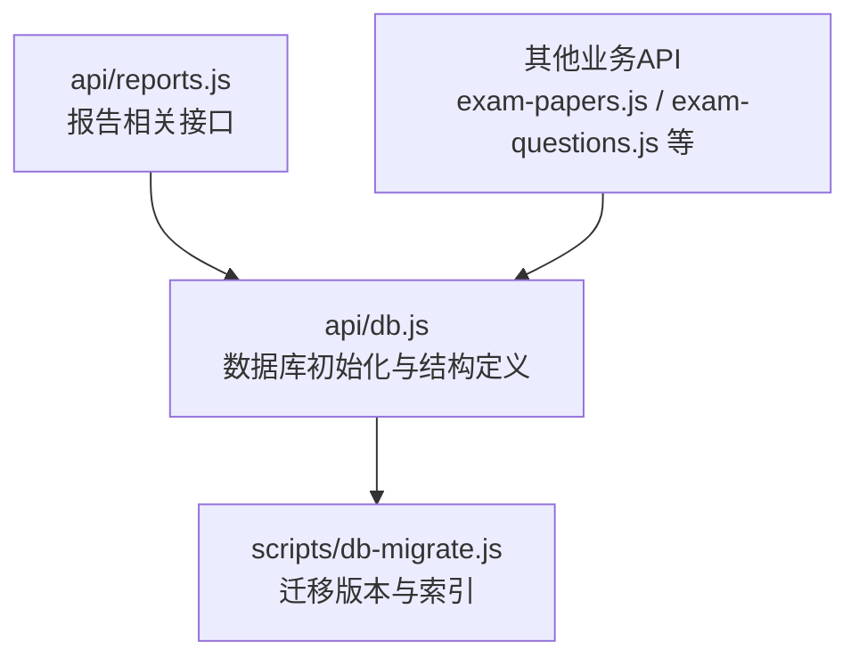
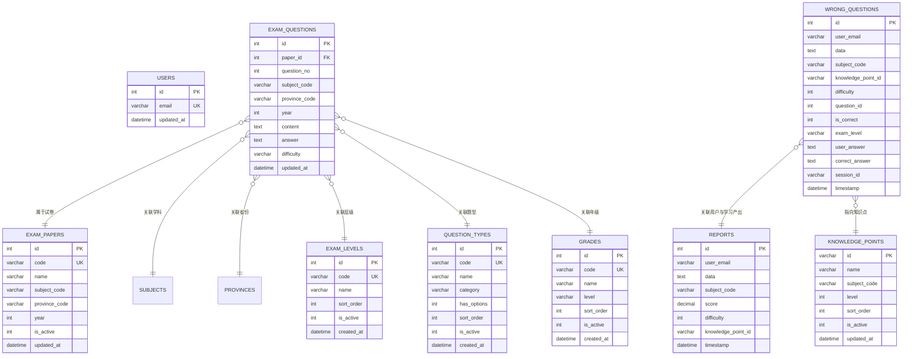
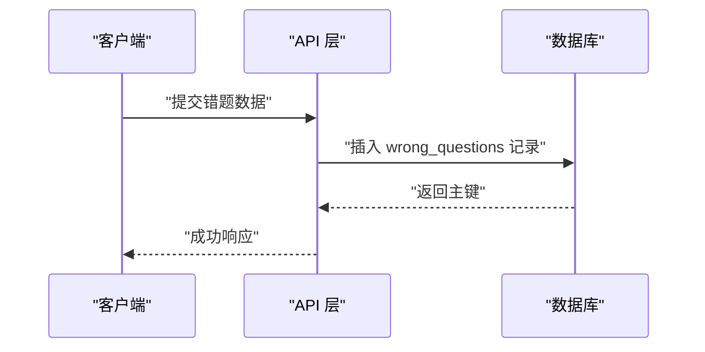
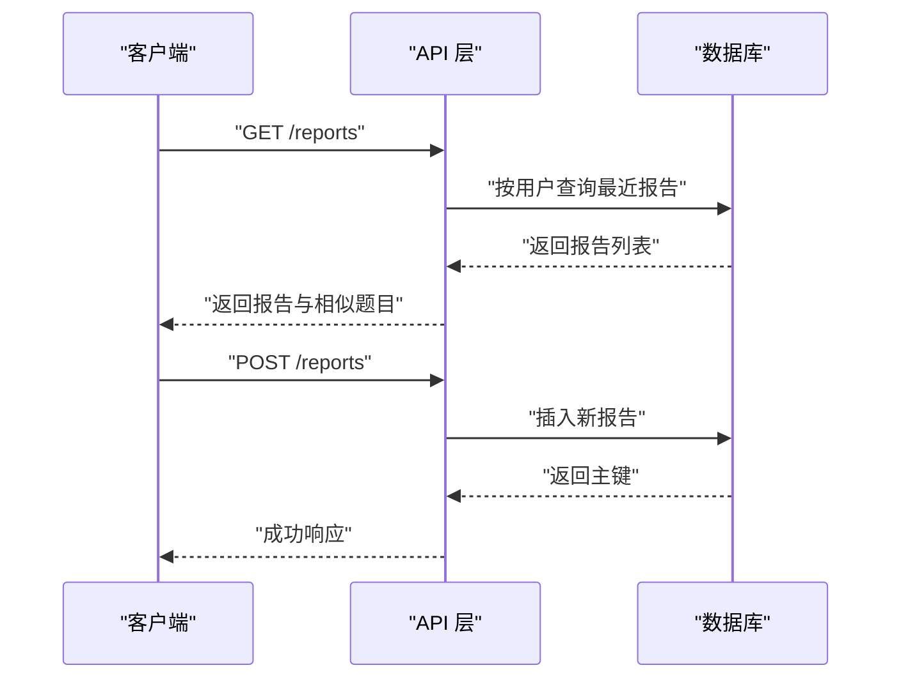
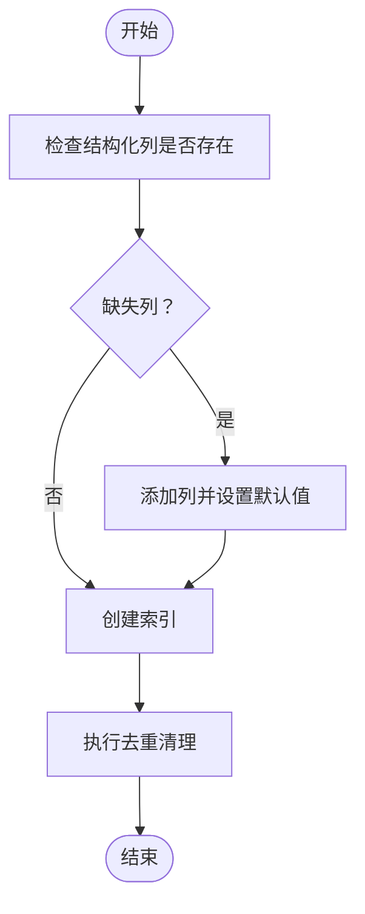

# 表结构设计

<cite>
**本文引用的文件**
- [api/db.js](file://api/db.js)
- [scripts/db-migrate.js](file://scripts/db-migrate.js)
- [api/reports.js](file://api/reports.js)
</cite>

## 目录
1. [简介](#简介)
2. [项目结构](#项目结构)
3. [核心组件](#核心组件)
4. [架构总览](#架构总览)
5. [详细组件分析](#详细组件分析)
6. [依赖分析](#依赖分析)
7. [性能考虑](#性能考虑)
8. [故障排查指南](#故障排查指南)
9. [结论](#结论)
10. [附录](#附录)

## 简介
本文件面向AI家教项目的数据库表结构设计，聚焦于核心业务表的结构定义、字段与约束、索引策略、表间关系与级联规则，并结合迁移脚本梳理表结构演进历史与兼容性保障。重点覆盖以下表：users、wrong_questions、reports、knowledge_points、exam_papers、exam_questions。同时给出数据完整性约束、业务规则校验与数据质量控制机制的建议与依据。

## 项目结构
数据库初始化与迁移逻辑集中在后端API层与迁移脚本中：
- 数据库初始化与结构定义位于API层的数据库模块中
- 迁移版本管理与索引创建由独立迁移脚本维护
- 业务接口通过数据库模块进行CRUD操作

图表来源
- [api/db.js:49-446](file://api/db.js#L49-L446)
- [scripts/db-migrate.js:93-500](file://scripts/db-migrate.js#L93-L500)

章节来源
- [api/db.js:49-446](file://api/db.js#L49-L446)
- [scripts/db-migrate.js:93-500](file://scripts/db-migrate.js#L93-L500)

## 核心组件
本节对关键业务表进行结构化说明，包括字段定义、数据类型、约束、默认值与索引策略。由于users表未在已知片段中完整展示，此处以“结构化列”检查逻辑为依据，给出其扩展字段的预期形态与约束。

- users
  - 结构化列检查逻辑表明存在更新时间戳字段，用于审计与排序
  - 建议补充主键、邮箱唯一性与活跃状态等常用约束
- wrong_questions
  - 主键自增；用户标识与原始数据文本；结构化列支持高效查询与分析
  - 结构化列包括学科代码、知识点ID、难度、题号、正误标记、考试层级、用户答案、标准答案、会话ID等
  - 时间戳默认当前时间
- reports
  - 主键自增；用户标识与序列化数据；结构化列支持评分、难度、知识点ID等
  - 时间戳默认当前时间
- knowledge_points
  - 结构化列包含更新时间戳
- exam_papers
  - 结构化列包含更新时间戳
- exam_questions
  - 结构化列包含更新时间戳、学科代码、省份代码、年份
- 类别与维度表
  - exam_levels：层级编码唯一、名称、排序、启用状态、创建时间
  - question_types：类型编码唯一、名称、分类、是否含选项、排序、启用状态、创建时间
  - grades：年级编码唯一、名称、层次、排序、启用状态、创建时间

章节来源
- [api/db.js:49-446](file://api/db.js#L49-L446)
- [scripts/db-migrate.js:107-126](file://scripts/db-migrate.js#L107-L126)
- [scripts/db-migrate.js:417-476](file://scripts/db-migrate.js#L417-L476)

## 架构总览
下图展示了核心表之间的关系与典型查询路径。其中，wrong_questions与reports作为用户行为与学习产出的核心表，分别通过结构化列支撑高效检索；知识体系与试卷题库通过结构化列实现多维过滤与统计。

图表来源
- [api/db.js:49-446](file://api/db.js#L49-L446)
- [scripts/db-migrate.js:107-126](file://scripts/db-migrate.js#L107-L126)
- [scripts/db-migrate.js:417-476](file://scripts/db-migrate.js#L417-L476)

## 详细组件分析

### 表：users（用户）
- 字段与类型
  - 主键：整型自增
  - 邮箱：字符串，唯一
  - 更新时间：日期时间，默认当前时间
- 约束
  - 主键唯一
  - 邮箱唯一
  - 启用/禁用状态可选扩展
- 索引策略
  - 建议对邮箱建立唯一索引
- 兼容性与演进
  - 当前结构以“结构化列检查”确认存在更新时间戳字段，便于后续扩展

章节来源
- [api/db.js:417-446](file://api/db.js#L417-L446)

### 表：wrong_questions（错题）
- 字段与类型
  - 主键：整型自增
  - 用户标识：字符串
  - 原始数据：文本
  - 结构化列：学科代码、知识点ID、难度、题号、正误标记、考试层级、用户答案、标准答案、会话ID
  - 时间戳：日期时间，默认当前时间
- 约束
  - 主键唯一
  - 结构化列允许为空，便于逐步迁移与增量完善
- 索引策略
  - 建议对用户标识、学科代码、知识点ID、会话ID、时间戳建立复合或单列索引以优化查询
- 典型流程（新增错题）

图表来源
- [api/db.js:79-93](file://api/db.js#L79-L93)

章节来源
- [api/db.js:79-93](file://api/db.js#L79-L93)
- [scripts/db-migrate.js:107-126](file://scripts/db-migrate.js#L107-L126)

### 表：reports（报告）
- 字段与类型
  - 主键：整型自增
  - 用户标识：字符串
  - 序列化数据：文本
  - 结构化列：学科代码、评分、难度、知识点ID
  - 时间戳：日期时间，默认当前时间
- 约束
  - 主键唯一
- 索引策略
  - 建议对用户标识、学科代码、时间戳建立索引
- 典型流程（查询与保存报告）

图表来源
- [api/reports.js:1-44](file://api/reports.js#L1-L44)
- [api/db.js:417-446](file://api/db.js#L417-L446)

章节来源
- [api/reports.js:1-44](file://api/reports.js#L1-L44)
- [api/db.js:417-446](file://api/db.js#L417-L446)

### 表：knowledge_points（知识点）
- 字段与类型
  - 主键：字符串
  - 名称：字符串
  - 学科代码：字符串
  - 等级：整型
  - 排序：整型
  - 启用状态：整型
  - 更新时间：日期时间，默认当前时间
- 约束
  - 主键唯一
- 索引策略
  - 建议对学科代码、等级、排序建立组合索引

章节来源
- [api/db.js:417-446](file://api/db.js#L417-L446)

### 表：exam_papers（试卷）
- 字段与类型
  - 主键：整型自增
  - 试卷代码：字符串，唯一
  - 名称：字符串
  - 学科代码：字符串
  - 省份代码：字符串
  - 年份：整型
  - 启用状态：整型
  - 更新时间：日期时间，默认当前时间
- 约束
  - 主键唯一
  - 试卷代码唯一
- 索引策略
  - 建议对学科代码、省份代码、年份建立组合索引

章节来源
- [api/db.js:417-446](file://api/db.js#L417-L446)

### 表：exam_questions（试题）
- 字段与类型
  - 主键：整型自增
  - 试卷ID：整型，外键指向试卷
  - 题号：整型
  - 学科代码：字符串
  - 省份代码：字符串
  - 年份：整型
  - 内容：文本
  - 答案：文本
  - 难度：字符串
  - 更新时间：日期时间，默认当前时间
- 约束
  - 主键唯一
  - 外键：试卷ID引用试卷表
- 索引策略
  - 建议对试卷ID、学科代码、省份代码、年份、题号建立组合索引

章节来源
- [api/db.js:417-446](file://api/db.js#L417-L446)

### 表：exam_levels、question_types、grades（维度表）
- exam_levels
  - 编码唯一、名称、排序、启用状态、创建时间
- question_types
  - 编码唯一、名称、分类、是否含选项、排序、启用状态、创建时间
- grades
  - 编码唯一、名称、层次、排序、启用状态、创建时间
- 索引策略
  - 建议对编码建立唯一索引

章节来源
- [api/db.js:49-77](file://api/db.js#L49-L77)

## 依赖分析
- 结构化列一致性
  - 迁移脚本统一为多个表添加结构化列，确保查询与分析能力一致
- 索引策略
  - 迁移脚本集中创建索引，提升查询性能与并发能力
- 数据去重
  - 迁移脚本提供重复数据清理逻辑，保障数据质量

图表来源
- [scripts/db-migrate.js:107-126](file://scripts/db-migrate.js#L107-L126)
- [scripts/db-migrate.js:417-476](file://scripts/db-migrate.js#L417-L476)
- [scripts/db-migrate.js:484-500](file://scripts/db-migrate.js#L484-L500)

章节来源
- [scripts/db-migrate.js:107-126](file://scripts/db-migrate.js#L107-L126)
- [scripts/db-migrate.js:417-476](file://scripts/db-migrate.js#L417-L476)
- [scripts/db-migrate.js:484-500](file://scripts/db-migrate.js#L484-L500)

## 性能考虑
- 索引优先级
  - 高频查询字段（如用户标识、学科代码、知识点ID、时间戳）应建立索引
  - 组合索引用于多维过滤场景（如学科+省份+年份）
- 查询优化
  - 使用结构化列减少复杂解析成本，提高WHERE与JOIN效率
- 数据量增长
  - 定期执行去重与归档策略，避免历史数据膨胀影响性能

## 故障排查指南
- 结构化列缺失
  - 现象：查询性能差或字段不存在
  - 处理：运行迁移脚本，确保结构化列已添加
- 索引缺失
  - 现象：慢查询、锁竞争
  - 处理：执行索引创建步骤
- 重复数据
  - 现象：统计结果异常、重复记录
  - 处理：执行去重清理逻辑

章节来源
- [scripts/db-migrate.js:107-126](file://scripts/db-migrate.js#L107-L126)
- [scripts/db-migrate.js:417-476](file://scripts/db-migrate.js#L417-L476)
- [scripts/db-migrate.js:484-500](file://scripts/db-migrate.js#L484-L500)

## 结论
本设计围绕“结构化列 + 维度表 + 索引策略”的思路，兼顾查询性能与扩展性。通过迁移脚本实现版本化演进与数据质量控制，确保系统在业务增长过程中保持稳定与高效。建议在生产环境持续监控索引使用情况与查询计划，按需调整索引与分区策略。

## 附录
- 表结构演进要点
  - 版本2：为错题表增加结构化列，提升查询与分析能力
  - 版本4：统一为多表添加结构化列与更新时间戳
  - 版本5：创建多类索引，优化查询性能
  - 版本9：清理重复记录，保障数据质量

章节来源
- [scripts/db-migrate.js:104-126](file://scripts/db-migrate.js#L104-L126)
- [scripts/db-migrate.js:417-476](file://scripts/db-migrate.js#L417-L476)
- [scripts/db-migrate.js:480-500](file://scripts/db-migrate.js#L480-L500)