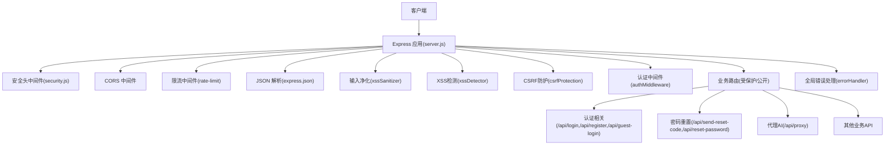
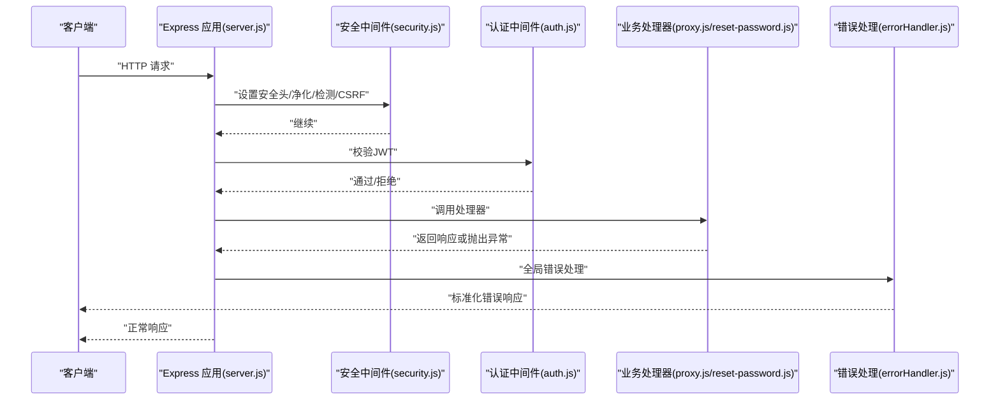
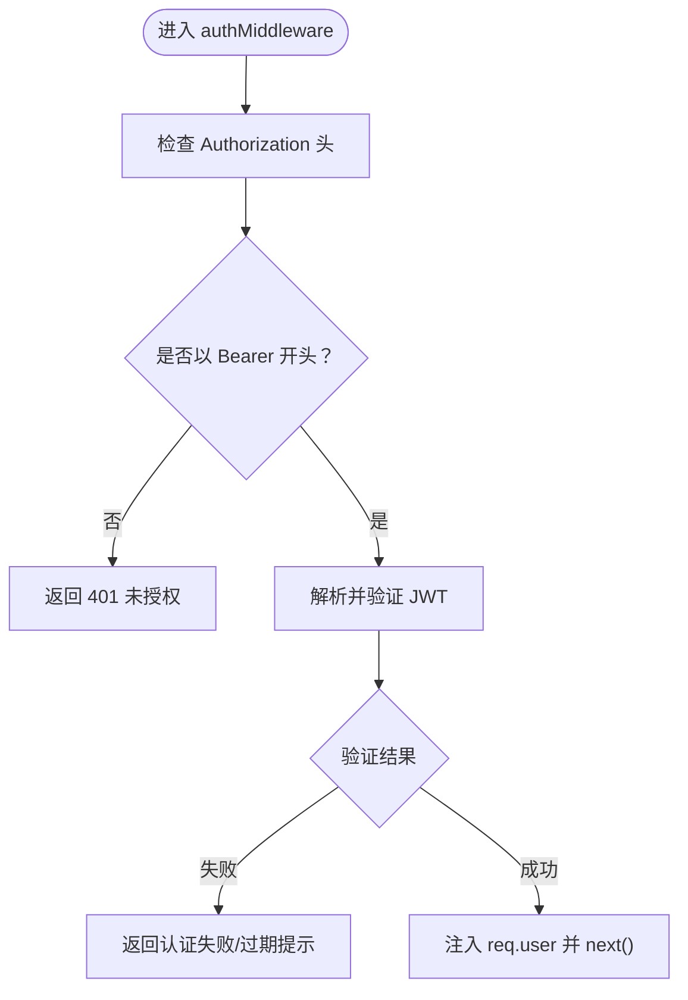
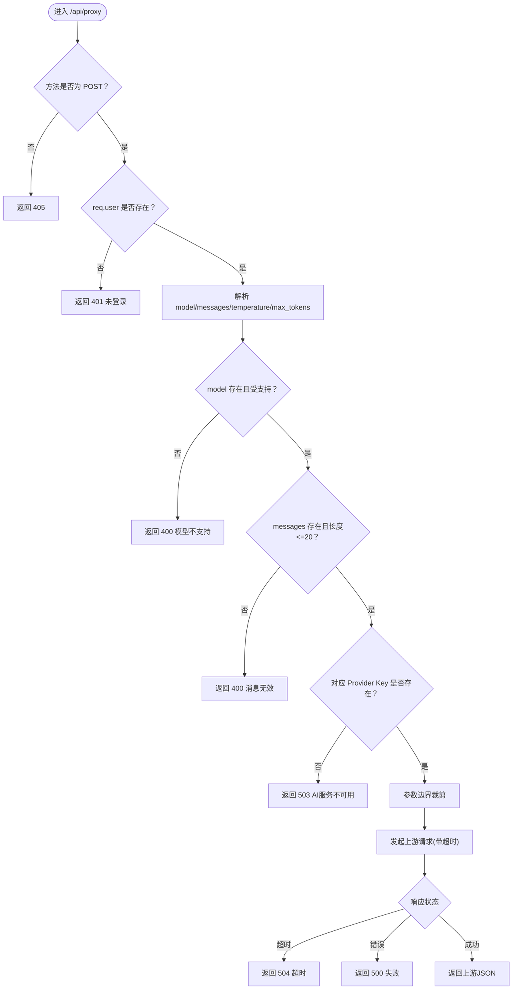
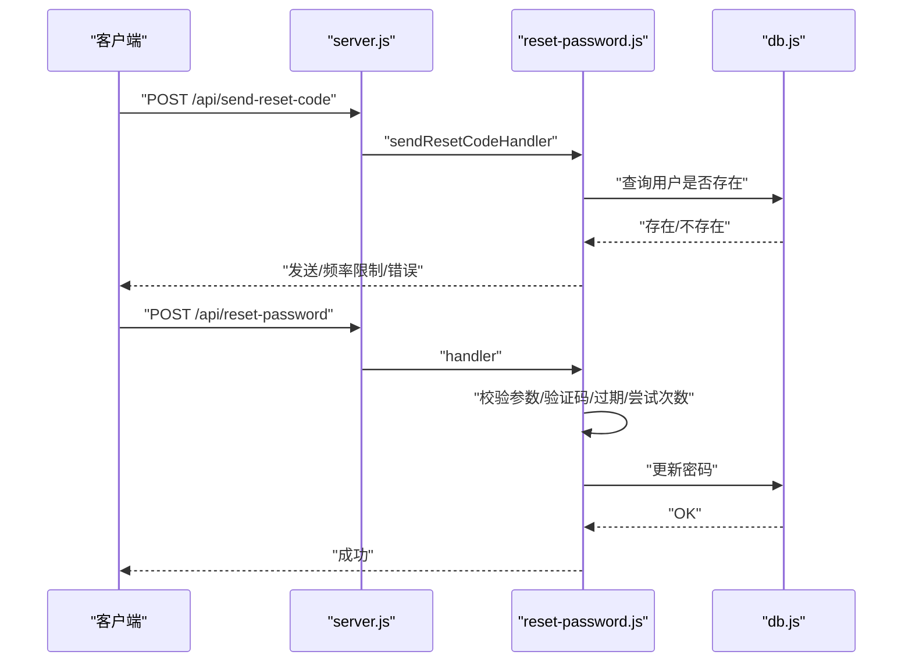
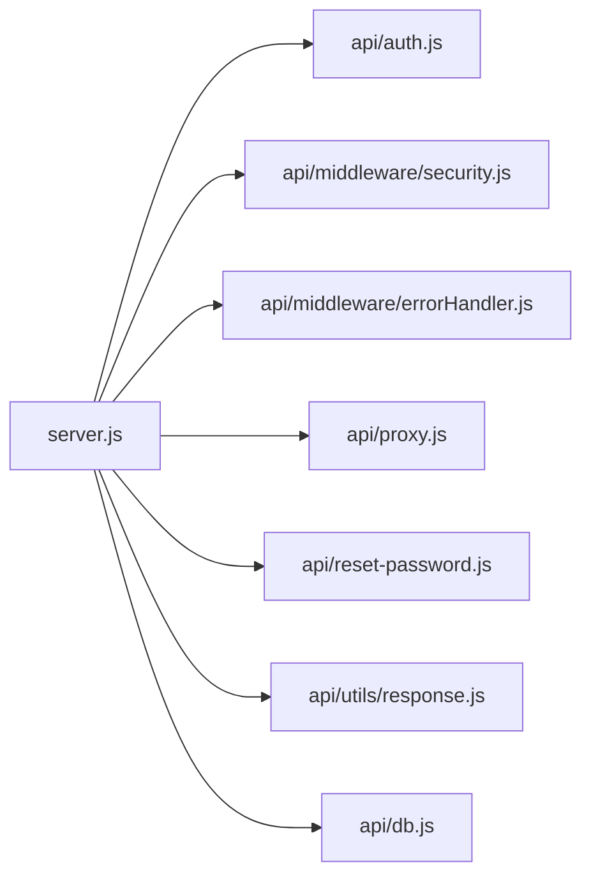

# API测试

<cite>
**本文引用的文件**
- [server.js](file://server.js)
- [auth.js](file://api/auth.js)
- [proxy.js](file://api/proxy.js)
- [reset-password.js](file://api/reset-password.js)
- [response.js](file://api/utils/response.js)
- [errorHandler.js](file://api/middleware/errorHandler.js)
- [security.js](file://api/middleware/security.js)
- [db.js](file://api/db.js)
- [auth.test.js](file://tests/api/auth.test.js)
- [proxy.test.js](file://tests/api/proxy.test.js)
- [reset-password.test.js](file://tests/api/reset-password.test.js)
- [vitest.config.js](file://vitest.config.js)
- [package.json](file://package.json)
- [test-flow.sh](file://test-flow.sh)
</cite>

## 目录
1. [引言](#引言)
2. [项目结构](#项目结构)
3. [核心组件](#核心组件)
4. [架构总览](#架构总览)
5. [详细组件分析](#详细组件分析)
6. [依赖分析](#依赖分析)
7. [性能考虑](#性能考虑)
8. [故障排查指南](#故障排查指南)
9. [结论](#结论)
10. [附录](#附录)

## 引言
本文件面向AI家教项目的API测试，系统化阐述RESTful API测试的设计与实施方法，覆盖HTTP方法测试、URL模式验证、请求响应测试、认证与代理API、密码重置API的关键测试策略，并提供工具使用、测试数据构造、测试环境配置、错误处理与安全测试、性能测试方案、API文档验证与契约测试、版本兼容性测试以及测试自动化与CI流程。文档基于仓库现有实现与测试用例进行归纳总结，确保非技术读者也能理解并执行。

## 项目结构
后端采用Express框架，路由集中在入口文件中统一挂载；认证中间件、安全中间件、错误处理中间件贯穿所有受保护路由；各业务模块按功能拆分至独立文件；测试使用Vitest，覆盖认证、代理、密码重置等关键路径。

图表来源
- [server.js:141-205](file://server.js#L141-L205)
- [security.js:73-114](file://api/middleware/security.js#L73-L114)
- [auth.js:29-46](file://api/auth.js#L29-L46)

章节来源
- [server.js:1-221](file://server.js#L1-L221)

## 核心组件
- 认证与JWT校验：负责JWT密钥合法性校验与请求头解析、签发与验证。
- 安全中间件：统一设置安全响应头、XSS净化与检测、CSRF来源校验。
- 错误处理中间件：统一捕获异常，区分业务错误类型并返回标准化响应。
- 响应格式工具：统一success/error/pagination等响应结构，便于测试断言。
- 数据库封装：SQLite连接、表结构初始化、索引与列补齐、查询封装。
- 代理AI：对DashScope与DeepSeek等模型网关进行参数校验、超时控制与错误映射。
- 密码重置：验证码生成、存储、过期与尝试次数限制、密码哈希更新。

章节来源
- [auth.js:12-46](file://api/auth.js#L12-L46)
- [security.js:4-114](file://api/middleware/security.js#L4-L114)
- [errorHandler.js:1-75](file://api/middleware/errorHandler.js#L1-L75)
- [response.js:1-69](file://api/utils/response.js#L1-L69)
- [db.js:15-365](file://api/db.js#L15-L365)
- [proxy.js:33-105](file://api/proxy.js#L33-L105)
- [reset-password.js:14-100](file://api/reset-password.js#L14-L100)

## 架构总览
下图展示从客户端到业务处理器的典型调用链，突出认证、安全与错误处理的横切关注点。

图表来源
- [server.js:141-205](file://server.js#L141-L205)
- [auth.js:29-46](file://api/auth.js#L29-L46)
- [security.js:23-114](file://api/middleware/security.js#L23-L114)
- [errorHandler.js:13-72](file://api/middleware/errorHandler.js#L13-L72)
- [proxy.js:33-105](file://api/proxy.js#L33-L105)
- [reset-password.js:14-100](file://api/reset-password.js#L14-L100)

## 详细组件分析

### 认证API测试策略
目标：验证JWT密钥合法性、认证中间件对有效/无效/过期令牌的处理，以及未携带或格式错误的授权头行为。

- JWT密钥校验
  - 场景：未设置/默认值/过短密钥/强密钥
  - 断言：进程退出/警告/通过
- 认证中间件
  - 场景：无授权头、非法格式、无效签名、过期令牌
  - 断言：401状态与消息；有效令牌放行并注入用户信息
- 测试用例参考
  - [auth.test.js:6-59](file://tests/api/auth.test.js#L6-L59)
  - [auth.test.js:61-115](file://tests/api/auth.test.js#L61-L115)

图表来源
- [auth.js:29-46](file://api/auth.js#L29-L46)
- [auth.test.js:70-114](file://tests/api/auth.test.js#L70-L114)

章节来源
- [auth.js:12-46](file://api/auth.js#L12-L46)
- [auth.test.js:1-117](file://tests/api/auth.test.js#L1-L117)

### 代理AI API测试策略
目标：验证POST方法限制、用户登录态要求、模型与消息参数校验、API Key缺失处理、超时与错误映射、参数边界约束。

- 方法与登录态
  - GET请求：405 Method Not Allowed
  - 无user：401 Unauthorized
- 模型与消息校验
  - 缺少/非数组/空数组：400 Bad Request
  - 消息数>20：400 Bad Request
  - 不支持的模型：400 Bad Request
- API Key与可用性
  - 缺失Key：503 Service Unavailable
- 参数边界与安全
  - max_tokens限制在[100,4000]之间
  - temperature限制在[0,2]之间
- 超时与异常
  - 超时：504 Gateway Timeout
  - 其他错误：500 Internal Server Error
- 测试用例参考
  - [proxy.test.js:25-98](file://tests/api/proxy.test.js#L25-L98)

图表来源
- [proxy.js:33-105](file://api/proxy.js#L33-L105)
- [proxy.test.js:25-98](file://tests/api/proxy.test.js#L25-L98)

章节来源
- [proxy.js:1-106](file://api/proxy.js#L1-L106)
- [proxy.test.js:1-99](file://tests/api/proxy.test.js#L1-L99)

### 密码重置API测试策略
目标：验证验证码发送与重置流程的参数校验、速率限制、过期与尝试次数限制、密码强度与最终更新。

- 发送验证码
  - 非POST：405 Method Not Allowed
  - 缺少邮箱：400 Bad Request
  - 用户不存在：404 Not Found
  - 频繁请求：429 Too Many Requests
- 重置密码
  - 非POST：405 Method Not Allowed
  - 缺少邮箱/新密码：400 Bad Request
  - 密码过短：400 Bad Request
  - 缺少验证码：400 Bad Request
  - 未发送验证码：403 Forbidden
  - 验证码过期：403 Forbidden
  - 尝试次数过多：403 Forbidden
  - 验证码错误：403 Forbidden（剩余次数提示）
  - 成功：更新密码并返回成功
- 测试用例参考
  - [reset-password.test.js:14-78](file://tests/api/reset-password.test.js#L14-L78)

图表来源
- [reset-password.js:14-100](file://api/reset-password.js#L14-L100)
- [db.js:15-365](file://api/db.js#L15-L365)
- [reset-password.test.js:14-78](file://tests/api/reset-password.test.js#L14-L78)

章节来源
- [reset-password.js:1-101](file://api/reset-password.js#L1-L101)
- [reset-password.test.js:1-80](file://tests/api/reset-password.test.js#L1-L80)

### 响应格式与错误处理测试
- 统一响应结构
  - 成功/失败/分页/创建/删除均有固定字段
  - validateResponseFormat用于断言响应体结构
- 错误处理
  - JWT错误/过期映射为401
  - 数据库错误映射为500
  - 端口占用映射为503
  - 开发环境可附加stack
- 测试要点
  - 断言success/message/status/data/pagination字段存在性与类型
  - 断言错误码与消息一致性

章节来源
- [response.js:1-69](file://api/utils/response.js#L1-L69)
- [errorHandler.js:13-72](file://api/middleware/errorHandler.js#L13-L72)

### 安全测试要点
- 输入净化与XSS检测
  - xssSanitizer对body/query/params进行净化
  - xssDetector递归检测字符串是否匹配常见XSS模式
- CSRF防护
  - 对非GET/HEAD/OPTIONS请求校验Origin/Referer是否在白名单
- 安全响应头
  - X-Content-Type-Options/NOSNIFF
  - X-Frame-Options/DENY
  - X-XSS-Protection/1; mode=block
  - Referrer-Policy/strict-origin-when-cross-origin
  - Permissions-Policy限制摄像头/麦克风/定位
- 测试建议
  - 构造含脚本标签/事件属性/JavaScript协议的payload，验证400与净化
  - 设置Origin不在白名单，验证403

章节来源
- [security.js:4-114](file://api/middleware/security.js#L4-L114)

## 依赖分析
- 组件耦合
  - server.js集中挂载中间件与路由，形成清晰的横切层（安全/认证/限流/错误处理）
  - 业务模块通过统一的wrapHandler与errorHandler保证一致性
- 外部依赖
  - JWT用于认证
  - SQLite用于本地开发与测试
  - fetch用于上游AI服务调用
- 潜在循环依赖
  - 当前结构以server.js为中心，模块间单向依赖，无明显循环

图表来源
- [server.js:141-205](file://server.js#L141-L205)
- [auth.js:1-47](file://api/auth.js#L1-L47)
- [security.js:1-114](file://api/middleware/security.js#L1-L114)
- [errorHandler.js:1-75](file://api/middleware/errorHandler.js#L1-L75)
- [proxy.js:1-106](file://api/proxy.js#L1-L106)
- [reset-password.js:1-101](file://api/reset-password.js#L1-L101)
- [response.js:1-69](file://api/utils/response.js#L1-L69)
- [db.js:1-487](file://api/db.js#L1-L487)

章节来源
- [server.js:1-221](file://server.js#L1-L221)

## 性能考虑
- 限流策略
  - 登录/注册：15分钟最多20次
  - 代理AI：1分钟最多10次
  - 通用API：1分钟最多60次
- 超时与资源
  - 代理AI请求超时30秒，避免阻塞
  - JSON解析上限50MB，防止过大请求
- 建议
  - 使用并发压测工具模拟多用户场景，观察429/504/503触发点
  - 关注上游AI服务SLA，必要时增加重试与熔断

章节来源
- [server.js:44-46](file://server.js#L44-L46)
- [proxy.js:6-71](file://api/proxy.js#L6-L71)

## 故障排查指南
- 启动阶段
  - JWT_SECRET未设置/默认值/过短：服务直接退出或发出警告
  - 数据库连接失败：健康检查返回dbReady=false
- 运行阶段
  - 401未授权：检查Authorization头格式与令牌有效性
  - 403来源不允许：检查ALLOWED_ORIGINS配置
  - 429请求频繁：检查限流策略与客户端退避
  - 503/504：上游AI服务不可用/超时，检查API Key与网络
- 日志
  - 代理AI会记录用户、模型与token用量
  - 错误处理中间件会输出堆栈（开发环境）

章节来源
- [auth.js:12-27](file://api/auth.js#L12-L27)
- [server.js:126-136](file://server.js#L126-L136)
- [security.js:89-113](file://api/middleware/security.js#L89-L113)
- [proxy.js:90-104](file://api/proxy.js#L90-L104)
- [errorHandler.js:67-71](file://api/middleware/errorHandler.js#L67-L71)

## 结论
本项目在中间件层面实现了统一的安全、认证与错误处理，在业务模块中提供了明确的参数校验与边界控制。结合现有Vitest测试与shell脚本，可构建从单元到端到端的完整测试体系。建议在CI中引入覆盖率统计、压力测试与安全扫描，持续保障API质量与稳定性。

## 附录

### API测试工具与环境配置
- 测试框架
  - Vitest：单元测试与覆盖率
  - 脚本命令：test/test:watch/test:coverage
- 环境变量
  - JWT_SECRET：强随机密钥（≥32字符）
  - DASHSCOPE_API_KEY / DEEPSEEK_API_KEY：代理AI所需
  - ALLOWED_ORIGINS：CSRF白名单
  - PORT：服务端口
- 覆盖率配置
  - 仅对api目录进行覆盖率统计，排除swagger与种子脚本

章节来源
- [vitest.config.js:1-15](file://vitest.config.js#L1-L15)
- [package.json:9-15](file://package.json#L9-L15)
- [auth.js:12-27](file://api/auth.js#L12-L27)
- [proxy.js:20-28](file://api/proxy.js#L20-L28)
- [security.js:83-87](file://api/middleware/security.js#L83-L87)

### 测试数据构造与环境准备
- 数据库
  - 自动初始化users、subjects、exam_levels、question_types、grades等基础表
  - 自动添加缺失列并补全部分denormalized字段
- 测试数据
  - 使用内存Map模拟验证码存储，便于快速断言
  - 代理API通过process.env注入API Key，避免硬编码

章节来源
- [db.js:367-481](file://api/db.js#L367-L481)
- [reset-password.js:5-8](file://api/reset-password.js#L5-L8)

### HTTP方法测试与URL模式验证
- 方法测试
  - 认证：GET/POST混合，验证405与401
  - 代理：仅POST，其余方法405
  - 密码重置：仅POST，其余方法405
- URL模式
  - 健康检查：/api/health
  - 文档：/api-docs 与 /api-docs.json
  - 认证：/api/login、/api/register、/api/guest-login
  - 代理：/api/proxy
  - 密码重置：/api/send-reset-code、/api/reset-password
  - 其他：省市区、试卷、问题、报告、任务、学习路径、班级分析、签到积分徽章等

章节来源
- [server.js:141-205](file://server.js#L141-L205)

### 请求与响应测试要点
- 统一响应结构断言
  - 成功：success=true，包含data或pagination
  - 失败：success=false，包含message与status
- 错误码映射
  - 400：参数缺失/越界/格式错误
  - 401：未认证/令牌过期
  - 403：来源不允许/验证码相关权限
  - 404：资源不存在
  - 429：请求过于频繁
  - 500：服务器内部错误
  - 503：服务不可用
  - 504：网关超时

章节来源
- [response.js:50-60](file://api/utils/response.js#L50-L60)
- [errorHandler.js:13-72](file://api/middleware/errorHandler.js#L13-L72)

### 错误处理测试与安全测试
- 错误处理
  - 统一错误响应体字段，开发环境可附加stack
  - JWT错误/过期/数据库错误/端口占用分别映射不同状态码
- 安全
  - 输入净化与XSS检测，阻止常见攻击模式
  - CSRF白名单校验，拒绝未知来源请求
  - 安全响应头统一设置

章节来源
- [errorHandler.js:13-72](file://api/middleware/errorHandler.js#L13-L72)
- [security.js:4-114](file://api/middleware/security.js#L4-L114)

### 性能测试实施方案
- 压力测试
  - 使用并发客户端对代理AI与认证接口施压，观察429/503/504触发点
- 超时与资源
  - 代理AI超时30秒，JSON解析上限50MB
- 指标监控
  - 关注上游AI服务SLA与后端吞吐，必要时引入重试与熔断

章节来源
- [proxy.js:6-71](file://api/proxy.js#L6-L71)
- [server.js:44-46](file://server.js#L44-L46)

### API文档验证、契约测试与版本兼容性
- 文档验证
  - 通过Swagger UI与JSON规范进行端点与参数核对
- 契约测试
  - 基于响应格式工具validateResponseFormat断言响应结构
  - 对关键接口（代理、认证、密码重置）建立契约规则
- 版本兼容性
  - 保持响应字段与状态码稳定，新增字段向后兼容
  - 对破坏性变更通过版本化端点或特性开关管理

章节来源
- [server.js:138-139](file://server.js#L138-L139)
- [response.js:50-60](file://api/utils/response.js#L50-L60)

### 测试自动化脚本与CI流程
- 单元测试
  - Vitest运行tests/api下的测试文件，覆盖率统计api目录
- 端到端脚本
  - 提供test-flow.sh对省份、试卷、趋势等API进行基本验证
- CI建议
  - 在工作流中执行：安装依赖、启动服务、运行测试与覆盖率、静态检查与格式化

章节来源
- [vitest.config.js:1-15](file://vitest.config.js#L1-L15)
- [test-flow.sh:1-101](file://test-flow.sh#L1-L101)
- [package.json:9-15](file://package.json#L9-L15)