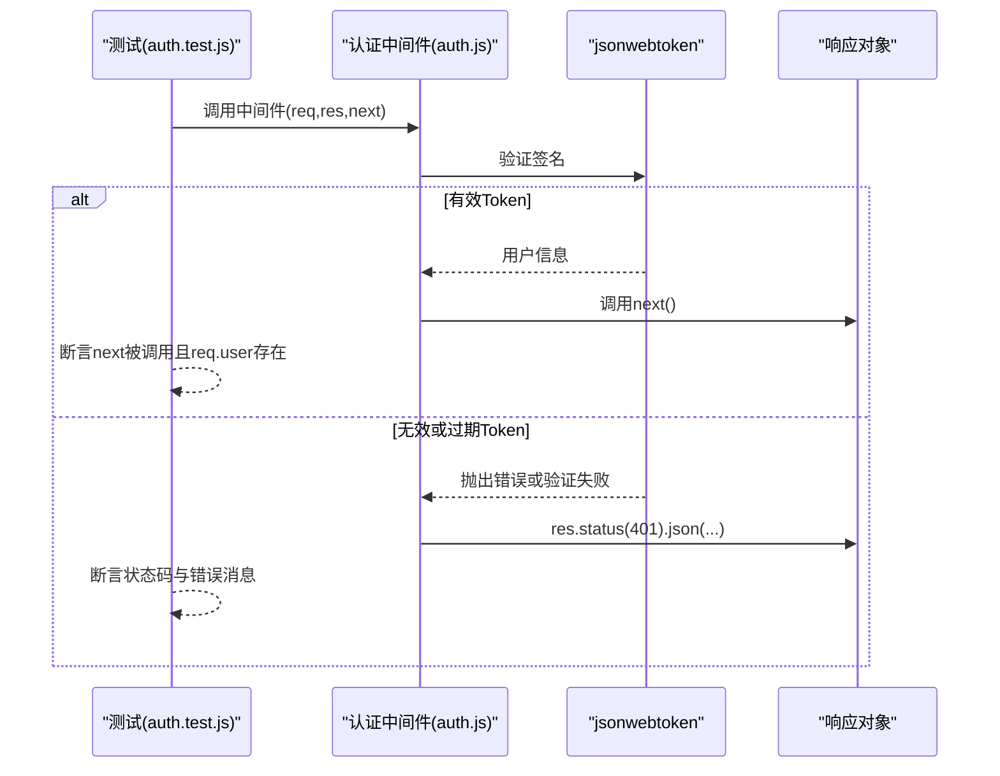
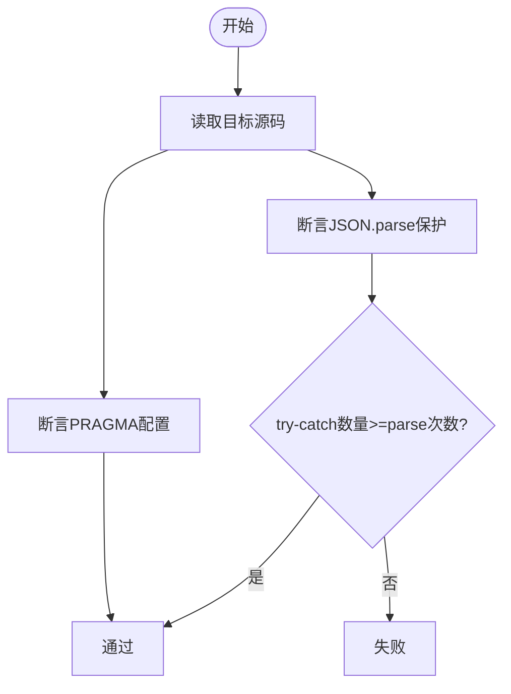
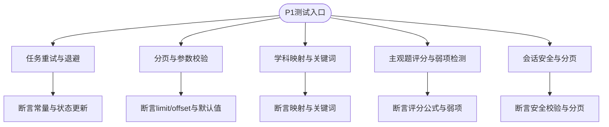
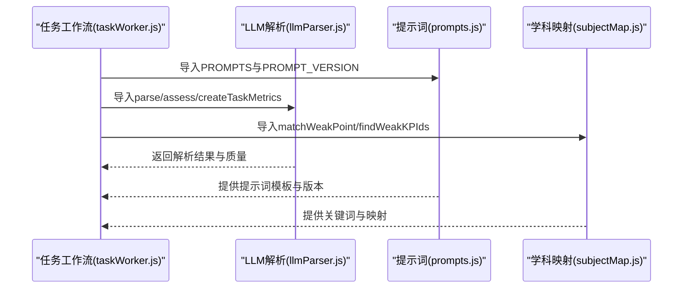
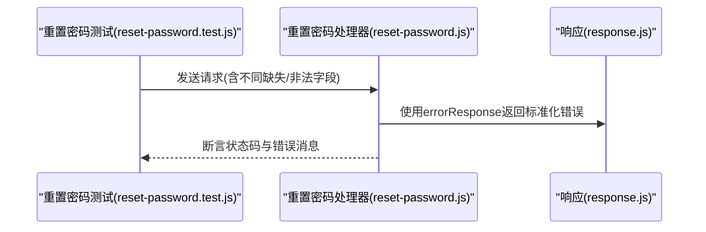
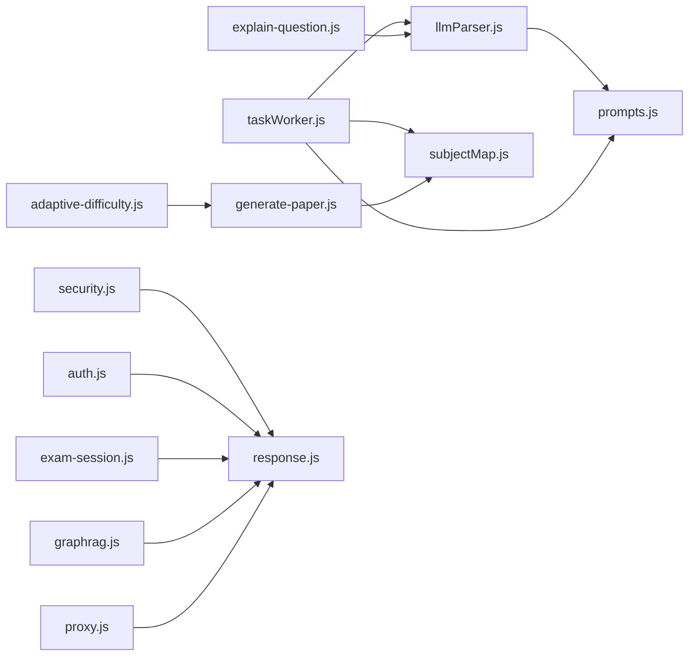

# 单元测试

<cite>
**本文引用的文件**
- [vitest.config.js](file://vitest.config.js)
- [package.json](file://package.json)
- [ci.yml](file://.github/workflows/ci.yml)
- [auth.test.js](file://tests/api/auth.test.js)
- [db-and-json.test.js](file://tests/api/db-and-json.test.js)
- [p1-business-logic.test.js](file://tests/api/p1-business-logic.test.js)
- [p2-ai-capability.test.js](file://tests/api/p2-ai-capability.test.js)
- [p3-ux-alignment.test.js](file://tests/api/p3-ux-alignment.test.js)
- [p4-education-deepening.test.js](file://tests/api/p4-education-deepening.test.js)
- [p5-engineering.test.js](file://tests/api/p5-engineering.test.js)
- [reset-password.test.js](file://tests/api/reset-password.test.js)
- [proxy.test.js](file://tests/api/proxy.test.js)
- [auth.js](file://api/auth.js)
- [db.js](file://api/db.js)
- [questions.js](file://api/questions.js)
- [knowledge-points.js](file://api/knowledge-points.js)
- [llmParser.js](file://api/utils/llmParser.js)
- [prompts.js](file://api/utils/prompts.js)
- [subjectMap.js](file://api/utils/subjectMap.js)
- [taskWorker.js](file://api/taskWorker.js)
- [explain-question.js](file://api/explain-question.js)
- [adaptive-difficulty.js](file://api/adaptive-difficulty.js)
- [response.js](file://api/utils/response.js)
- [security.js](file://api/middleware/security.js)
- [server.js](file://server.js)
- [test-flow.sh](file://test-flow.sh)
</cite>

## 目录
1. [引言](#引言)
2. [项目结构](#项目结构)
3. [核心组件](#核心组件)
4. [架构总览](#架构总览)
5. [详细组件分析](#详细组件分析)
6. [依赖关系分析](#依赖关系分析)
7. [性能考量](#性能考量)
8. [故障排查指南](#故障排查指南)
9. [结论](#结论)
10. [附录](#附录)

## 引言
本文件面向AI家教项目的单元测试体系，系统化阐述测试设计原则、实施方法与最佳实践。内容覆盖认证模块、数据库与JSON处理、业务逻辑、AI能力、用户体验、教育深度、工程化与CI/CD等维度，配套Vitest配置、测试环境与执行命令、覆盖率统计、测试报告与持续集成流程，并总结Mock对象、异步测试与错误场景策略。

## 项目结构
- 测试组织采用按主题分层的文件夹结构，位于 tests/api 下，按质量等级与主题划分测试套件，便于定位与维护。
- Vitest作为测试运行器与断言库，配合ESLint与Prettier保证代码风格与质量。
- CI通过GitHub Actions在多Node版本上运行测试、安全审计与Docker构建。

```mermaid
graph TB
subgraph "测试层"
T1["tests/api/auth.test.js"]
T2["tests/api/db-and-json.test.js"]
T3["tests/api/p1-business-logic.test.js"]
T4["tests/api/p2-ai-capability.test.js"]
T5["tests/api/p3-ux-alignment.test.js"]
T6["tests/api/p4-education-deepening.test.js"]
T7["tests/api/p5-engineering.test.js"]
T8["tests/api/reset-password.test.js"]
T9["tests/api/proxy.test.js"]
end
subgraph "被测代码"
C1["api/auth.js"]
C2["api/db.js"]
C3["api/questions.js"]
C4["api/knowledge-points.js"]
C5["api/utils/llmParser.js"]
C6["api/utils/prompts.js"]
C7["api/utils/subjectMap.js"]
C8["api/taskWorker.js"]
C9["api/explain-question.js"]
C10["api/adaptive-difficulty.js"]
C11["api/utils/response.js"]
C12["api/middleware/security.js"]
C13["server.js"]
end
T1 --> C1
T2 --> C2
T2 --> C3
T2 --> C4
T3 --> C8
T3 --> C2
T4 --> C5
T4 --> C6
T4 --> C7
T4 --> C8
T4 --> C9
T5 --> C10
T6 --> C7
T6 --> C6
T7 --> C11
T7 --> C12
T7 --> C13
T8 --> C11
T9 --> C11
```

**图表来源**
- [auth.test.js:1-117](file://tests/api/auth.test.js#L1-L117)
- [db-and-json.test.js:1-45](file://tests/api/db-and-json.test.js#L1-L45)
- [p1-business-logic.test.js:1-325](file://tests/api/p1-business-logic.test.js#L1-L325)
- [p2-ai-capability.test.js:1-422](file://tests/api/p2-ai-capability.test.js#L1-L422)
- [p3-ux-alignment.test.js:1-338](file://tests/api/p3-ux-alignment.test.js#L1-L338)
- [p4-education-deepening.test.js:1-399](file://tests/api/p4-education-deepening.test.js#L1-L399)
- [p5-engineering.test.js:1-329](file://tests/api/p5-engineering.test.js#L1-L329)
- [reset-password.test.js:1-80](file://tests/api/reset-password.test.js#L1-L80)
- [proxy.test.js:1-99](file://tests/api/proxy.test.js#L1-L99)

**章节来源**
- [vitest.config.js:1-15](file://vitest.config.js#L1-L15)
- [package.json:1-43](file://package.json#L1-L43)

## 核心组件
- 测试运行与配置
  - Vitest全局模式、Node环境、测试文件匹配与覆盖率配置，仅对api目录进行覆盖率统计，排除Swagger与种子脚本。
  - 命令行脚本：运行测试、监听模式、覆盖率报告。
- 测试主题分层
  - P1-P5：按质量等级与主题划分，覆盖业务逻辑、AI能力、UX、教育深度与工程化。
  - 专项测试：认证、数据库与JSON保护、重置密码、代理接口等。

**章节来源**
- [vitest.config.js:1-15](file://vitest.config.js#L1-L15)
- [package.json:5-16](file://package.json#L5-L16)

## 架构总览
下图展示测试与被测模块之间的交互关系，突出认证中间件、数据库初始化、JSON解析保护、LLM解析与提示词管理、主观题适配难度、响应格式统一、安全中间件与服务路由注册等关键链路。

```mermaid
graph TB
subgraph "测试套件"
A["认证测试(auth.test.js)"]
B["数据库与JSON测试(db-and-json.test.js)"]
C["业务逻辑测试(p1-business-logic.test.js)"]
D["AI能力测试(p2-ai-capability.test.js)"]
E["UX测试(p3-ux-alignment.test.js)"]
F["教育深度测试(p4-education-deepening.test.js)"]
G["工程化测试(p5-engineering.test.js)"]
H["重置密码测试(reset-password.test.js)"]
I["代理接口测试(proxy.test.js)"]
end
subgraph "后端模块"
M1["认证中间件(auth.js)"]
M2["数据库(db.js)"]
M3["题目查询(questions.js)"]
M4["知识点(knowledge-points.js)"]
M5["LLM解析(llmParser.js)"]
M6["提示词(prompts.js)"]
M7["学科映射(subjectMap.js)"]
M8["任务工作流(taskWorker.js)"]
M9["解题解释(explain-question.js)"]
M10["自适应难度(adaptive-difficulty.js)"]
M11["响应格式(response.js)"]
M12["安全中间件(security.js)"]
M13["服务器(server.js)"]
end
A --> M1
B --> M2
B --> M3
B --> M4
C --> M8
C --> M2
D --> M5
D --> M6
D --> M7
D --> M8
D --> M9
E --> M10
F --> M7
F --> M6
G --> M11
G --> M12
G --> M13
H --> M11
I --> M11
```

**图表来源**
- [auth.test.js:1-117](file://tests/api/auth.test.js#L1-L117)
- [db-and-json.test.js:1-45](file://tests/api/db-and-json.test.js#L1-L45)
- [p1-business-logic.test.js:1-325](file://tests/api/p1-business-logic.test.js#L1-L325)
- [p2-ai-capability.test.js:1-422](file://tests/api/p2-ai-capability.test.js#L1-L422)
- [p3-ux-alignment.test.js:1-338](file://tests/api/p3-ux-alignment.test.js#L1-L338)
- [p4-education-deepening.test.js:1-399](file://tests/api/p4-education-deepening.test.js#L1-L399)
- [p5-engineering.test.js:1-329](file://tests/api/p5-engineering.test.js#L1-L329)
- [reset-password.test.js:1-80](file://tests/api/reset-password.test.js#L1-L80)
- [proxy.test.js:1-99](file://tests/api/proxy.test.js#L1-L99)

## 详细组件分析

### 认证模块测试
- 设计原则
  - 使用Mock环境变量模拟JWT密钥状态，覆盖缺失、默认值与弱密钥场景；使用spy监控进程退出与控制台输出。
  - 对中间件进行请求头校验、Token有效性与过期判断、用户信息注入与错误响应断言。
- 关键断言
  - 401未授权、错误消息包含“过期”字样、next调用与req.user注入。
- Mock策略
  - 使用vi.spyOn替换process.exit与console方法，确保测试隔离与可控输出。
- 异步与错误场景
  - 无效Token、过期Token、缺失Authorization头、空Token字符串等。

**图表来源**
- [auth.test.js:61-115](file://tests/api/auth.test.js#L61-L115)
- [auth.js](file://api/auth.js)

**章节来源**
- [auth.test.js:1-117](file://tests/api/auth.test.js#L1-L117)

### 数据库与JSON处理测试
- 设计原则
  - 通过读取源码字符串断言SQLite PRAGMA配置、JSON解析保护与大小限制。
  - 确保所有JSON.parse周围具备try-catch保护，防止异常导致进程崩溃。
- 关键断言
  - db.js包含WAL、busy_timeout、foreign_keys；questions.js与knowledge-points.js包含try-catch与1MB限制。
- 错误场景
  - 非法JSON、尾随逗号、转义字符、超大载荷等。

**图表来源**
- [db-and-json.test.js:1-45](file://tests/api/db-and-json.test.js#L1-L45)
- [db.js](file://api/db.js)
- [questions.js](file://api/questions.js)
- [knowledge-points.js](file://api/knowledge-points.js)

**章节来源**
- [db-and-json.test.js:1-45](file://tests/api/db-and-json.test.js#L1-L45)

### 业务逻辑测试（P1）
- 设计原则
  - 以“源码扫描+行为断言”的方式验证关键实现细节：重试机制、指数退避、过期任务恢复、API Key校验、分页与限制、subjectMap统一模块、主观题评分与弱项检测、会话安全与分页等。
- 关键断言
  - MAX_RETRIES常量、RETRY_DELAYS序列、recoverStaleTasks更新状态、limit/offset与默认值、subjectMap映射与关键词、generate-paper评分公式、exam-session安全校验与分页。
- Mock策略
  - 使用动态import读取源码字符串，避免真实依赖加载。

**图表来源**
- [p1-business-logic.test.js:1-325](file://tests/api/p1-business-logic.test.js#L1-L325)

**章节来源**
- [p1-business-logic.test.js:1-325](file://tests/api/p1-business-logic.test.js#L1-L325)

### AI能力测试（P2）
- 设计原则
  - 验证任务指标表结构、任务统计导出、指标记录与令牌用量、提示词版本管理、LLM响应解析增强、弱项算法升级与GraphRAG索引脚本存在性。
- 关键断言
  - db.js包含task_metrics表字段；llmParser导出解析与质量评估；prompts导出版本与模型配置；weak point匹配与排序；subjectMap关键词扩展。
- Mock策略
  - 直接导入工具函数进行单元断言，避免网络请求。

**图表来源**
- [p2-ai-capability.test.js:1-422](file://tests/api/p2-ai-capability.test.js#L1-L422)
- [llmParser.js](file://api/utils/llmParser.js)
- [prompts.js](file://api/utils/prompts.js)
- [subjectMap.js](file://api/utils/subjectMap.js)
- [taskWorker.js](file://api/taskWorker.js)

**章节来源**
- [p2-ai-capability.test.js:1-422](file://tests/api/p2-ai-capability.test.js#L1-L422)

### UX与自适应难度测试（P3）
- 设计原则
  - 前端SPA内存泄漏修复、PC拍照搜索、考试模式倒计时与防作弊守卫、自适应难度计算与范围约束。
- 关键断言
  - App类清理方法、定时器与AbortController管理；dashboard.html的拍照模态与上传输入；exam-mode.js倒计时切换与低时长告警；自适应难度边界与API暴露。
- Mock策略
  - 通过源码扫描验证前端HTML与JS中的关键方法与事件绑定。

**章节来源**
- [p3-ux-alignment.test.js:1-338](file://tests/api/p3-ux-alignment.test.js#L1-L338)

### 教育深度测试（P4）
- 设计原则
  - 知识点扩展至200+、高考选科模型适配、主观题模板扩展、作文多维评分、班级分析SQL查询与参数校验。
- 关键断言
  - KEYWORD_MAP条目数量与前缀规则；GAOKAO_MODELS结构与组合数量；generate-paper模板与得分；prompts评分维度；class-analysis查询与参数边界。
- Mock策略
  - 动态import与源码扫描相结合，确保跨模块一致性。

**章节来源**
- [p4-education-deepening.test.js:1-399](file://tests/api/p4-education-deepening.test.js#L1-L399)

### 工程化与CI/CD测试（P5）
- 设计原则
  - CI流水线配置、ESLint与Prettier规范、Docker容器化与健康检查、API响应格式统一与错误响应规范化。
- 关键断言
  - GitHub Actions工作流包含测试、Linter、安全审计与Docker构建；eslint.config.js与.prettierrc存在；Dockerfile与compose配置；response.js导出统一响应工具；各API与中间件使用errorResponse。
- Mock策略
  - 文件存在性与内容扫描，确保工程标准落地。

**章节来源**
- [p5-engineering.test.js:1-329](file://tests/api/p5-engineering.test.js#L1-L329)

### 重置密码与代理接口测试
- 重置密码
  - 验证缺少邮箱、错误方法、验证码缺失、短密码、未发送验证码等场景的错误处理。
- 代理接口
  - 验证GET拒绝、未登录、不支持模型、空消息、消息超限、API Key缺失、最大token边界等。

**图表来源**
- [reset-password.test.js:1-80](file://tests/api/reset-password.test.js#L1-L80)
- [response.js](file://api/utils/response.js)

**章节来源**
- [reset-password.test.js:1-80](file://tests/api/reset-password.test.js#L1-L80)
- [proxy.test.js:1-99](file://tests/api/proxy.test.js#L1-L99)

## 依赖关系分析
- 模块耦合
  - llmParser与prompts紧密耦合，共同支撑任务工作流与解释接口。
  - subjectMap被多个模块复用，形成稳定的学科映射与关键词体系。
  - response.js作为统一响应出口，被多处API与中间件依赖。
- 外部依赖
  - JWT用于认证中间件；SQLite用于本地开发与CI；DashScope/DeepSeek API Key用于代理接口。
- 循环依赖
  - 测试通过动态import与源码扫描规避直接循环依赖风险。

**图表来源**
- [p2-ai-capability.test.js:1-422](file://tests/api/p2-ai-capability.test.js#L1-L422)
- [p3-ux-alignment.test.js:1-338](file://tests/api/p3-ux-alignment.test.js#L1-L338)
- [p4-education-deepening.test.js:1-399](file://tests/api/p4-education-deepening.test.js#L1-L399)
- [p5-engineering.test.js:1-329](file://tests/api/p5-engineering.test.js#L1-L329)

**章节来源**
- [p2-ai-capability.test.js:1-422](file://tests/api/p2-ai-capability.test.js#L1-L422)
- [p3-ux-alignment.test.js:1-338](file://tests/api/p3-ux-alignment.test.js#L1-L338)
- [p4-education-deepening.test.js:1-399](file://tests/api/p4-education-deepening.test.js#L1-L399)
- [p5-engineering.test.js:1-329](file://tests/api/p5-engineering.test.js#L1-L329)

## 性能考量
- 测试执行
  - 使用Vitest的内置覆盖率与并行执行能力，减少测试时间。
- 覆盖率策略
  - 仅对api目录统计覆盖率，排除文档与种子脚本，聚焦核心业务逻辑。
- CI并行
  - 多Node版本矩阵运行，提升兼容性验证效率。

**章节来源**
- [vitest.config.js:8-12](file://vitest.config.js#L8-L12)
- [ci.yml:14-14](file://.github/workflows/ci.yml#L14-L14)

## 故障排查指南
- 认证相关
  - 确认JWT_SECRET已设置且非默认值；检查中间件是否正确注入req.user。
- 数据库与JSON
  - 确认db.js PRAGMA配置存在；确保questions与knowledge-points对JSON.parse进行保护。
- 代理接口
  - 确认DASHSCOPE_API_KEY与DEEPSEEK_API_KEY环境变量；检查消息长度与max_tokens边界。
- 响应格式
  - 统一使用errorResponse与createdResponse/updatedResponse等工具，避免手写错误对象。
- CI失败
  - 查看Actions日志中的测试与安全审计步骤；确认NODE_ENV=test与必要环境变量。

**章节来源**
- [auth.test.js:1-117](file://tests/api/auth.test.js#L1-L117)
- [db-and-json.test.js:1-45](file://tests/api/db-and-json.test.js#L1-L45)
- [proxy.test.js:1-99](file://tests/api/proxy.test.js#L1-L99)
- [p5-engineering.test.js:202-329](file://tests/api/p5-engineering.test.js#L202-L329)
- [ci.yml:35-40](file://.github/workflows/ci.yml#L35-L40)

## 结论
本项目单元测试体系以Vitest为核心，结合源码扫描与行为断言，覆盖认证、数据库与JSON保护、业务逻辑、AI能力、UX优化、教育深度与工程化等多个层面。通过统一响应格式、严格的错误处理与CI多版本矩阵，保障了系统的稳定性与可维护性。建议持续完善异步流程与外部依赖的Mock策略，进一步提升测试的确定性与可读性。

## 附录

### Vitest配置与执行
- 配置要点
  - 全局模式、Node环境、测试文件匹配、覆盖率提供者与排除列表。
- 执行命令
  - 运行测试、监听模式、生成覆盖率报告。
- CI集成
  - Actions在ubuntu-latest上安装依赖、运行Linter与测试、上传覆盖率工件。

**章节来源**
- [vitest.config.js:1-15](file://vitest.config.js#L1-L15)
- [package.json:5-16](file://package.json#L5-L16)
- [ci.yml:1-85](file://.github/workflows/ci.yml#L1-L85)

### 测试环境与数据准备
- 环境变量
  - JWT_SECRET、DASHSCOPE_API_KEY、NODE_ENV=test等。
- Mock对象
  - 使用vi.spyOn与自定义响应对象模拟HTTP请求与响应。
- 异步测试
  - 使用async/await与动态import读取源码，确保断言在Promise完成后执行。
- 错误场景
  - 通过构造非法输入与缺失字段，验证4xx/5xx响应与错误消息。

**章节来源**
- [auth.test.js:1-117](file://tests/api/auth.test.js#L1-L117)
- [proxy.test.js:1-99](file://tests/api/proxy.test.js#L1-L99)
- [reset-password.test.js:1-80](file://tests/api/reset-password.test.js#L1-L80)

### 测试报告与覆盖率
- 覆盖率统计
  - 仅统计api目录，排除Swagger与种子脚本；在Node 22版本上传覆盖率工件。
- 报告生成
  - 使用npm脚本生成覆盖率报告；可在CI中下载artifact查看详细报告。

**章节来源**
- [vitest.config.js:8-12](file://vitest.config.js#L8-L12)
- [ci.yml:42-47](file://.github/workflows/ci.yml#L42-L47)

### 端到端测试补充
- 自动化脚本
  - 提供完整的端到端测试脚本，覆盖省份、试卷、趋势分析、首页与PWA应用的基本可用性验证。
- 建议
  - 将关键路径纳入CI，或在本地开发时配合自动化脚本快速回归。

**章节来源**
- [test-flow.sh:1-101](file://test-flow.sh#L1-L101)