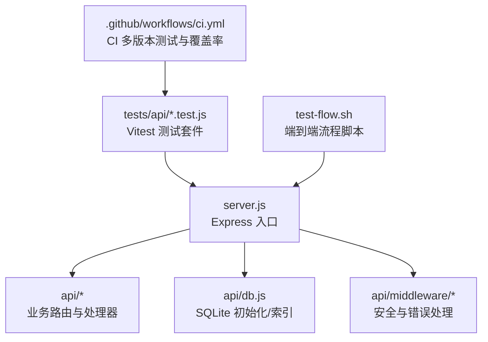
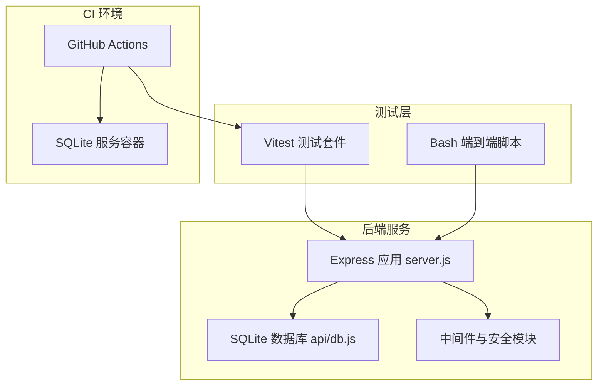
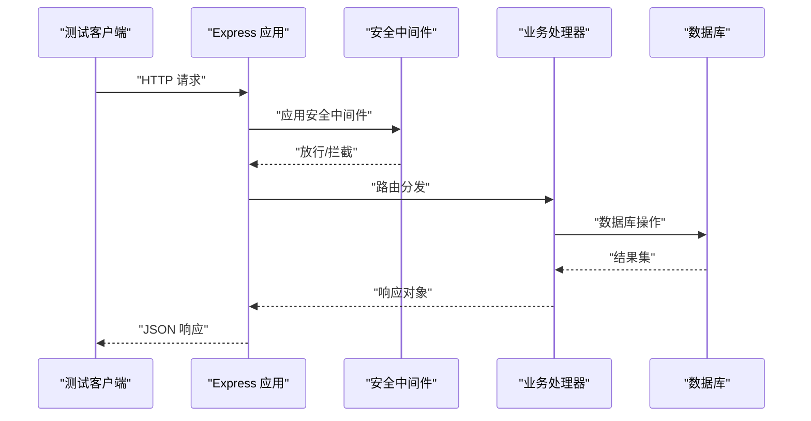
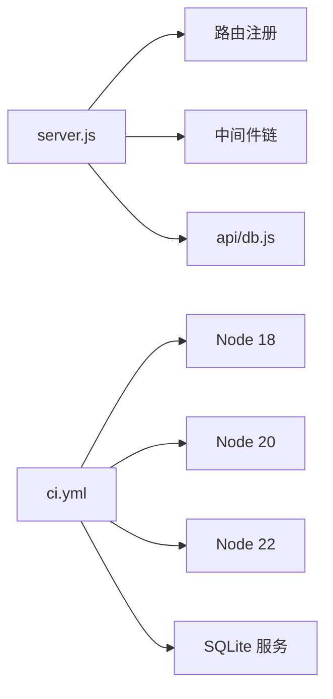

# 测试策略

<cite>
**本文引用的文件**
- [package.json](file://package.json)
- [vitest.config.js](file://vitest.config.js)
- [test-flow.sh](file://test-flow.sh)
- [.github/workflows/ci.yml](file://.github/workflows/ci.yml)
- [server.js](file://server.js)
- [api/db.js](file://api/db.js)
- [tests/api/p1-business-logic.test.js](file://tests/api/p1-business-logic.test.js)
- [tests/api/p2-ai-capability.test.js](file://tests/api/p2-ai-capability.test.js)
- [tests/api/p3-ux-alignment.test.js](file://tests/api/p3-ux-alignment.test.js)
- [tests/api/p4-education-deepening.test.js](file://tests/api/p4-education-deepening.test.js)
- [tests/api/p5-engineering.test.js](file://tests/api/p5-engineering.test.js)
- [tests/api/auth.test.js](file://tests/api/auth.test.js)
- [tests/api/proxy.test.js](file://tests/api/proxy.test.js)
- [tests/api/reset-password.test.js](file://tests/api/reset-password.test.js)
- [tests/api/db-and-json.test.js](file://tests/api/db-and-json.test.js)
</cite>

## 目录
1. 引言
2. 项目结构
3. 核心组件
4. 架构总览
5. 详细组件分析
6. 依赖分析
7. 性能考虑
8. 故障排查指南
9. 结论
10. 附录

## 引言
本测试策略文档面向“AI家教”项目，系统化定义单元测试、集成测试、API测试与性能测试的实施方法，明确测试框架配置、测试用例设计与测试数据管理方式；同时给出业务逻辑、AI能力、用户体验与工程测试的分类标准，覆盖测试覆盖率要求、持续集成配置与自动化测试流程，并提供测试环境搭建、测试数据准备与测试执行策略，以及性能基准、负载与压力测试方案。

## 项目结构
后端基于 Express 框架，路由集中在入口文件中统一注册，数据库通过独立模块提供连接与表结构初始化；测试采用 Vitest 进行单元/集成测试，配合 Bash 脚本进行端到端 API 流程验证；CI 使用 GitHub Actions 在多 Node 版本下运行测试并上传覆盖率报告。

图表来源
- [server.js:1-221](file://server.js#L1-L221)
- [api/db.js:1-478](file://api/db.js#L1-L478)
- [vitest.config.js:1-15](file://vitest.config.js#L1-L15)
- [test-flow.sh:1-101](file://test-flow.sh#L1-L101)
- [.github/workflows/ci.yml:1-85](file://.github/workflows/ci.yml#L1-L85)

章节来源
- [server.js:1-221](file://server.js#L1-L221)
- [api/db.js:1-478](file://api/db.js#L1-L478)
- [vitest.config.js:1-15](file://vitest.config.js#L1-L15)
- [test-flow.sh:1-101](file://test-flow.sh#L1-L101)
- [.github/workflows/ci.yml:1-85](file://.github/workflows/ci.yml#L1-L85)

## 核心组件
- 测试框架与配置
  - 使用 Vitest，全局启用、Node 环境、按 tests/**.test.js 包含规则扫描；覆盖率仅统计 api/**.js，排除 Swagger 与种子脚本。
  - 命令行脚本提供 test、test:watch、test:coverage 等常用任务。
- 测试分层与分类
  - p1-business-logic：业务规则与数据一致性校验
  - p2-ai-capability：AI 推理与提示词解析能力验证
  - p3-ux-alignment：前端交互与移动端适配一致性
  - p4-education-deepening：教育场景深度与知识点关联
  - p5-engineering：工程质量与健壮性（日志、限流、中间件）
- 端到端流程脚本
  - test-flow.sh 对省份、试卷、趋势等核心 API 进行链路验证，便于本地快速回归。
- CI/CD
  - 多 Node 版本矩阵测试，SQLite 服务容器，上传覆盖率报告，安全审计。

章节来源
- [vitest.config.js:1-15](file://vitest.config.js#L1-L15)
- [package.json:1-43](file://package.json#L1-L43)
- [tests/api/p1-business-logic.test.js](file://tests/api/p1-business-logic.test.js)
- [tests/api/p2-ai-capability.test.js](file://tests/api/p2-ai-capability.test.js)
- [tests/api/p3-ux-alignment.test.js](file://tests/api/p3-ux-alignment.test.js)
- [tests/api/p4-education-deepening.test.js](file://tests/api/p4-education-deepening.test.js)
- [tests/api/p5-engineering.test.js](file://tests/api/p5-engineering.test.js)
- [test-flow.sh:1-101](file://test-flow.sh#L1-L101)
- [.github/workflows/ci.yml:1-85](file://.github/workflows/ci.yml#L1-L85)

## 架构总览
下图展示测试体系与后端服务的交互关系：Vitest 单元/集成测试直接调用业务模块；端到端脚本通过 HTTP 访问真实服务；CI 在受控环境中拉起 SQLite 服务并执行测试。

图表来源
- [server.js:1-221](file://server.js#L1-L221)
- [api/db.js:1-478](file://api/db.js#L1-L478)
- [vitest.config.js:1-15](file://vitest.config.js#L1-L15)
- [test-flow.sh:1-101](file://test-flow.sh#L1-L101)
- [.github/workflows/ci.yml:1-85](file://.github/workflows/ci.yml#L1-L85)

## 详细组件分析

### 单元测试与集成测试
- 覆盖范围
  - 单元测试：聚焦业务模块函数与工具函数，确保边界条件、错误路径与返回值正确性。
  - 集成测试：围绕路由与数据库交互，验证 SQL 执行、索引使用与事务一致性。
- 关键实现要点
  - 使用 Vitest 的全局模式与 Node 环境，避免重复配置。
  - 通过 api/db.js 提供的 getDb() 获取连接，确保测试前数据库已初始化并建立索引。
  - 对于需要鉴权的接口，可在测试中构造认证上下文或使用代理处理器包装器。
- 分类测试用例示例（不展开代码）
  - 业务逻辑：参数校验、状态转换、报表生成、会话管理
  - 工程质量：速率限制、CORS、XSS 清洗、CSRF 保护、错误处理
  - 数据一致性：外键约束、唯一索引、列存在性与默认值
- 测试数据管理
  - 利用测试前钩子初始化最小化数据集，避免跨用例污染。
  - 对于 AI 相关模块，使用固定输入与期望输出，必要时引入 mock 或离线模型。

章节来源
- [vitest.config.js:1-15](file://vitest.config.js#L1-L15)
- [api/db.js:1-478](file://api/db.js#L1-L478)
- [tests/api/p1-business-logic.test.js](file://tests/api/p1-business-logic.test.js)
- [tests/api/p5-engineering.test.js](file://tests/api/p5-engineering.test.js)
- [tests/api/db-and-json.test.js](file://tests/api/db-and-json.test.js)

### API 测试
- 路由与中间件
  - server.js 统一注册路由，内置 CORS、速率限制、安全头、XSS 清洗、CSRF 保护与错误处理。
  - 鉴权中间件用于受保护端点，确保会话有效性与权限控制。
- 测试策略
  - 对公开端点进行正反向用例验证，包括参数缺失、非法格式、越权访问等。
  - 对受保护端点，先模拟登录获取令牌，再携带令牌发起请求。
  - 对代理与外部 LLM 能力，使用稳定响应的 mock 或离线模式，保证可重复性。
- 端到端流程
  - test-flow.sh 覆盖省份列表、详情、试卷查询、趋势分析等主流程，便于本地回归。

图表来源
- [server.js:140-205](file://server.js#L140-L205)
- [api/db.js:15-365](file://api/db.js#L15-L365)

章节来源
- [server.js:1-221](file://server.js#L1-L221)
- [tests/api/auth.test.js](file://tests/api/auth.test.js)
- [tests/api/proxy.test.js](file://tests/api/proxy.test.js)
- [tests/api/reset-password.test.js](file://tests/api/reset-password.test.js)
- [test-flow.sh:1-101](file://test-flow.sh#L1-L101)

### 性能测试
- 基准测试
  - 针对高频查询（如省份、试卷、知识点）建立基准，记录平均耗时与 P95/P99。
  - 使用 Vitest 的计时能力或 Node 内置性能 API，结合数据库索引命中情况评估优化空间。
- 负载测试
  - 使用压测工具对 /api/provinces、/api/exam-papers 等端点施加并发请求，观察吞吐与延迟变化。
  - 关注速率限制触发与错误率，评估限流策略的有效性。
- 压力测试
  - 逐步提升并发与数据规模，定位瓶颈（CPU、I/O、数据库锁竞争）。
  - 结合数据库 WAL 模式与索引策略，验证在高并发下的稳定性。

章节来源
- [api/db.js:23-25](file://api/db.js#L23-L25)
- [api/db.js:308-361](file://api/db.js#L308-L361)
- [server.js:44-46](file://server.js#L44-L46)

### 用户体验测试
- 移动端与桌面端差异
  - 通过 UA 判定返回不同入口页面，需分别验证移动端与桌面端的交互一致性。
- PWA 与静态资源
  - 验证 /app 与 /frontend 静态资源加载、缓存策略与离线能力。
- 交互一致性
  - 省份选择、试卷浏览、报告查看等关键路径应在不同设备上保持一致行为。

章节来源
- [server.js:77-104](file://server.js#L77-L104)
- [test-flow.sh:85-93](file://test-flow.sh#L85-L93)

### AI 能力验证
- 提示词解析与结构化解析
  - 针对 LLM 解析模块，使用标准化输入输出样例，确保解析稳定性与可扩展性。
- 代理与外部服务
  - 对 /api/proxy 的调用进行超时、重试与错误码覆盖，保证鲁棒性。
- 离线与回退
  - 在 CI 中使用离线模式或固定响应，确保测试可重复且不受外部依赖影响。

章节来源
- [tests/api/p2-ai-capability.test.js](file://tests/api/p2-ai-capability.test.js)
- [tests/api/proxy.test.js](file://tests/api/proxy.test.js)

### 教育场景深度测试
- 知识点与报表
  - 验证知识点聚合、弱项分析、学习路径生成等教育功能的数据一致性与算法正确性。
- 会话与练习
  - 考察练习记录、错题本、自适应难度等闭环流程的完整性与一致性。

章节来源
- [tests/api/p4-education-deepening.test.js](file://tests/api/p4-education-deepening.test.js)

## 依赖分析
- 组件耦合
  - server.js 将路由与中间件集中管理，降低模块间耦合；数据库初始化在 api/db.js 中完成，被各路由共享。
- 外部依赖
  - CI 使用 SQLite 服务容器，确保数据库可用性；Node 版本矩阵覆盖主流 LTS。
- 潜在风险
  - 速率限制与安全中间件可能影响测试并发度，需在测试中合理配置或绕过。

图表来源
- [server.js:1-221](file://server.js#L1-L221)
- [api/db.js:1-478](file://api/db.js#L1-L478)
- [.github/workflows/ci.yml:16-18](file://.github/workflows/ci.yml#L16-L18)

章节来源
- [server.js:1-221](file://server.js#L1-L221)
- [.github/workflows/ci.yml:1-85](file://.github/workflows/ci.yml#L1-L85)

## 性能考虑
- 数据库性能
  - 启用 WAL 模式与合理的 busy_timeout，确保并发写入稳定性。
  - 确保关键查询具备复合索引，避免全表扫描。
- 服务端性能
  - 合理设置速率限制，避免突发流量导致雪崩。
  - 静态资源缓存与无缓存策略区分，平衡更新与性能。
- 测试中的性能观测
  - 使用基准测试记录关键路径耗时，结合覆盖率与错误率形成综合指标。

章节来源
- [api/db.js:23-25](file://api/db.js#L23-L25)
- [api/db.js:308-361](file://api/db.js#L308-L361)
- [server.js:44-54](file://server.js#L44-L54)

## 故障排查指南
- 常见问题
  - 数据库未初始化：确认 api/db.js 的 getDb() 是否在测试前被调用。
  - 速率限制触发：调整测试并发或在测试中临时放宽限流策略。
  - CORS/安全头：检查 server.js 中的安全中间件与 CORS 配置。
  - 404 端点：核对 server.js 路由注册与路径前缀处理。
- 日志与错误
  - 使用 errorHandler 中间件捕获未处理异常，确保测试中可见错误堆栈。
  - 在 CI 中打印数据库健康状态与错误信息，辅助定位问题。

章节来源
- [server.js:205](file://server.js#L205)
- [server.js:126-136](file://server.js#L126-L136)

## 结论
本测试策略以 Vitest 为核心，结合端到端脚本与 CI 管道，覆盖业务逻辑、AI 能力、用户体验与工程质量四大维度。通过数据库初始化与索引保障、速率限制与安全中间件验证、以及基准/负载/压力测试，确保系统在多 Node 版本与 SQLite 环境下的稳定性与可维护性。建议持续完善测试用例与覆盖率目标，逐步引入可视化性能监控与告警机制。

## 附录

### 测试覆盖率要求（建议）
- 行覆盖率：≥80%
- 分支覆盖率：≥70%
- 函数覆盖率：≥85%
- 语句覆盖率：≥80%
- 覆盖范围：api/**/*.js（排除 Swagger 与种子脚本）

章节来源
- [vitest.config.js:8-12](file://vitest.config.js#L8-L12)

### 持续集成配置要点
- Node 版本矩阵：18/20/22
- 服务依赖：SQLite 服务容器
- 步骤：安装依赖 → Lint → 测试 → 上传覆盖率（Node 22）
- 安全审计：npm audit（中等及以上级别）

章节来源
- [.github/workflows/ci.yml:1-85](file://.github/workflows/ci.yml#L1-L85)

### 自动化测试流程
- 本地开发：npm run test:watch 实时反馈
- 提交前：npm run test 运行全部用例
- CI：自动执行多版本测试与覆盖率收集

章节来源
- [package.json:5-16](file://package.json#L5-L16)

### 测试环境搭建与数据准备
- 环境变量
  - JWT_SECRET：用于鉴权测试
  - DASHSCOPE_API_KEY：用于 AI 能力测试（可使用测试密钥）
  - NODE_ENV=test：确保测试环境隔离
- 数据准备
  - 通过 api/db.js 初始化数据库与索引
  - 在测试前钩子中插入最小化样例数据，避免跨用例干扰

章节来源
- [.github/workflows/ci.yml:37-40](file://.github/workflows/ci.yml#L37-L40)
- [api/db.js:15-365](file://api/db.js#L15-L365)

### 测试执行策略
- 分层执行
  - 单元测试：优先执行，快速反馈
  - 集成测试：验证路由与数据库交互
  - 端到端脚本：验证核心业务链路
- 并发与限流
  - 在测试中适当放宽限流，避免误判
  - 对外部依赖使用 mock 或离线模式

章节来源
- [server.js:44-46](file://server.js#L44-L46)
- [tests/api/p5-engineering.test.js](file://tests/api/p5-engineering.test.js)