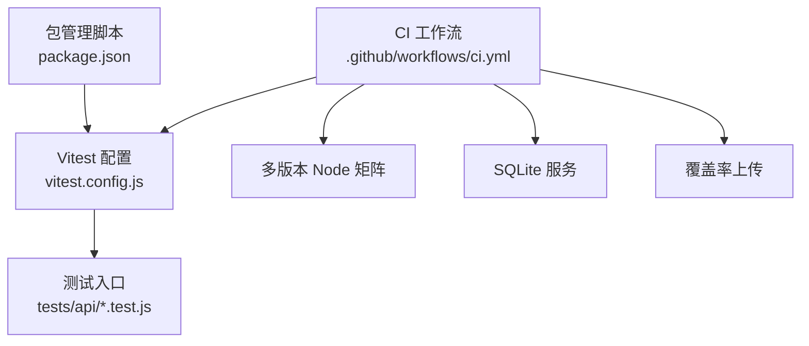
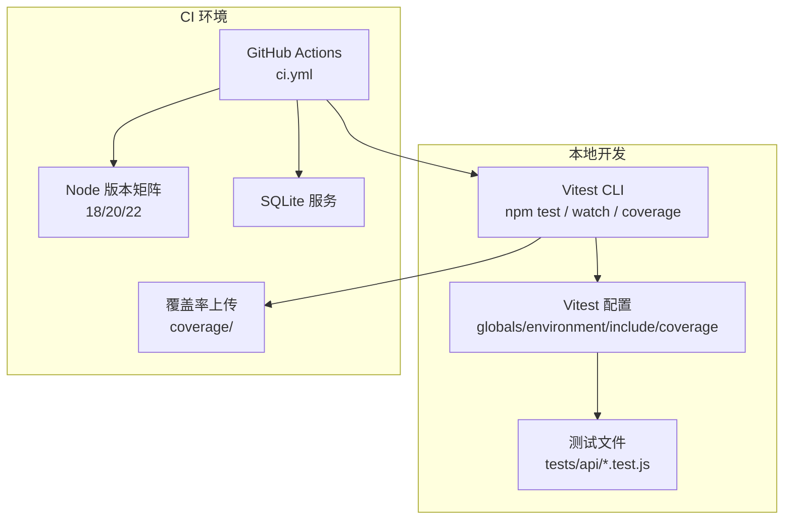
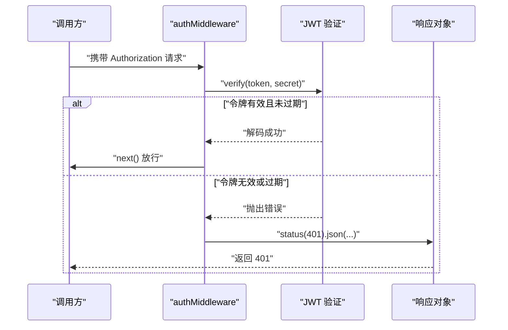
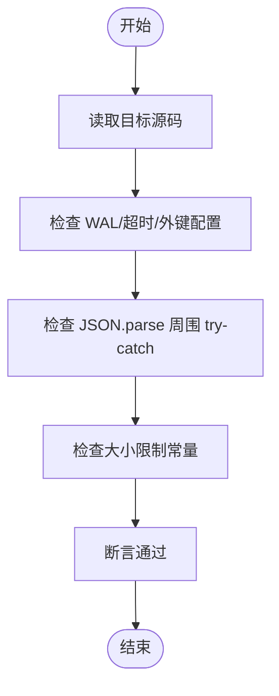
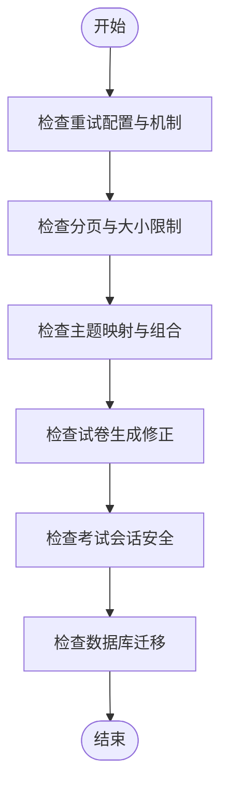
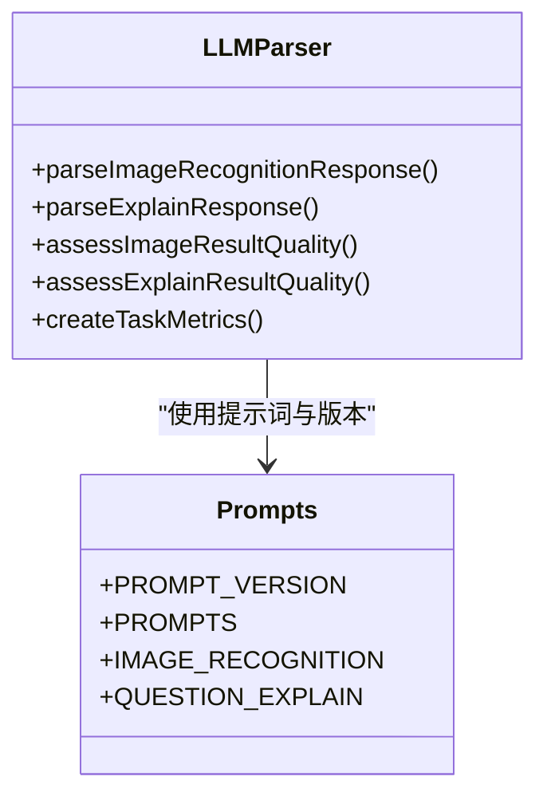
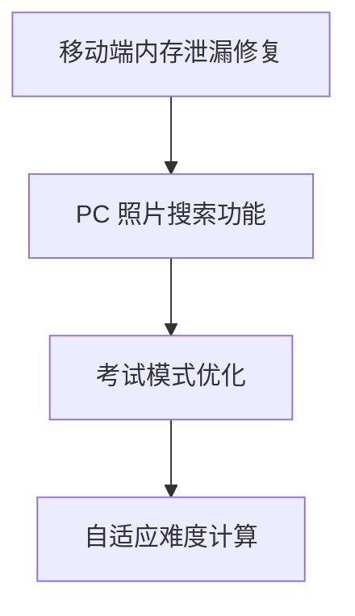
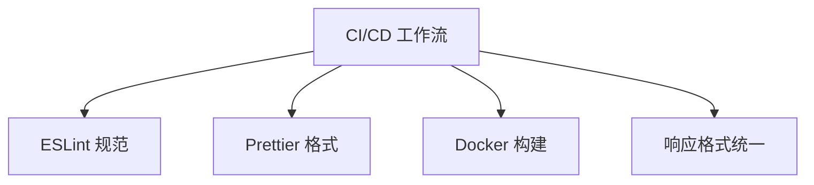
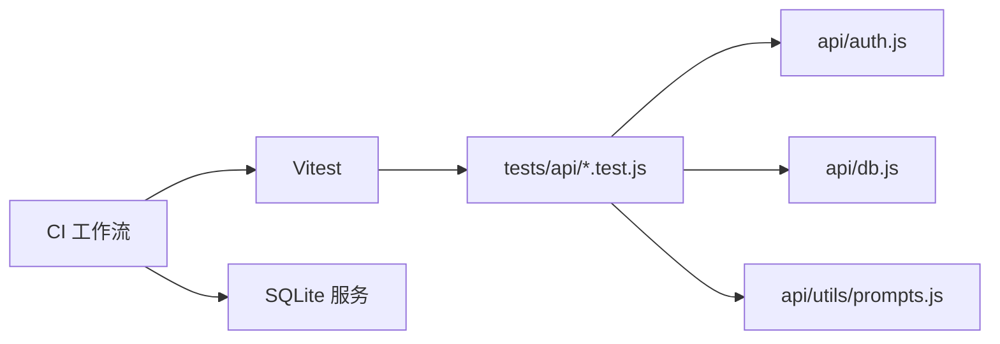

# 测试配置

<cite>
**本文引用的文件**
- [vitest.config.js](file://vitest.config.js)
- [package.json](file://package.json)
- [.github/workflows/ci.yml](file://.github/workflows/ci.yml)
- [tests/api/auth.test.js](file://tests/api/auth.test.js)
- [tests/api/db-and-json.test.js](file://tests/api/db-and-json.test.js)
- [tests/api/p1-business-logic.test.js](file://tests/api/p1-business-logic.test.js)
- [tests/api/p2-ai-capability.test.js](file://tests/api/p2-ai-capability.test.js)
- [tests/api/p3-ux-alignment.test.js](file://tests/api/p3-ux-alignment.test.js)
- [tests/api/p4-education-deepening.test.js](file://tests/api/p4-education-deepening.test.js)
- [tests/api/p5-engineering.test.js](file://tests/api/p5-engineering.test.js)
- [test-flow.sh](file://test-flow.sh)
- [api/auth.js](file://api/auth.js)
- [api/db.js](file://api/db.js)
- [api/explain-question.js](file://api/explain-question.js)
- [api/taskWorker.js](file://api/taskWorker.js)
- [api/utils/llmParser.js](file://api/utils/llmParser.js)
- [api/utils/prompts.js](file://api/utils/prompts.js)
- [api/utils/subjectMap.js](file://api/utils/subjectMap.js)
- [api/utils/response.js](file://api/utils/response.js)
- [api/middleware/security.js](file://api/middleware/security.js)
- [api/proxy.js](file://api/proxy.js)
- [api/gamification.js](file://api/gamification.js)
- [api/graphrag.js](file://api/graphrag.js)
- [api/knowledge-points.js](file://api/knowledge-points.js)
- [api/exam-session.js](file://api/exam-session.js)
- [api/adaptive-difficulty.js](file://api/adaptive-difficulty.js)
- [api/class-analysis.js](file://api/class-analysis.js)
- [api/questions.js](file://api/questions.js)
- [api/login.js](file://api/login.js)
- [api/register.js](file://api/register.js)
- [api/guest-login.js](file://api/guest-login.js)
- [api/reset-password.js](file://api/reset-password.js)
- [api/reports.js](file://api/reports.js)
- [api/tasks.js](file://api/tasks.js)
- [api/user-province.js](file://api/user-province.js)
- [api/exam-questions.js](file://api/exam-questions.js)
- [api/exam-papers.js](file://api/exam-papers.js)
- [api/provinces.js](file://api/provinces.js)
- [api/learning-dashboard.js](file://api/learning-dashboard.js)
- [api/learning-path.js](file://api/learning-path.js)
- [api/seed-provinces.js](file://api/seed-provinces.js)
- [api/graphrag_service/main.py](file://graphrag_service/main.py)
- [graphrag_service/config.py](file://graphrag_service/config.py)
- [scripts/split_by_subject.py](file://scripts/split_by_subject.py)
- [scripts/build_subject_indexes.py](file://scripts/build_subject_indexes.py)
- [scripts/run_graphrag_index.py](file://scripts/run_graphrag_index.py)
- [scripts/init_graphrag_service.sh](file://scripts/init_graphrag_service.sh)
- [setup.sh](file://setup.sh)
- [eslint.config.js](file://eslint.config.js)
- [Dockerfile](file://Dockerfile)
- [docker-compose.yml](file://docker-compose.yml)
- [uibe-tutor.service](file://uibe-tutor.service)
- [uibe.conf](file://uibe.conf)
</cite>

## 目录
1. [简介](#简介)
2. [项目结构](#项目结构)
3. [核心组件](#核心组件)
4. [架构总览](#架构总览)
5. [详细组件分析](#详细组件分析)
6. [依赖分析](#依赖分析)
7. [性能考虑](#性能考虑)
8. [故障排除指南](#故障排除指南)
9. [结论](#结论)
10. [附录](#附录)

## 简介
本文件面向AI家教项目的测试配置与运行，系统化说明Vitest测试框架的配置项、测试环境设置、运行参数、覆盖率与报告生成、CI/CD集成、测试数据管理与隔离、并行执行策略、调试技巧、性能优化与故障排除。内容基于仓库中的实际配置与测试文件进行提炼，帮助开发者快速搭建与维护高质量的测试体系。

## 项目结构
- 测试目录 tests/api 下按主题划分测试文件，涵盖鉴权、业务逻辑、AI能力、用户体验、教育深化、工程规范等维度。
- Vitest配置集中于 vitest.config.js，通过 include 指定测试文件范围，并启用全局API与Node环境。
- package.json 提供测试脚本与开发依赖，包括 Vitest。
- CI/CD 采用 GitHub Actions，在多 Node 版本矩阵下运行测试与安全审计，并在特定分支触发容器构建。

图表来源
- [vitest.config.js:1-15](file://vitest.config.js#L1-L15)
- [package.json:5-16](file://package.json#L5-L16)
- [.github/workflows/ci.yml:10-47](file://.github/workflows/ci.yml#L10-L47)

章节来源
- [vitest.config.js:1-15](file://vitest.config.js#L1-L15)
- [package.json:1-43](file://package.json#L1-L43)
- [.github/workflows/ci.yml:1-85](file://.github/workflows/ci.yml#L1-L85)

## 核心组件
- Vitest 配置
  - 全局API启用：使测试文件无需导入即可使用 describe、it、expect 等。
  - 运行环境：Node 环境，便于后端接口与数据库测试。
  - 测试文件匹配：include 指向 tests/**/*.test.js。
  - 覆盖率：provider 使用 V8；仅对 api/**/*.js 进行统计；排除 Swagger 与种子脚本。
- 测试脚本
  - 命令行脚本：test、test:watch、test:coverage 分别对应运行、监听与覆盖率运行。
- CI/CD
  - 多 Node 版本矩阵：18/20/22。
  - 环境变量：JWT_SECRET、DASHSCOPE_API_KEY、NODE_ENV=test。
  - 服务：内置 SQLite 服务用于数据库测试。
  - 覆盖率产物上传：仅在 Node 22 的一次作业中上传 coverage 目录。

章节来源
- [vitest.config.js:3-14](file://vitest.config.js#L3-L14)
- [package.json:9-11](file://package.json#L9-L11)
- [.github/workflows/ci.yml:12-47](file://.github/workflows/ci.yml#L12-L47)

## 架构总览
下图展示测试配置与运行的整体关系：Vitest 读取配置，扫描测试文件，按环境变量与覆盖率规则执行，并在 CI 中与服务、覆盖率上传联动。

图表来源
- [vitest.config.js:3-14](file://vitest.config.js#L3-L14)
- [package.json:9-11](file://package.json#L9-L11)
- [.github/workflows/ci.yml:12-47](file://.github/workflows/ci.yml#L12-L47)

## 详细组件分析

### 组件A：鉴权与安全中间件测试
- 覆盖要点
  - JWT 密钥校验：缺失或默认值时应退出；短密钥给出警告；强密钥通过。
  - 中间件行为：无授权头返回401；无效令牌返回401；过期令牌返回明确信息；有效令牌放行并注入用户信息。
- 环境隔离
  - 使用 beforeEach/afterEach 在测试前后恢复 JWT_SECRET，避免跨用例污染。
- 关键实现参考
  - 鉴权模块与密钥校验逻辑位于 api/auth.js。
  - 测试文件路径：tests/api/auth.test.js。

图表来源
- [tests/api/auth.test.js:61-115](file://tests/api/auth.test.js#L61-L115)
- [api/auth.js:12-36](file://api/auth.js#L12-L36)

章节来源
- [tests/api/auth.test.js:1-117](file://tests/api/auth.test.js#L1-L117)
- [api/auth.js:12-36](file://api/auth.js#L12-L36)

### 组件B：数据库与JSON安全测试
- 覆盖要点
  - SQLite 配置：WAL 模式、busy_timeout、外键约束等。
  - JSON 解析保护：questions.js 与 knowledge-points.js 对 JSON.parse 周围包裹 try-catch，并限制输入大小。
- 实施方式
  - 通过读取源码字符串断言包含相应关键字与配置片段。
- 关键实现参考
  - 数据库初始化与配置位于 api/db.js。
  - JSON 安全处理位于 api/questions.js 与 api/knowledge-points.js。
  - 测试文件路径：tests/api/db-and-json.test.js。

图表来源
- [tests/api/db-and-json.test.js:3-44](file://tests/api/db-and-json.test.js#L3-L44)
- [api/db.js:1-10](file://api/db.js#L1-L10)
- [api/questions.js:1-100](file://api/questions.js#L1-L100)
- [api/knowledge-points.js:1-100](file://api/knowledge-points.js#L1-L100)

章节来源
- [tests/api/db-and-json.test.js:1-45](file://tests/api/db-and-json.test.js#L1-L45)
- [api/db.js:1-10](file://api/db.js#L1-L10)
- [api/questions.js:1-100](file://api/questions.js#L1-L100)
- [api/knowledge-points.js:1-100](file://api/knowledge-points.js#L1-L100)

### 组件C：业务逻辑与任务工作流测试
- 覆盖要点
  - 任务重试机制：最大重试次数、指数退避延迟、过期任务恢复、API Key 校验、达到上限标记失败。
  - 分页与校验：limit/offset、默认与上限、分页响应封装、数据大小限制。
  - 主题映射统一：subjectMap 与 subjectCombinations 的一致性与关键词映射。
  - 试卷生成修正：除零保护、科目名称兼容、分数计算、弱考点检测。
  - 考试会话安全：UUID 会话ID、答案数组校验、问题ID归属校验、数值安全转换、分页安全。
  - 数据库迁移：任务队列表新增 retry_count 列。
- 关键实现参考
  - 任务工作流与指标记录位于 api/taskWorker.js。
  - 业务逻辑与修复位于 api/generate-paper.js、api/exam-session.js、api/db.js。
  - 测试文件路径：tests/api/p1-business-logic.test.js。

图表来源
- [tests/api/p1-business-logic.test.js:3-324](file://tests/api/p1-business-logic.test.js#L3-L324)
- [api/taskWorker.js:1-200](file://api/taskWorker.js#L1-L200)
- [api/generate-paper.js:1-250](file://api/generate-paper.js#L1-L250)
- [api/exam-session.js:1-300](file://api/exam-session.js#L1-L300)
- [api/db.js:1-100](file://api/db.js#L1-L100)

章节来源
- [tests/api/p1-business-logic.test.js:1-325](file://tests/api/p1-business-logic.test.js#L1-L325)
- [api/taskWorker.js:1-200](file://api/taskWorker.js#L1-L200)
- [api/generate-paper.js:1-250](file://api/generate-paper.js#L1-L250)
- [api/exam-session.js:1-300](file://api/exam-session.js#L1-L300)
- [api/db.js:1-100](file://api/db.js#L1-L100)

### 组件D：AI能力与提示词测试
- 覆盖要点
  - 任务指标表与统计：质量评分、处理时间、Token 使用、提示词版本。
  - 提示词版本管理：统一导出版本号与模型参数。
  - LLM 响应解析增强：去除<think>标签、标准JSON、代码块包裹、尾随文本、尾逗号、转义换行、质量评估。
  - 弱考点算法升级：匹配关键词、置信度归一、排序与字段优先级。
- 关键实现参考
  - 解析器与提示词位于 api/utils/llmParser.js 与 api/utils/prompts.js。
  - 测试文件路径：tests/api/p2-ai-capability.test.js。

图表来源
- [tests/api/p2-ai-capability.test.js:12-267](file://tests/api/p2-ai-capability.test.js#L12-L267)
- [api/utils/llmParser.js:1-200](file://api/utils/llmParser.js#L1-L200)
- [api/utils/prompts.js:1-100](file://api/utils/prompts.js#L1-L100)

章节来源
- [tests/api/p2-ai-capability.test.js:1-422](file://tests/api/p2-ai-capability.test.js#L1-L422)
- [api/utils/llmParser.js:1-200](file://api/utils/llmParser.js#L1-L200)
- [api/utils/prompts.js:1-100](file://api/utils/prompts.js#L1-L100)

### 组件E：用户体验与自适应难度测试
- 覆盖要点
  - 移动端SPA 内存泄漏修复：清理计时器、AbortController、页面事件监听、Cropper 销毁。
  - PC 照片搜索功能：模态框、摄像头控制、文件上传、代理请求、XSS 防护。
  - 考试模式优化：倒计时/正计时切换、低时长告警颜色、可见性变更防作弊、API 暴露。
  - 自适应难度：用户能力计算、弱考点比例影响、难度边界钳制、路由注册与导入。
- 关键实现参考
  - 自适应难度位于 api/adaptive-difficulty.js。
  - 测试文件路径：tests/api/p3-ux-alignment.test.js。

图表来源
- [tests/api/p3-ux-alignment.test.js:4-337](file://tests/api/p3-ux-alignment.test.js#L4-L337)
- [api/adaptive-difficulty.js:1-200](file://api/adaptive-difficulty.js#L1-L200)

章节来源
- [tests/api/p3-ux-alignment.test.js:1-338](file://tests/api/p3-ux-alignment.test.js#L1-L338)
- [api/adaptive-difficulty.js:1-200](file://api/adaptive-difficulty.js#L1-L200)

### 组件F：教育深化与模板扩展测试
- 覆盖要点
  - 知识点扩展：KEYWORD_MAP 覆盖 9 个学科、前缀规范化、核心关键词更新。
  - 高考选科适配：3+1+2/3+3/traditional 模型、组合枚举、科目归属判断。
  - 新题型模板：填空与解答模板、生物/历史/地理模板、现有学科模板扩充。
  - 作文多维评分：四个维度、满分为 20 分、总分 0-80。
  - 班级分析增强：学生表现、班级弱项、周趋势、分数分布、进度与历史查询。
- 关键实现参考
  - 主题映射与组合位于 api/utils/subjectMap.js 与 api/utils/subjectCombinations.js。
  - 测试文件路径：tests/api/p4-education-deepening.test.js。

图表来源
- [tests/api/p4-education-deepening.test.js:12-398](file://tests/api/p4-education-deepening.test.js#L12-L398)
- [api/utils/subjectMap.js:1-200](file://api/utils/subjectMap.js#L1-200)
- [api/utils/subjectCombinations.js:1-200](file://api/utils/subjectCombinations.js#L1-200)

章节来源
- [tests/api/p4-education-deepening.test.js:1-399](file://tests/api/p4-education-deepening.test.js#L1-L399)
- [api/utils/subjectMap.js:1-200](file://api/utils/subjectMap.js#L1-200)
- [api/utils/subjectCombinations.js:1-200](file://api/utils/subjectCombinations.js#L1-200)

### 组件G：工程规范与容器化测试
- 覆盖要点
  - CI/CD：GitHub Actions 工作流、多 Node 版本矩阵、安全审计、Docker 构建。
  - 代码规范：ESLint + Prettier 配置与脚本。
  - 容器化：Dockerfile、docker-compose、.dockerignore。
  - API 响应格式统一：validateResponseFormat、errorResponse 导入与使用。
- 关键实现参考
  - 工程规范与容器化位于 tests/api/p5-engineering.test.js。
  - 响应格式工具位于 api/utils/response.js。
  - 测试文件路径：tests/api/p5-engineering.test.js。

图表来源
- [tests/api/p5-engineering.test.js:4-328](file://tests/api/p5-engineering.test.js#L4-L328)
- [api/utils/response.js:1-100](file://api/utils/response.js#L1-L100)

章节来源
- [tests/api/p5-engineering.test.js:1-329](file://tests/api/p5-engineering.test.js#L1-L329)
- [api/utils/response.js:1-100](file://api/utils/response.js#L1-L100)

## 依赖分析
- 测试框架与工具
  - Vitest 作为核心测试框架，提供快照、覆盖率、Mock 等能力。
  - ESLint 与 Prettier 保障代码风格一致，减少测试与主业务耦合风险。
- 外部服务
  - CI 中使用 SQLite 服务镜像，确保数据库相关测试稳定。
  - DASHSCOPE_API_KEY 用于 AI 能力测试，需在 CI 环境变量中提供。
- 关键依赖链
  - 测试文件依赖业务模块（如 auth.js、db.js、prompts.js 等），通过相对路径导入。
  - CI 通过 npm test 调用 Vitest，自动加载 vitest.config.js。

图表来源
- [vitest.config.js:3-14](file://vitest.config.js#L3-L14)
- [tests/api/auth.test.js:1-117](file://tests/api/auth.test.js#L1-L117)
- [tests/api/db-and-json.test.js:1-45](file://tests/api/db-and-json.test.js#L1-L45)
- [tests/api/p2-ai-capability.test.js:1-422](file://tests/api/p2-ai-capability.test.js#L1-L422)
- [.github/workflows/ci.yml:16-18](file://.github/workflows/ci.yml#L16-L18)

章节来源
- [vitest.config.js:3-14](file://vitest.config.js#L3-L14)
- [package.json:31-40](file://package.json#L31-L40)
- [.github/workflows/ci.yml:16-18](file://.github/workflows/ci.yml#L16-L18)

## 性能考虑
- 并行执行
  - Vitest 默认支持并发测试，可在 CI 中通过矩阵并行不同 Node 版本，缩短整体耗时。
- 覆盖率粒度
  - 当前仅对 api 层进行覆盖率统计，有助于聚焦核心业务逻辑；若需前端覆盖率，可扩展 include 与 exclude。
- 监听模式
  - 使用 test:watch 在本地开发时快速反馈测试结果，提升迭代效率。
- 数据库与外部服务
  - CI 中使用 SQLite 服务镜像，避免真实数据库连接开销；对外部 API（如 DashScope）建议使用 Mock 或稳定的测试密钥。

章节来源
- [package.json:10-11](file://package.json#L10-L11)
- [vitest.config.js:8-12](file://vitest.config.js#L8-L12)
- [.github/workflows/ci.yml:12-14](file://.github/workflows/ci.yml#L12-L14)

## 故障排除指南
- JWT_SECRET 未设置或默认值
  - 现象：鉴权校验直接退出或发出警告。
  - 排查：确认环境变量是否正确设置，长度满足要求。
  - 参考：tests/api/auth.test.js 与 api/auth.js。
- JSON 解析异常
  - 现象：解析失败导致业务中断。
  - 排查：检查 questions.js 与 knowledge-points.js 是否包含 try-catch 与大小限制。
  - 参考：tests/api/db-and-json.test.js。
- 任务重试与过期任务
  - 现象：任务长时间未完成或重复执行。
  - 排查：核对 taskWorker.js 中重试次数、延迟与过期恢复逻辑。
  - 参考：tests/api/p1-business-logic.test.js。
- 提示词与响应解析
  - 现象：LLM 输出不稳定或解析失败。
  - 排查：确认 llmParser.js 的解析增强逻辑与 prompts.js 的版本号。
  - 参考：tests/api/p2-ai-capability.test.js。
- CI 覆盖率上传失败
  - 现象：覆盖率产物未上传。
  - 排查：确认 CI 步骤仅在指定 Node 版本执行，且 coverage 目录存在。
  - 参考：.github/workflows/ci.yml。

章节来源
- [tests/api/auth.test.js:13-58](file://tests/api/auth.test.js#L13-L58)
- [api/auth.js:12-36](file://api/auth.js#L12-L36)
- [tests/api/db-and-json.test.js:17-44](file://tests/api/db-and-json.test.js#L17-L44)
- [tests/api/p1-business-logic.test.js:39-59](file://tests/api/p1-business-logic.test.js#L39-L59)
- [tests/api/p2-ai-capability.test.js:150-267](file://tests/api/p2-ai-capability.test.js#L150-L267)
- [.github/workflows/ci.yml:42-47](file://.github/workflows/ci.yml#L42-L47)

## 结论
本项目基于 Vitest 构建了覆盖鉴权、业务逻辑、AI 能力、用户体验、教育深化与工程规范的测试体系。通过 CI 多版本矩阵与 SQLite 服务保障稳定性，结合覆盖率与报告上传形成闭环。建议后续扩展前端覆盖率、引入更细粒度的 Mock 与数据库事务隔离，持续提升测试效率与质量。

## 附录

### A. 测试环境搭建步骤
- 安装依赖
  - 使用 npm ci 安装依赖，确保与 lock 文件一致。
- 启动服务
  - 在 CI 中使用 SQLite 服务镜像；本地可按需启动数据库或使用内存数据库。
- 设置环境变量
  - CI 中已设置 JWT_SECRET、DASHSCOPE_API_KEY、NODE_ENV=test。
- 运行测试
  - npm test 运行全部测试；npm run test:watch 以监听模式运行；npm run test:coverage 生成覆盖率报告。

章节来源
- [.github/workflows/ci.yml:29-40](file://.github/workflows/ci.yml#L29-L40)
- [package.json:9-11](file://package.json#L9-L11)

### B. 测试配置参数详解
- globals
  - 作用：启用全局测试 API，简化测试文件导入。
  - 参考：vitest.config.js。
- environment
  - 作用：指定测试运行环境为 Node，便于后端接口与数据库测试。
  - 参考：vitest.config.js。
- include
  - 作用：定义测试文件匹配模式，统一扫描 tests/**/*.test.js。
  - 参考：vitest.config.js。
- coverage.provider
  - 作用：使用 V8 提供覆盖率统计。
  - 参考：vitest.config.js。
- coverage.include/exclude
  - 作用：限定统计范围，排除 Swagger 与种子脚本，聚焦核心业务。
  - 参考：vitest.config.js。

章节来源
- [vitest.config.js:3-14](file://vitest.config.js#L3-L14)

### C. 测试数据管理与隔离
- 环境变量隔离
  - 鉴权测试通过 beforeEach/afterEach 恢复 JWT_SECRET，避免跨用例污染。
  - 参考：tests/api/auth.test.js。
- 文件级断言
  - 通过读取源码字符串断言配置与安全措施，确保实现符合预期。
  - 参考：tests/api/db-and-json.test.js、tests/api/p1-business-logic.test.js。
- 外部依赖隔离
  - 通过 CI 环境变量提供 DASHSCOPE_API_KEY；本地可使用 Mock 或占位值。

章节来源
- [tests/api/auth.test.js:6-11](file://tests/api/auth.test.js#L6-L11)
- [tests/api/db-and-json.test.js:3-14](file://tests/api/db-and-json.test.js#L3-L14)
- [.github/workflows/ci.yml:37-40](file://.github/workflows/ci.yml#L37-L40)

### D. 并行测试执行
- CI 矩阵并行
  - 通过 Node 版本矩阵并行执行测试，缩短整体耗时。
  - 参考：.github/workflows/ci.yml。
- 本地监听
  - 使用 test:watch 快速反馈测试结果，适合开发阶段。
  - 参考：package.json。

章节来源
- [.github/workflows/ci.yml:12-14](file://.github/workflows/ci.yml#L12-L14)
- [package.json:10](file://package.json#L10)

### E. 覆盖率与报告生成
- 覆盖率配置
  - provider 为 v8；include 限定为 api/**/*；exclude 排除 Swagger 与种子脚本。
  - 参考：vitest.config.js。
- 报告上传
  - CI 中仅在 Node 22 的一次作业中上传 coverage 目录。
  - 参考：.github/workflows/ci.yml。

章节来源
- [vitest.config.js:8-12](file://vitest.config.js#L8-L12)
- [.github/workflows/ci.yml:42-47](file://.github/workflows/ci.yml#L42-L47)

### F. CI/CD 集成设置
- 工作流文件
  - .github/workflows/ci.yml 定义测试、安全审计与 Docker 构建。
- 服务与环境
  - 使用 SQLite 服务镜像；设置 JWT_SECRET、DASHSCOPE_API_KEY、NODE_ENV。
- 多版本矩阵
  - Node 18/20/22 并行执行，提升兼容性验证效率。
- 容器构建
  - 仅在 main 分支触发 Docker 构建，便于发布。

章节来源
- [.github/workflows/ci.yml:1-85](file://.github/workflows/ci.yml#L1-L85)

### G. 测试调试技巧
- 使用 Vitest 监听模式
  - npm run test:watch 在文件变化时自动重新运行测试。
- 断言与日志
  - 在测试中保留必要的 console 输出以便定位问题。
- Mock 与 Stub
  - 对外部服务（如 DashScope）使用 Mock，减少网络波动对测试的影响。
- 逐步缩小范围
  - 通过 describe/it 分层组织测试，先运行最小可复现用例，再逐步扩大范围。

章节来源
- [package.json:10](file://package.json#L10)

### H. 性能优化建议
- 缩小测试范围
  - 仅对核心模块（api）进行覆盖率统计，减少无关文件干扰。
- 并行化
  - 利用 CI 矩阵并行不同 Node 版本，缩短总耗时。
- 本地缓存
  - 使用 npm ci 与缓存策略，减少依赖安装时间。
- 减少外部依赖
  - 将对外部 API 的调用替换为 Mock，避免网络延迟与不可用。

章节来源
- [vitest.config.js:8-12](file://vitest.config.js#L8-L12)
- [.github/workflows/ci.yml:12-14](file://.github/workflows/ci.yml#L12-L14)

### I. 测试数据与脚本
- 测试流程脚本
  - test-flow.sh 提供端到端流程验证示例，便于手动回归。
  - 参考：test-flow.sh。
- 图数据库索引脚本
  - scripts/split_by_subject.py 与 scripts/build_subject_indexes.py 用于知识图谱索引准备。
  - 参考：scripts/split_by_subject.py、scripts/build_subject_indexes.py。
- GraphRAG 服务
  - graphrag_service 目录包含 Python 服务与配置，配合后端使用。
  - 参考：graphrag_service/main.py、graphrag_service/config.py。

章节来源
- [test-flow.sh:1-101](file://test-flow.sh#L1-L101)
- [scripts/split_by_subject.py:1-100](file://scripts/split_by_subject.py#L1-L100)
- [scripts/build_subject_indexes.py:1-100](file://scripts/build_subject_indexes.py#L1-L100)
- [graphrag_service/main.py:1-100](file://graphrag_service/main.py#L1-L100)
- [graphrag_service/config.py:1-100](file://graphrag_service/config.py#L1-L100)