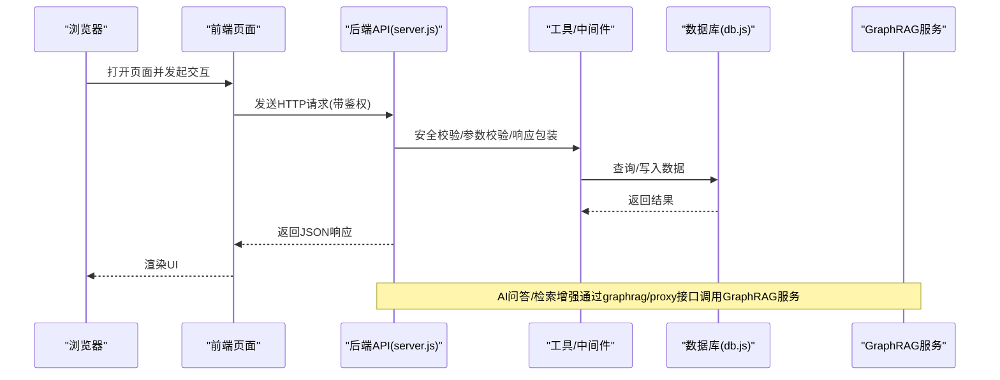
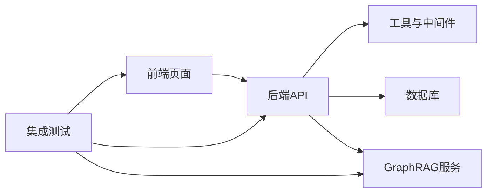

# 集成测试

<cite>
**本文引用的文件**
- [server.js](file://server.js)
- [package.json](file://package.json)
- [vitest.config.js](file://vitest.config.js)
- [test-flow.sh](file://test-flow.sh)
- [api/auth.js](file://api/auth.js)
- [api/login.js](file://api/login.js)
- [api/register.js](file://api/register.js)
- [api/reset-password.js](file://api/reset-password.js)
- [api/exam-session.js](file://api/exam-session.js)
- [api/explain-question.js](file://api/explain-question.js)
- [api/graphrag.js](file://api/graphrag.js)
- [api/proxy.js](file://api/proxy.js)
- [api/knowledge-points.js](file://api/knowledge-points.js)
- [api/learning-dashboard.js](file://api/learning-dashboard.js)
- [api/adaptive-difficulty.js](file://api/adaptive-difficulty.js)
- [api/gamification.js](file://api/gamification.js)
- [api/reports.js](file://api/reports.js)
- [api/tasks.js](file://api/tasks.js)
- [api/db.js](file://api/db.js)
- [api/middleware/security.js](file://api/middleware/security.js)
- [api/middleware/errorHandler.js](file://api/middleware/errorHandler.js)
- [api/utils/cache.js](file://api/utils/cache.js)
- [api/utils/llmParser.js](file://api/utils/llmParser.js)
- [api/utils/prompts.js](file://api/utils/prompts.js)
- [api/utils/response.js](file://api/utils/response.js)
- [api/utils/validator.js](file://api/utils/validator.js)
- [api/utils/subjectMap.js](file://api/utils/subjectMap.js)
- [api/utils/subjectCombinations.js](file://api/utils/subjectCombinations.js)
- [frontend/components.js](file://frontend/components.js)
- [frontend/dashboard.html](file://frontend/dashboard.html)
- [frontend/login.html](file://frontend/login.html)
- [frontend/register.html](file://frontend/register.html)
- [frontend/math-exam.html](file://frontend/math-exam.html)
- [frontend/chinese-exam.html](file://frontend/chinese-exam.html)
- [frontend/chemistry-exam.html](file://frontend/chemistry-exam.html)
- [frontend/english-exam.html](file://frontend/english-exam.html)
- [frontend/politics-exam.html](file://frontend/politics-exam.html)
- [frontend/wrong-book.html](file://frontend/wrong-book.html)
- [frontend/my-reports.html](file://frontend/my-reports.html)
- [frontend/my-weak-points.html](file://frontend/my-weak-points.html)
- [frontend/question-explainer.html](file://frontend/question-explainer.html)
- [frontend/personalized-paper.html](file://frontend/personalized-paper.html)
- [frontend/exam-view.html](file://frontend/exam-view.html)
- [frontend/learning-path.html](file://frontend/learning-path.html)
- [frontend/province-selector.js](file://frontend/province-selector.js)
- [frontend/theme-utils.js](file://frontend/theme-utils.js)
- [frontend/exam-mode.js](file://frontend/exam-mode.js)
- [frontend/qr.js](file://frontend/qr.js)
- [graphrag_service/main.py](file://graphrag_service/main.py)
- [graphrag_service/config.py](file://graphrag_service/config.py)
- [graphrag_service/db.py](file://graphrag_service/db.py)
- [graphrag_service/indexer.py](file://graphrag_service/indexer.py)
- [scripts/init_graphrag_service.sh](file://scripts/init_graphrag_service.sh)
- [scripts/setup_graphrag.sh](file://scripts/setup_graphrag.sh)
- [tests/api/p1-business-logic.test.js](file://tests/api/p1-business-logic.test.js)
- [tests/api/p2-ai-capability.test.js](file://tests/api/p2-ai-capability.test.js)
- [tests/api/p3-ux-alignment.test.js](file://tests/api/p3-ux-alignment.test.js)
- [tests/api/p4-education-deepening.test.js](file://tests/api/p4-education-deepening.test.js)
- [tests/api/p5-engineering.test.js](file://tests/api/p5-engineering.test.js)
- [tests/api/auth.test.js](file://tests/api/auth.test.js)
- [tests/api/proxy.test.js](file://tests/api/proxy.test.js)
- [tests/api/reset-password.test.js](file://tests/api/reset-password.test.js)
- [tests/api/db-and-json.test.js](file://tests/api/db-and-json.test.js)
</cite>

## 目录
1. [引言](#引言)
2. [项目结构](#项目结构)
3. [核心组件](#核心组件)
4. [架构总览](#架构总览)
5. [详细组件分析](#详细组件分析)
6. [依赖分析](#依赖分析)
7. [性能考虑](#性能考虑)
8. [故障排查指南](#故障排查指南)
9. [结论](#结论)
10. [附录](#附录)

## 引言
本集成测试文档面向AI家教项目，围绕业务逻辑、AI能力、用户体验、教育深度与工程质量五个层级，系统化设计端到端测试方案。目标是通过可重复、可度量的测试流程，验证功能完整性、AI服务集成稳定性、用户界面一致性、系统性能与可靠性，并覆盖跨模块与API集成测试。

## 项目结构
项目采用前后端分离架构：后端基于Node.js（Express风格）提供REST API；前端HTML/JS页面负责展示与交互；GraphRAG服务作为独立Python微服务提供知识检索增强；数据库脚本与种子数据用于初始化与验证；测试位于tests/api目录下，按层级划分用例。

```mermaid
graph TB
subgraph "后端服务"
S["server.js<br/>应用入口"]
A1["api/auth.js"]
A2["api/login.js"]
A3["api/register.js"]
A4["api/reset-password.js"]
A5["api/exam-session.js"]
A6["api/explain-question.js"]
A7["api/graphrag.js"]
A8["api/proxy.js"]
A9["api/knowledge-points.js"]
A10["api/learning-dashboard.js"]
A11["api/adaptive-difficulty.js"]
A12["api/gamification.js"]
A13["api/reports.js"]
A14["api/tasks.js"]
U1["api/utils/*"]
M1["api/middleware/*"]
D1["api/db.js"]
end
subgraph "前端"
F1["frontend/*.html<br/>页面与组件"]
F2["frontend/components.js"]
F3["frontend/theme-utils.js"]
F4["frontend/province-selector.js"]
F5["frontend/exam-mode.js"]
end
subgraph "GraphRAG服务"
G1["graphrag_service/main.py"]
G2["graphrag_service/config.py"]
G3["graphrag_service/db.py"]
G4["graphrag_service/indexer.py"]
end
subgraph "测试"
T1["tests/api/p1-business-logic.test.js"]
T2["tests/api/p2-ai-capability.test.js"]
T3["tests/api/p3-ux-alignment.test.js"]
T4["tests/api/p4-education-deepening.test.js"]
T5["tests/api/p5-engineering.test.js"]
T6["tests/api/auth.test.js"]
T7["tests/api/proxy.test.js"]
T8["tests/api/reset-password.test.js"]
T9["tests/api/db-and-json.test.js"]
end
S --> A1
S --> A2
S --> A3
S --> A4
S --> A5
S --> A6
S --> A7
S --> A8
S --> A9
S --> A10
S --> A11
S --> A12
S --> A13
S --> A14
A1 --> U1
A2 --> U1
A3 --> U1
A4 --> U1
A5 --> U1
A6 --> U1
A7 --> G1
A8 --> G1
A9 --> D1
A10 --> D1
A11 --> D1
A12 --> D1
A13 --> D1
A14 --> D1
F1 --> S
F2 --> S
F3 --> S
F4 --> S
F5 --> S
T1 --> S
T2 --> S
T3 --> S
T4 --> S
T5 --> S
T6 --> S
T7 --> S
T8 --> S
T9 --> S
```

图表来源
- [server.js](file://server.js)
- [api/auth.js](file://api/auth.js)
- [api/login.js](file://api/login.js)
- [api/register.js](file://api/register.js)
- [api/reset-password.js](file://api/reset-password.js)
- [api/exam-session.js](file://api/exam-session.js)
- [api/explain-question.js](file://api/explain-question.js)
- [api/graphrag.js](file://api/graphrag.js)
- [api/proxy.js](file://api/proxy.js)
- [api/knowledge-points.js](file://api/knowledge-points.js)
- [api/learning-dashboard.js](file://api/learning-dashboard.js)
- [api/adaptive-difficulty.js](file://api/adaptive-difficulty.js)
- [api/gamification.js](file://api/gamification.js)
- [api/reports.js](file://api/reports.js)
- [api/tasks.js](file://api/tasks.js)
- [api/db.js](file://api/db.js)
- [api/utils/cache.js](file://api/utils/cache.js)
- [api/utils/llmParser.js](file://api/utils/llmParser.js)
- [api/utils/prompts.js](file://api/utils/prompts.js)
- [api/utils/response.js](file://api/utils/response.js)
- [api/utils/validator.js](file://api/utils/validator.js)
- [api/utils/subjectMap.js](file://api/utils/subjectMap.js)
- [api/utils/subjectCombinations.js](file://api/utils/subjectCombinations.js)
- [api/middleware/security.js](file://api/middleware/security.js)
- [api/middleware/errorHandler.js](file://api/middleware/errorHandler.js)
- [frontend/components.js](file://frontend/components.js)
- [frontend/dashboard.html](file://frontend/dashboard.html)
- [frontend/login.html](file://frontend/login.html)
- [frontend/register.html](file://frontend/register.html)
- [frontend/math-exam.html](file://frontend/math-exam.html)
- [frontend/chinese-exam.html](file://frontend/chinese-exam.html)
- [frontend/chemistry-exam.html](file://frontend/chemistry-exam.html)
- [frontend/english-exam.html](file://frontend/english-exam.html)
- [frontend/politics-exam.html](file://frontend/politics-exam.html)
- [frontend/wrong-book.html](file://frontend/wrong-book.html)
- [frontend/my-reports.html](file://frontend/my-reports.html)
- [frontend/my-weak-points.html](file://frontend/my-weak-points.html)
- [frontend/question-explainer.html](file://frontend/question-explainer.html)
- [frontend/personalized-paper.html](file://frontend/personalized-paper.html)
- [frontend/exam-view.html](file://frontend/exam-view.html)
- [frontend/learning-path.html](file://frontend/learning-path.html)
- [frontend/province-selector.js](file://frontend/province-selector.js)
- [frontend/theme-utils.js](file://frontend/theme-utils.js)
- [frontend/exam-mode.js](file://frontend/exam-mode.js)
- [graphrag_service/main.py](file://graphrag_service/main.py)
- [graphrag_service/config.py](file://graphrag_service/config.py)
- [graphrag_service/db.py](file://graphrag_service/db.py)
- [graphrag_service/indexer.py](file://graphrag_service/indexer.py)
- [tests/api/p1-business-logic.test.js](file://tests/api/p1-business-logic.test.js)
- [tests/api/p2-ai-capability.test.js](file://tests/api/p2-ai-capability.test.js)
- [tests/api/p3-ux-alignment.test.js](file://tests/api/p3-ux-alignment.test.js)
- [tests/api/p4-education-deepening.test.js](file://tests/api/p4-education-deepening.test.js)
- [tests/api/p5-engineering.test.js](file://tests/api/p5-engineering.test.js)
- [tests/api/auth.test.js](file://tests/api/auth.test.js)
- [tests/api/proxy.test.js](file://tests/api/proxy.test.js)
- [tests/api/reset-password.test.js](file://tests/api/reset-password.test.js)
- [tests/api/db-and-json.test.js](file://tests/api/db-and-json.test.js)

章节来源
- [server.js](file://server.js)
- [package.json](file://package.json)
- [vitest.config.js](file://vitest.config.js)
- [test-flow.sh](file://test-flow.sh)

## 核心组件
- 应用入口与路由：server.js承载HTTP服务与路由分发，连接各API模块。
- 认证与安全中间件：auth与security中间件保障登录态与请求安全。
- 数据访问层：db.js封装数据库操作，供各业务模块调用。
- 工具与解析：cache、llmParser、prompts、response、validator、subjectMap、subjectCombinations等工具支撑业务处理与输出格式化。
- 前端页面与组件：dashboard、exam页面、报告页、弱项与错题页等构成用户体验闭环。
- GraphRAG服务：独立Python服务，提供知识检索与增强问答能力，通过proxy与graphrag接口对接。
- 测试框架：Vitest配置与测试脚本驱动全链路测试执行。

章节来源
- [server.js](file://server.js)
- [api/db.js](file://api/db.js)
- [api/middleware/security.js](file://api/middleware/security.js)
- [api/middleware/errorHandler.js](file://api/middleware/errorHandler.js)
- [api/utils/cache.js](file://api/utils/cache.js)
- [api/utils/llmParser.js](file://api/utils/llmParser.js)
- [api/utils/prompts.js](file://api/utils/prompts.js)
- [api/utils/response.js](file://api/utils/response.js)
- [api/utils/validator.js](file://api/utils/validator.js)
- [api/utils/subjectMap.js](file://api/utils/subjectMap.js)
- [api/utils/subjectCombinations.js](file://api/utils/subjectCombinations.js)
- [frontend/dashboard.html](file://frontend/dashboard.html)
- [frontend/math-exam.html](file://frontend/math-exam.html)
- [frontend/chinese-exam.html](file://frontend/chinese-exam.html)
- [frontend/chemistry-exam.html](file://frontend/chemistry-exam.html)
- [frontend/english-exam.html](file://frontend/english-exam.html)
- [frontend/politics-exam.html](file://frontend/politics-exam.html)
- [frontend/my-reports.html](file://frontend/my-reports.html)
- [frontend/my-weak-points.html](file://frontend/my-weak-points.html)
- [frontend/wrong-book.html](file://frontend/wrong-book.html)
- [frontend/question-explainer.html](file://frontend/question-explainer.html)
- [frontend/personalized-paper.html](file://frontend/personalized-paper.html)
- [frontend/exam-view.html](file://frontend/exam-view.html)
- [frontend/learning-path.html](file://frontend/learning-path.html)
- [frontend/components.js](file://frontend/components.js)
- [frontend/province-selector.js](file://frontend/province-selector.js)
- [frontend/theme-utils.js](file://frontend/theme-utils.js)
- [frontend/exam-mode.js](file://frontend/exam-mode.js)
- [graphrag_service/main.py](file://graphrag_service/main.py)
- [graphrag_service/config.py](file://graphrag_service/config.py)
- [graphrag_service/db.py](file://graphrag_service/db.py)
- [graphrag_service/indexer.py](file://graphrag_service/indexer.py)
- [tests/api/p1-business-logic.test.js](file://tests/api/p1-business-logic.test.js)
- [tests/api/p2-ai-capability.test.js](file://tests/api/p2-ai-capability.test.js)
- [tests/api/p3-ux-alignment.test.js](file://tests/api/p3-ux-alignment.test.js)
- [tests/api/p4-education-deepening.test.js](file://tests/api/p4-education-deepening.test.js)
- [tests/api/p5-engineering.test.js](file://tests/api/p5-engineering.test.js)
- [tests/api/auth.test.js](file://tests/api/auth.test.js)
- [tests/api/proxy.test.js](file://tests/api/proxy.test.js)
- [tests/api/reset-password.test.js](file://tests/api/reset-password.test.js)
- [tests/api/db-and-json.test.js](file://tests/api/db-and-json.test.js)

## 架构总览
下图展示从浏览器到后端API再到GraphRAG服务的典型端到端路径，以及关键中间件与工具的作用。

图表来源
- [server.js](file://server.js)
- [api/middleware/security.js](file://api/middleware/security.js)
- [api/middleware/errorHandler.js](file://api/middleware/errorHandler.js)
- [api/utils/response.js](file://api/utils/response.js)
- [api/db.js](file://api/db.js)
- [api/graphrag.js](file://api/graphrag.js)
- [api/proxy.js](file://api/proxy.js)
- [graphrag_service/main.py](file://graphrag_service/main.py)

## 详细组件分析

### 业务逻辑测试（p1）
目标：验证核心业务流程的正确性与边界条件处理，如用户注册、登录、考试会话、知识点管理、学习仪表盘与自适应难度计算等。

- 关键模块与职责
  - 用户认证与会话：auth、login、register、reset-password
  - 考试与答题：exam-session
  - 知识点与弱项：knowledge-points、my-weak-points
  - 学习与报告：learning-dashboard、reports
  - 自适应难度：adaptive-difficulty
  - 奖励与激励：gamification
  - 任务与工单：tasks
  - 工具与中间件：cache、llmParser、prompts、response、validator、subjectMap、subjectCombinations、security、errorHandler

- 测试场景设计
  - 注册与登录：用户名/邮箱唯一性、密码强度、登录态保持、登出清理
  - 考试会话：开始/结束会话、题目顺序、答案提交、时长限制、异常中断恢复
  - 知识点与错题：增删改查、过滤与分页、与弱项关联
  - 学习报告：生成策略、缓存命中、字段完整性
  - 自适应难度：历史记录聚合、能力值范围约束、难度区间映射
  - 奖励体系：积分/等级变化规则、并发更新一致性
  - 任务队列：任务创建、状态流转、失败重试

- 测试数据准备
  - 使用db-and-json测试确保数据库与JSON结构一致性
  - 为每个场景构造最小化且稳定的种子数据集，避免跨用例污染
  - 对GraphRAG相关接口准备mock或本地服务实例

- 执行流程
  - 启动后端与GraphRAG服务
  - 初始化数据库与索引
  - 运行p1-business-logic.test.js
  - 校验响应码、数据结构与业务规则

章节来源
- [tests/api/p1-business-logic.test.js](file://tests/api/p1-business-logic.test.js)
- [tests/api/db-and-json.test.js](file://tests/api/db-and-json.test.js)
- [api/auth.js](file://api/auth.js)
- [api/login.js](file://api/login.js)
- [api/register.js](file://api/register.js)
- [api/reset-password.js](file://api/reset-password.js)
- [api/exam-session.js](file://api/exam-session.js)
- [api/knowledge-points.js](file://api/knowledge-points.js)
- [api/learning-dashboard.js](file://api/learning-dashboard.js)
- [api/adaptive-difficulty.js](file://api/adaptive-difficulty.js)
- [api/gamification.js](file://api/gamification.js)
- [api/reports.js](file://api/reports.js)
- [api/tasks.js](file://api/tasks.js)
- [api/db.js](file://api/db.js)
- [api/utils/cache.js](file://api/utils/cache.js)
- [api/utils/llmParser.js](file://api/utils/llmParser.js)
- [api/utils/prompts.js](file://api/utils/prompts.js)
- [api/utils/response.js](file://api/utils/response.js)
- [api/utils/validator.js](file://api/utils/validator.js)
- [api/utils/subjectMap.js](file://api/utils/subjectMap.js)
- [api/utils/subjectCombinations.js](file://api/utils/subjectCombinations.js)
- [api/middleware/security.js](file://api/middleware/security.js)
- [api/middleware/errorHandler.js](file://api/middleware/errorHandler.js)

### AI能力验证（p2）
目标：验证AI问答与GraphRAG检索增强在真实问题上的回答质量、稳定性与一致性。

- 关键模块与职责
  - AI问答：explain-question
  - 检索增强：graphrag、proxy
  - LLM解析与提示词：llmParser、prompts
  - 缓存与响应：cache、response

- 测试场景设计
  - 代表性学科问题：数学、语文、英语、物理、化学、政治
  - 多轮对话与上下文连贯性
  - 边界输入与模糊表达的鲁棒性
  - 响应时间与吞吐量指标
  - 缓存命中率与失效策略

- 测试数据准备
  - 构建学科题库样本与标准答案
  - 准备GraphRAG索引与查询语料
  - 设定性能基线与SLA阈值

- 执行流程
  - 启动GraphRAG服务与后端API
  - 导入学科数据并构建索引
  - 运行p2-ai-capability.test.js
  - 统计准确率、响应时间、错误率与缓存效果

章节来源
- [tests/api/p2-ai-capability.test.js](file://tests/api/p2-ai-capability.test.js)
- [api/explain-question.js](file://api/explain-question.js)
- [api/graphrag.js](file://api/graphrag.js)
- [api/proxy.js](file://api/proxy.js)
- [api/utils/llmParser.js](file://api/utils/llmParser.js)
- [api/utils/prompts.js](file://api/utils/prompts.js)
- [api/utils/cache.js](file://api/utils/cache.js)
- [api/utils/response.js](file://api/utils/response.js)
- [graphrag_service/main.py](file://graphrag_service/main.py)
- [graphrag_service/config.py](file://graphrag_service/config.py)
- [graphrag_service/db.py](file://graphrag_service/db.py)
- [graphrag_service/indexer.py](file://graphrag_service/indexer.py)

### 用户体验对齐测试（p3）
目标：验证前端页面与交互行为与设计预期一致，涵盖多学科考试模式、报告页、错题与弱项页等。

- 关键页面与组件
  - 考试页面：math-exam、chinese-exam、chemistry-exam、english-exam、politics-exam
  - 报告与弱项：my-reports、my-weak-points、question-explainer
  - 仪表盘与学习路径：dashboard、learning-path
  - 交互组件：components.js、province-selector.js、theme-utils.js、exam-mode.js、qr.js

- 测试场景设计
  - 页面加载与资源渲染
  - 学科切换与题型适配
  - 交卷与跳转逻辑
  - 报告字段完整性与链接可用性
  - 主题切换与响应式布局
  - 地区选择联动与省市区趋势

- 执行流程
  - 启动后端API
  - 在浏览器中打开对应页面
  - 执行p3-ux-alignment.test.js
  - 记录页面元素存在性、事件绑定与导航一致性

章节来源
- [tests/api/p3-ux-alignment.test.js](file://tests/api/p3-ux-alignment.test.js)
- [frontend/math-exam.html](file://frontend/math-exam.html)
- [frontend/chinese-exam.html](file://frontend/chinese-exam.html)
- [frontend/chemistry-exam.html](file://frontend/chemistry-exam.html)
- [frontend/english-exam.html](file://frontend/english-exam.html)
- [frontend/politics-exam.html](file://frontend/politics-exam.html)
- [frontend/my-reports.html](file://frontend/my-reports.html)
- [frontend/my-weak-points.html](file://frontend/my-weak-points.html)
- [frontend/wrong-book.html](file://frontend/wrong-book.html)
- [frontend/question-explainer.html](file://frontend/question-explainer.html)
- [frontend/personalized-paper.html](file://frontend/personalized-paper.html)
- [frontend/exam-view.html](file://frontend/exam-view.html)
- [frontend/learning-path.html](file://frontend/learning-path.html)
- [frontend/dashboard.html](file://frontend/dashboard.html)
- [frontend/components.js](file://frontend/components.js)
- [frontend/province-selector.js](file://frontend/province-selector.js)
- [frontend/theme-utils.js](file://frontend/theme-utils.js)
- [frontend/exam-mode.js](file://frontend/exam-mode.js)
- [frontend/qr.js](file://frontend/qr.js)

### 教育深度测试（p4）
目标：验证教学与学习过程的教育价值，包括个性化组卷、知识点覆盖率、学习路径推荐与弱项巩固策略。

- 关键模块与职责
  - 个性化组卷：personalized-paper（结合subjectCombinations与prompts）
  - 知识点与弱项：knowledge-points、my-weak-points
  - 学习路径：learning-path
  - 错题本：wrong-book
  - 自适应难度：adaptive-difficulty

- 测试场景设计
  - 组卷策略：学科组合、难度分布、题型比例
  - 知识点覆盖：按章节/标签统计覆盖率
  - 学习路径：推荐合理性与可执行性
  - 弱项巩固：错题回练与难度递进

- 执行流程
  - 准备学科与知识点元数据
  - 运行p4-education-deepening.test.js
  - 分析组卷质量指标与学习建议有效性

章节来源
- [tests/api/p4-education-deepening.test.js](file://tests/api/p4-education-deepening.test.js)
- [api/utils/subjectCombinations.js](file://api/utils/subjectCombinations.js)
- [api/utils/prompts.js](file://api/utils/prompts.js)
- [api/knowledge-points.js](file://api/knowledge-points.js)
- [api/adaptive-difficulty.js](file://api/adaptive-difficulty.js)
- [frontend/personalized-paper.html](file://frontend/personalized-paper.html)
- [frontend/my-weak-points.html](file://frontend/my-weak-points.html)
- [frontend/wrong-book.html](file://frontend/wrong-book.html)
- [frontend/learning-path.html](file://frontend/learning-path.html)

### 工程测试（p5）
目标：验证系统稳定性、可维护性与可扩展性，包括数据库一致性、缓存策略、错误处理与中间件行为。

- 关键模块与职责
  - 数据库一致性：db-and-json
  - 缓存与性能：cache
  - 错误处理：errorHandler
  - 安全中间件：security
  - 响应格式：response

- 测试场景设计
  - 数据库迁移与表结构一致性
  - 缓存读写与过期策略
  - 异常分支与错误码规范
  - 并发请求下的幂等性与一致性

- 执行流程
  - 运行p5-engineering.test.js
  - 校验日志、指标与回归情况

章节来源
- [tests/api/p5-engineering.test.js](file://tests/api/p5-engineering.test.js)
- [tests/api/db-and-json.test.js](file://tests/api/db-and-json.test.js)
- [api/utils/cache.js](file://api/utils/cache.js)
- [api/middleware/errorHandler.js](file://api/middleware/errorHandler.js)
- [api/middleware/security.js](file://api/middleware/security.js)
- [api/utils/response.js](file://api/utils/response.js)

### 认证与安全测试（auth）
目标：验证登录、注册、重置密码与安全中间件的行为与边界。

- 测试场景设计
  - 登录凭据校验与令牌发放
  - 注册邮箱唯一性与强口令策略
  - 重置密码邮件流程与链接有效期
  - 中间件拦截未授权请求

- 执行流程
  - 运行auth与reset-password测试
  - 校验响应与数据库状态

章节来源
- [tests/api/auth.test.js](file://tests/api/auth.test.js)
- [tests/api/reset-password.test.js](file://tests/api/reset-password.test.js)
- [api/auth.js](file://api/auth.js)
- [api/login.js](file://api/login.js)
- [api/register.js](file://api/register.js)
- [api/reset-password.js](file://api/reset-password.js)
- [api/middleware/security.js](file://api/middleware/security.js)

### 代理与网关测试（proxy）
目标：验证后端对GraphRAG服务的代理转发、超时与错误处理。

- 测试场景设计
  - 正常请求转发与响应透传
  - 服务不可用与超时降级
  - 请求头与鉴权信息传递

- 执行流程
  - 运行proxy测试
  - 校验代理行为与日志

章节来源
- [tests/api/proxy.test.js](file://tests/api/proxy.test.js)
- [api/proxy.js](file://api/proxy.js)
- [graphrag_service/main.py](file://graphrag_service/main.py)

## 依赖分析
- 模块耦合
  - API层高度依赖db.js与utils/*，并通过中间件统一处理安全与错误。
  - 前端页面通过server.js暴露的静态资源与API接口进行交互。
  - GraphRAG服务通过proxy与graphrag接口被后端调用，形成外部依赖。
- 外部依赖
  - GraphRAG服务：独立进程，需在测试前启动并初始化索引。
  - 数据库：需在测试前完成迁移与种子数据导入。
- 可能的循环依赖
  - 当前结构清晰，API模块不相互import，避免循环依赖风险。

图表来源
- [server.js](file://server.js)
- [api/db.js](file://api/db.js)
- [api/utils/*](file://api/utils/)
- [api/middleware/*](file://api/middleware/)
- [frontend/*.html](file://frontend/)
- [graphrag_service/main.py](file://graphrag_service/main.py)

章节来源
- [server.js](file://server.js)
- [api/db.js](file://api/db.js)
- [api/utils/cache.js](file://api/utils/cache.js)
- [api/utils/llmParser.js](file://api/utils/llmParser.js)
- [api/utils/prompts.js](file://api/utils/prompts.js)
- [api/utils/response.js](file://api/utils/response.js)
- [api/utils/validator.js](file://api/utils/validator.js)
- [api/middleware/security.js](file://api/middleware/security.js)
- [api/middleware/errorHandler.js](file://api/middleware/errorHandler.js)
- [frontend/components.js](file://frontend/components.js)
- [graphrag_service/main.py](file://graphrag_service/main.py)

## 性能考虑
- 响应时间与吞吐量
  - 为AI问答与GraphRAG检索设置SLA阈值，监控平均响应时间与P95/P99。
- 缓存策略
  - 利用cache工具提升热点数据访问效率，测试缓存命中率与失效策略。
- 并发与限流
  - 在高并发场景下验证中间件的安全与限流机制。
- 数据库性能
  - 针对复杂查询（如自适应难度计算）进行索引优化与SQL审查。

## 故障排查指南
- 常见问题定位
  - 认证失败：检查security中间件与auth接口返回。
  - GraphRAG不可达：确认服务已启动、端口开放与代理配置。
  - 数据不一致：运行db-and-json测试，核对数据库与JSON结构。
- 日志与指标
  - 开启详细日志，收集错误堆栈与请求追踪ID。
- 回滚与修复
  - 使用数据库迁移脚本回滚至稳定版本，逐步排查变更。

章节来源
- [tests/api/auth.test.js](file://tests/api/auth.test.js)
- [tests/api/proxy.test.js](file://tests/api/proxy.test.js)
- [tests/api/db-and-json.test.js](file://tests/api/db-and-json.test.js)
- [api/middleware/errorHandler.js](file://api/middleware/errorHandler.js)
- [api/middleware/security.js](file://api/middleware/security.js)

## 结论
通过分层测试与端到端验证，本集成测试方案能够系统性地评估AI家教项目在业务正确性、AI能力、用户体验、教育深度与工程稳健性方面的表现。建议在CI流水线中自动化执行测试流程，持续监控关键指标，保障产品迭代质量。

## 附录
- 测试环境配置
  - 后端：启动server.js，确保端口可用与环境变量就绪。
  - GraphRAG：执行scripts/init_graphrag_service.sh与scripts/setup_graphrag.sh初始化索引。
  - 数据库：执行数据库迁移与种子数据导入脚本。
- 测试执行流程
  - 使用test-flow.sh统一调度各层级测试，或在CI中按层级顺序执行。
- 测试结果分析
  - 统计成功率、失败用例与错误类型，输出测试报告并归档日志。

章节来源
- [test-flow.sh](file://test-flow.sh)
- [scripts/init_graphrag_service.sh](file://scripts/init_graphrag_service.sh)
- [scripts/setup_graphrag.sh](file://scripts/setup_graphrag.sh)
- [server.js](file://server.js)
- [graphrag_service/main.py](file://graphrag_service/main.py)