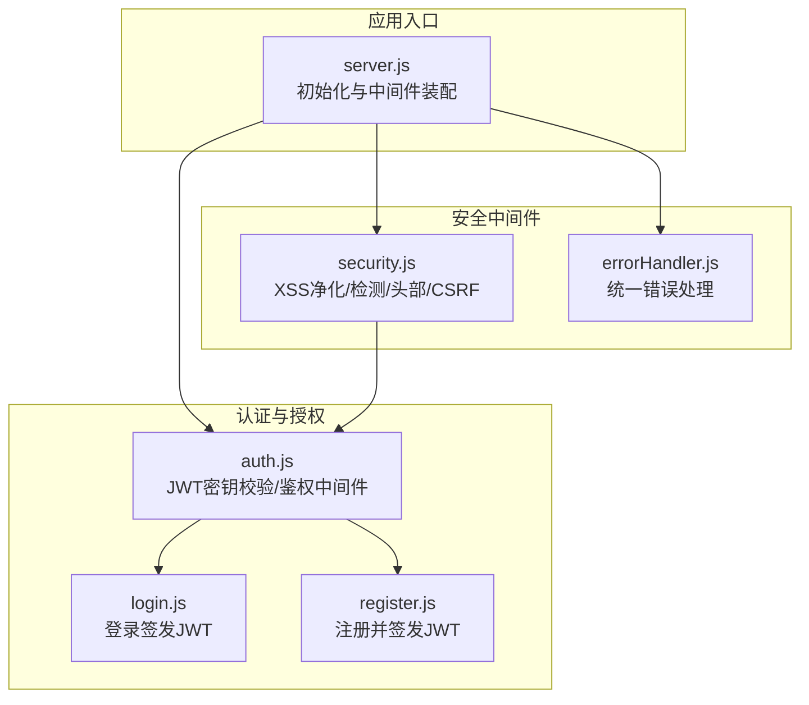
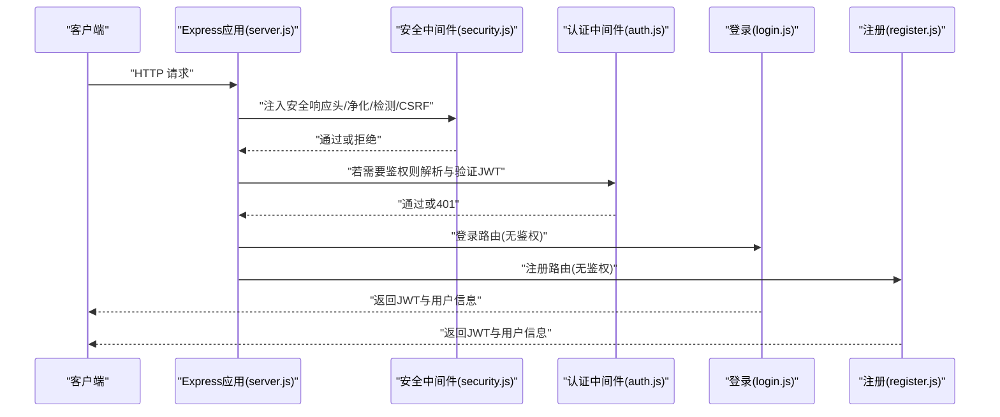
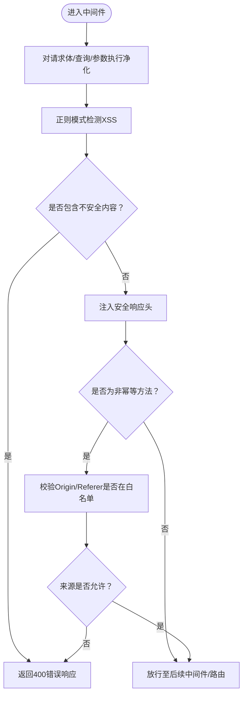
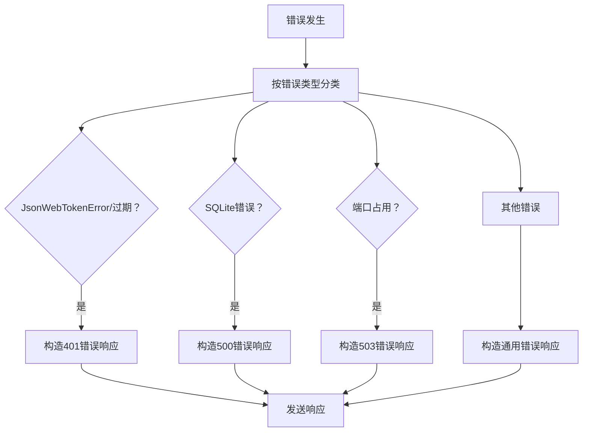
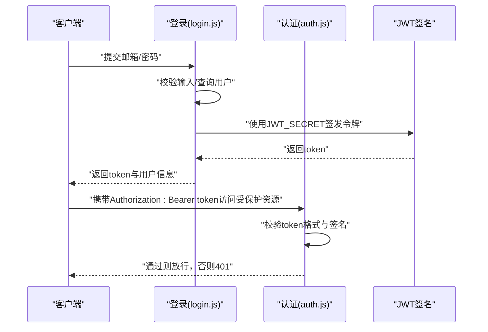
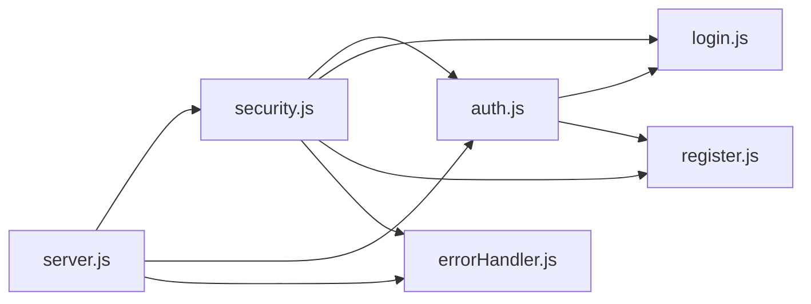

# 安全架构设计

<cite>
**本文引用的文件**
- [server.js](file://server.js)
- [security.js](file://api/middleware/security.js)
- [errorHandler.js](file://api/middleware/errorHandler.js)
- [auth.js](file://api/auth.js)
- [login.js](file://api/login.js)
- [register.js](file://api/register.js)
- [auth.test.js](file://tests/api/auth.test.js)
</cite>

## 目录
1. [引言](#引言)
2. [项目结构](#项目结构)
3. [核心组件](#核心组件)
4. [架构总览](#架构总览)
5. [详细组件分析](#详细组件分析)
6. [依赖关系分析](#依赖关系分析)
7. [性能与安全权衡](#性能与安全权衡)
8. [故障排查指南](#故障排查指南)
9. [结论](#结论)
10. [附录](#附录)

## 引言
本文件面向“AI家教”项目，系统化梳理并设计其安全架构，覆盖多层防护机制：JWT认证、CORS配置、XSS防护、CSRF保护、速率限制、统一错误处理与敏感数据保护。文档从代码级实现出发，结合威胁模型与应急响应，给出可落地的配置建议与合规性考量。

## 项目结构
后端基于 Express 应用，通过中间件链路实现安全控制；认证与授权由独立模块负责；统一错误处理模块对各类异常进行标准化输出；前端静态资源位于 public 与 frontend 目录，后端接口集中于 api 目录。

图示来源
- [server.js:37-75](file://server.js#L37-L75)
- [security.js:23-81](file://api/middleware/security.js#L23-L81)
- [errorHandler.js:13-37](file://api/middleware/errorHandler.js#L13-L37)
- [auth.js:12-46](file://api/auth.js#L12-L46)
- [login.js:7-40](file://api/login.js#L7-L40)
- [register.js:9-50](file://api/register.js#L9-L50)

章节来源
- [server.js:37-75](file://server.js#L37-L75)

## 核心组件
- 安全中间件：提供输入净化、XSS检测、安全响应头注入、CSRF来源校验。
- 统一错误处理：对JWT过期、数据库错误、端口占用等进行分类处理与标准化响应。
- 认证模块：校验JWT密钥强度并在启动时阻断弱配置；提供鉴权中间件解析与验证令牌。
- 登录/注册：完成凭据校验与用户查询，成功后签发JWT并返回用户信息。

章节来源
- [security.js:23-113](file://api/middleware/security.js#L23-L113)
- [errorHandler.js:13-72](file://api/middleware/errorHandler.js#L13-L72)
- [auth.js:12-46](file://api/auth.js#L12-L46)
- [login.js:7-40](file://api/login.js#L7-L40)
- [register.js:9-50](file://api/register.js#L9-L50)

## 架构总览
下图展示请求在进入业务路由前的完整安全处理链路，以及认证与授权的关键节点。

图示来源
- [server.js:41-75](file://server.js#L41-L75)
- [security.js:23-81](file://api/middleware/security.js#L23-L81)
- [auth.js:29-46](file://api/auth.js#L29-L46)
- [login.js:7-40](file://api/login.js#L7-L40)
- [register.js:9-50](file://api/register.js#L9-L50)

## 详细组件分析

### 安全中间件（XSS、CSRF、安全响应头）
- 输入净化与检测
  - 对请求体、查询参数、路径参数递归执行净化与模式检测，拦截常见XSS模式。
  - 检测到不安全内容时直接返回错误响应。
- 安全响应头
  - 设置浏览器安全头，禁用嗅探、点击劫持、严格来源策略与权限最小化策略，并移除易泄露的服务器标识。
- CSRF保护
  - 仅对非幂等方法进行来源校验，支持Origin与Referer；白名单来源于环境变量与本地开发地址。

图示来源
- [security.js:23-81](file://api/middleware/security.js#L23-L81)
- [security.js:89-113](file://api/middleware/security.js#L89-L113)

章节来源
- [security.js:23-113](file://api/middleware/security.js#L23-L113)

### 统一错误处理
- 错误类型识别：区分JWT错误、数据库错误、端口占用等。
- 标准化响应：统一success/message/status字段；开发环境附加stack。
- 运维提示：对致命问题（如JWT密钥缺失/默认值）直接终止进程，避免弱配置上线。

图示来源
- [errorHandler.js:13-72](file://api/middleware/errorHandler.js#L13-L72)

章节来源
- [errorHandler.js:13-72](file://api/middleware/errorHandler.js#L13-L72)

### 认证与授权（JWT）
- 启动时校验
  - 必须设置JWT_SECRET；禁止使用默认值；长度不足32字符发出警告。
- 鉴权中间件
  - 要求Bearer Token；解析失败或过期均返回401。
- 登录/注册
  - 成功后使用相同密钥签发JWT，设置合理过期时间；返回用户基本信息。

图示来源
- [auth.js:12-27](file://api/auth.js#L12-L27)
- [auth.js:29-46](file://api/auth.js#L29-L46)
- [login.js:33-39](file://api/login.js#L33-L39)

章节来源
- [auth.js:12-46](file://api/auth.js#L12-L46)
- [login.js:7-40](file://api/login.js#L7-L40)
- [register.js:47-49](file://api/register.js#L47-L49)

### CORS与速率限制
- CORS
  - 允许来源来自环境变量白名单，默认允许本地开发端口；支持凭证传递。
- 速率限制
  - 登录接口：窗口15分钟最多20次；
  - 代理接口：窗口1分钟最多10次；
  - API接口：窗口1分钟最多60次；
  - 信任代理以正确获取真实IP。

章节来源
- [server.js:44-46](file://server.js#L44-L46)
- [server.js:50](file://server.js#L50)
- [server.js:48](file://server.js#L48)

## 依赖关系分析
- 中间件耦合
  - 安全中间件在鉴权之前执行，确保所有请求均经过净化、检测与来源校验。
  - 统一错误处理作为兜底，捕获全局异常并标准化输出。
- 认证依赖
  - 登录/注册依赖数据库查询与写入；鉴权中间件依赖JWT_SECRET一致性。
- 外部依赖
  - 速率限制库版本与Node版本需满足要求；CORS库用于跨域控制。

图示来源
- [server.js:41-75](file://server.js#L41-L75)
- [security.js:23-81](file://api/middleware/security.js#L23-L81)
- [auth.js:29-46](file://api/auth.js#L29-L46)
- [login.js:7-40](file://api/login.js#L7-L40)
- [register.js:9-50](file://api/register.js#L9-L50)
- [errorHandler.js:13-37](file://api/middleware/errorHandler.js#L13-L37)

## 性能与安全权衡
- 速率限制
  - 需根据实际流量调优窗口与阈值，避免误伤正常用户；对登录接口应更严格。
- XSS检测
  - 正则检测与DOMPurify净化组合可降低误报与漏报风险，但会增加CPU开销；建议在高并发场景评估异步净化或缓存策略。
- 安全响应头
  - 增加少量响应头处理成本，收益显著；建议保持开启。
- 数据库与加密
  - 密码哈希成本固定，建议在部署环境统一配置；避免在热路径重复计算。

[本节为通用指导，无需列出章节来源]

## 故障排查指南
- JWT密钥问题
  - 现象：启动即退出或鉴权失败。
  - 排查：确认环境变量存在且非默认值；检查长度是否达到建议标准；查看统一错误处理对JWT错误的分类响应。
- 登录/注册频繁触发
  - 现象：出现速率限制错误。
  - 排查：核对速率限制配置与当前窗口内的请求量；检查是否命中登录/代理/API限流规则。
- 跨域或CSRF被拒
  - 现象：403来源不允许。
  - 排查：确认请求头中的Origin/Referer是否在白名单；核对环境变量ALLOWED_ORIGINS配置。
- XSS检测误报
  - 现象：合法输入被判定为不安全。
  - 排查：检查输入是否包含脚本标签或事件属性；必要时调整净化策略或扩展白名单字段。

章节来源
- [auth.js:12-27](file://api/auth.js#L12-L27)
- [errorHandler.js:13-37](file://api/middleware/errorHandler.js#L13-L37)
- [server.js:44-46](file://server.js#L44-L46)
- [security.js:89-113](file://api/middleware/security.js#L89-L113)

## 结论
本项目通过“中间件前置+统一错误处理+严格认证”的安全架构，在输入净化、跨域控制、CSRF防护、速率限制与JWT鉴权方面形成闭环。建议持续完善日志审计、密钥轮换与渗透测试流程，确保在演进中保持安全基线。

## 附录

### 安全配置最佳实践
- 密钥管理
  - 使用强随机密钥（≥32字符），定期轮换；避免硬编码与明文存储。
- CORS白名单
  - 仅允许受控域名；生产环境关闭通配符；启用凭证时注意同源策略。
- 速率限制
  - 分场景差异化配置；对登录/重置接口采用更严阈值；记录限流事件便于分析。
- 日志与监控
  - 记录认证失败、CSRF拦截、XSS检测与限流事件；设置告警阈值。
- 前端安全
  - 对用户输入渲染采用安全模板或框架内置转义；避免内联事件与动态eval。

[本节为通用指导，无需列出章节来源]

### 合规性与威胁模型
- 合规性
  - 数据最小化、传输加密（HTTPS）、访问日志保留策略、用户数据删除权。
- 威胁建模
  - 主要威胁：暴力破解、会话劫持、跨站脚本、跨域攻击、滥用API。
  - 缓解措施：强口令策略、短时效令牌、CSP与安全头、CSRF令牌/来源校验、速率限制与审计。

[本节为通用指导，无需列出章节来源]