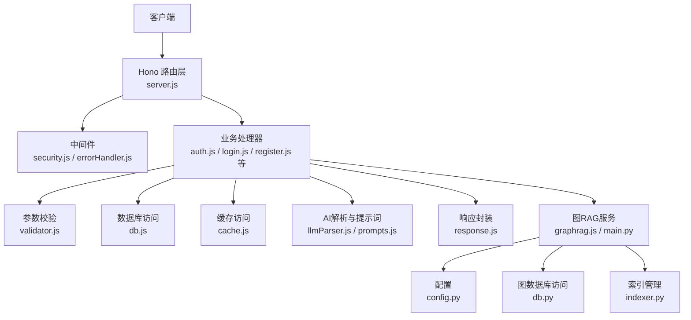
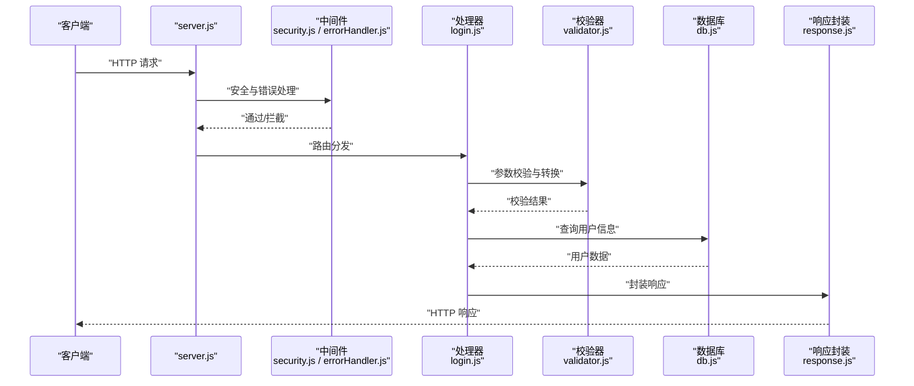
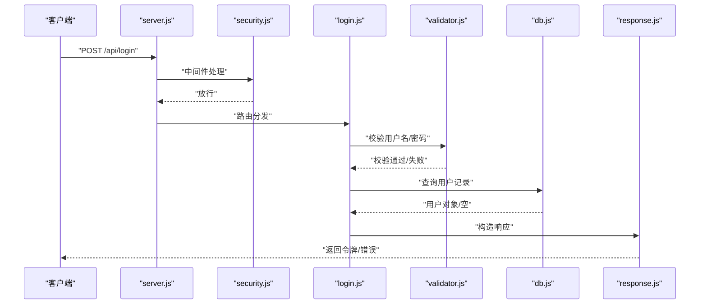
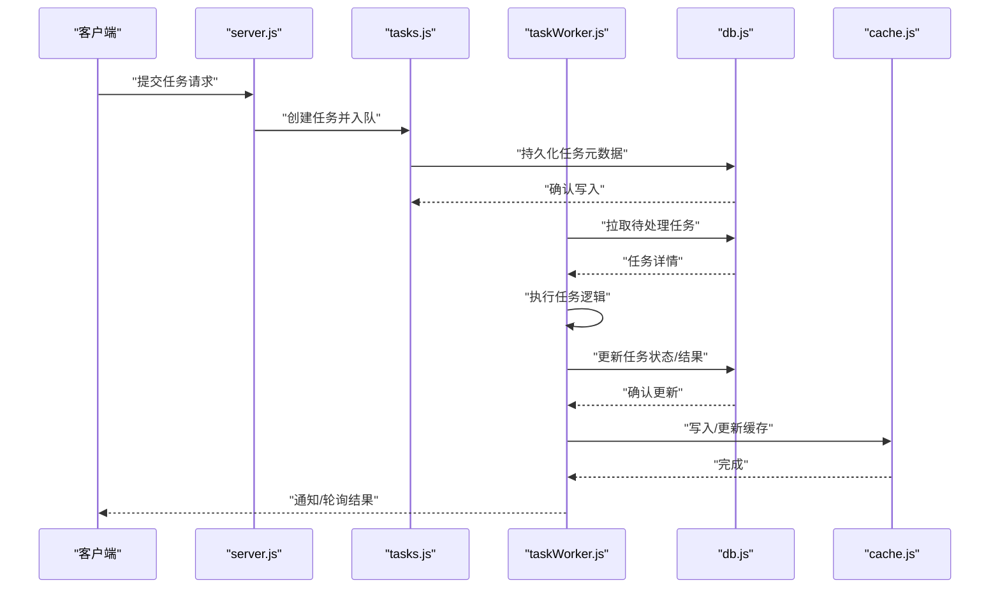
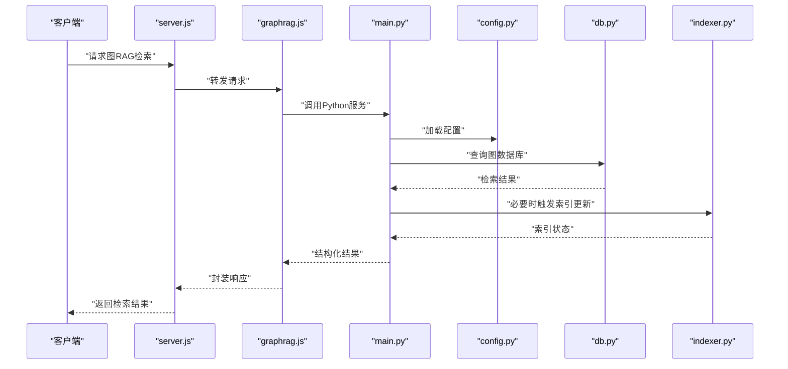
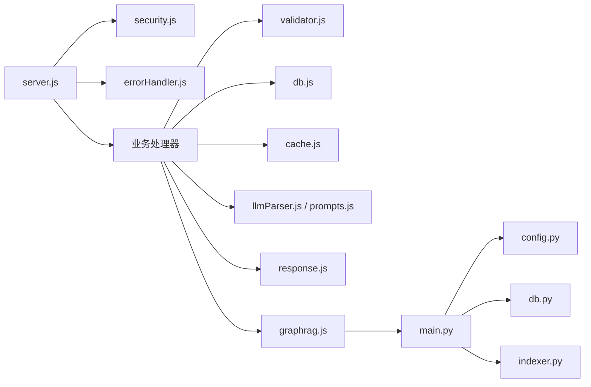

# 数据流设计

<cite>
**本文引用的文件**
- [server.js](file://server.js)
- [db.js](file://api/db.js)
- [cache.js](file://api/utils/cache.js)
- [validator.js](file://api/utils/validator.js)
- [response.js](file://api/utils/response.js)
- [errorHandler.js](file://api/middleware/errorHandler.js)
- [security.js](file://api/middleware/security.js)
- [llmParser.js](file://api/utils/llmParser.js)
- [prompts.js](file://api/utils/prompts.js)
- [auth.js](file://api/auth.js)
- [login.js](file://api/login.js)
- [register.js](file://api/register.js)
- [tasks.js](file://api/tasks.js)
- [taskWorker.js](file://api/taskWorker.js)
- [explain-question.js](file://api/explain-question.js)
- [adaptive-difficulty.js](file://api/adaptive-difficulty.js)
- [learning-dashboard.js](file://api/learning-dashboard.js)
- [gamification.js](file://api/gamification.js)
- [graphrag.js](file://api/graphrag.js)
- [main.py](file://graphrag_service/main.py)
- [config.py](file://graphrag_service/config.py)
- [db.py](file://graphrag_service/db.py)
- [indexer.py](file://graphrag_service/indexer.py)
</cite>

## 目录
1. [引言](#引言)
2. [项目结构](#项目结构)
3. [核心组件](#核心组件)
4. [架构总览](#架构总览)
5. [详细组件分析](#详细组件分析)
6. [依赖关系分析](#依赖关系分析)
7. [性能考虑](#性能考虑)
8. [故障排查指南](#故障排查指南)
9. [结论](#结论)
10. [附录](#附录)

## 引言
本设计文档围绕AI家教项目的“数据流”进行系统化梳理，覆盖从HTTP请求接入、参数校验与转换、数据库访问、AI服务调用、缓存命中与更新、响应封装，到异常处理与回滚策略的全链路流程。文档旨在帮助开发者与产品人员快速理解数据在各组件之间的传递方式、数据验证与格式化规则、缓存策略与一致性保障，并提供可操作的排障建议。

## 项目结构
后端基于Hono框架构建，采用模块化路由组织业务功能；AI相关能力通过本地或外部LLM解析器与提示词模板驱动；缓存层统一由工具模块提供；安全与错误处理分别通过中间件实现；图RAG服务独立部署为Python微服务，供主站通过代理或直连调用。

图表来源
- [server.js](file://server.js)
- [security.js](file://api/middleware/security.js)
- [errorHandler.js](file://api/middleware/errorHandler.js)
- [validator.js](file://api/utils/validator.js)
- [db.js](file://api/db.js)
- [cache.js](file://api/utils/cache.js)
- [llmParser.js](file://api/utils/llmParser.js)
- [prompts.js](file://api/utils/prompts.js)
- [response.js](file://api/utils/response.js)
- [graphrag.js](file://api/graphrag.js)
- [main.py](file://graphrag_service/main.py)
- [config.py](file://graphrag_service/config.py)
- [db.py](file://graphrag_service/db.py)
- [indexer.py](file://graphrag_service/indexer.py)

章节来源
- [server.js](file://server.js)
- [db.js](file://api/db.js)
- [cache.js](file://api/utils/cache.js)
- [validator.js](file://api/utils/validator.js)
- [response.js](file://api/utils/response.js)
- [errorHandler.js](file://api/middleware/errorHandler.js)
- [security.js](file://api/middleware/security.js)
- [llmParser.js](file://api/utils/llmParser.js)
- [prompts.js](file://api/utils/prompts.js)
- [graphrag.js](file://api/graphrag.js)
- [main.py](file://graphrag_service/main.py)
- [config.py](file://graphrag_service/config.py)
- [db.py](file://graphrag_service/db.py)
- [indexer.py](file://graphrag_service/indexer.py)

## 核心组件
- 路由与中间件：负责HTTP请求接入、安全防护（CORS/CSRF/限流）、统一错误处理与日志记录。
- 参数校验与转换：对请求体/查询参数进行类型、范围、必填性等校验，并进行必要的字段映射与格式化。
- 数据库访问：封装连接、事务、查询执行与结果映射，确保数据一致性与隔离级别。
- 缓存访问：提供键空间管理、TTL控制、命中/未命中分支处理，支持多级缓存与失效策略。
- AI解析与提示词：统一的LLM解析器与提示词模板，标准化AI输出结构，便于后续处理与响应。
- 响应封装：统一封装成功/失败响应格式，包含状态码、消息与数据载体，便于前端消费。
- 图RAG服务：独立的Python服务，负责图数据库访问、索引构建与检索，主站通过代理或直连调用。

章节来源
- [server.js](file://server.js)
- [validator.js](file://api/utils/validator.js)
- [db.js](file://api/db.js)
- [cache.js](file://api/utils/cache.js)
- [llmParser.js](file://api/utils/llmParser.js)
- [prompts.js](file://api/utils/prompts.js)
- [response.js](file://api/utils/response.js)
- [graphrag.js](file://api/graphrag.js)

## 架构总览
下图展示一次典型请求（如登录）的端到端数据流，包括参数校验、数据库查询、AI辅助处理（如有）、缓存与响应封装。

图表来源
- [server.js](file://server.js)
- [security.js](file://api/middleware/security.js)
- [errorHandler.js](file://api/middleware/errorHandler.js)
- [login.js](file://api/login.js)
- [validator.js](file://api/utils/validator.js)
- [db.js](file://api/db.js)
- [response.js](file://api/utils/response.js)

## 详细组件分析

### 登录流程（示例）
登录流程体现了完整的数据流闭环：请求进入、参数校验、数据库查询、响应封装。

图表来源
- [login.js](file://api/login.js)
- [validator.js](file://api/utils/validator.js)
- [db.js](file://api/db.js)
- [response.js](file://api/utils/response.js)
- [security.js](file://api/middleware/security.js)

章节来源
- [login.js](file://api/login.js)
- [validator.js](file://api/utils/validator.js)
- [db.js](file://api/db.js)
- [response.js](file://api/utils/response.js)
- [security.js](file://api/middleware/security.js)

### 任务处理与工作队列
任务处理涉及任务创建、入队、后台Worker消费与结果回写，体现异步数据流与幂等性保障。

图表来源
- [tasks.js](file://api/tasks.js)
- [taskWorker.js](file://api/taskWorker.js)
- [db.js](file://api/db.js)
- [cache.js](file://api/utils/cache.js)

章节来源
- [tasks.js](file://api/tasks.js)
- [taskWorker.js](file://api/taskWorker.js)
- [db.js](file://api/db.js)
- [cache.js](file://api/utils/cache.js)

### 图RAG检索流程
图RAG服务独立运行，主站通过代理接口调用，实现知识图谱检索与答案生成。

图表来源
- [graphrag.js](file://api/graphrag.js)
- [main.py](file://graphrag_service/main.py)
- [config.py](file://graphrag_service/config.py)
- [db.py](file://graphrag_service/db.py)
- [indexer.py](file://graphrag_service/indexer.py)

章节来源
- [graphrag.js](file://api/graphrag.js)
- [main.py](file://graphrag_service/main.py)
- [config.py](file://graphrag_service/config.py)
- [db.py](file://graphrag_service/db.py)
- [indexer.py](file://graphrag_service/indexer.py)

### 数据验证与转换规则
- 类型校验：对数值、布尔、枚举、日期等字段进行严格类型检查。
- 范围与长度：对字符串长度、数值区间、数组元素数量进行限制。
- 必填性：区分路径参数、查询参数、请求体字段的必填规则。
- 字段映射：将前端字段名映射到后端存储字段，避免暴露内部结构。
- 格式化：统一时间戳、金额、编码等格式，确保下游一致。

章节来源
- [validator.js](file://api/utils/validator.js)

### 缓存策略与一致性
- 命中优先：先查缓存，命中则直接返回，降低DB压力。
- 失效策略：按业务设置TTL，热点数据短TTL，静态数据长TTL。
- 写穿透保护：写入前先删除旧键，再写入新值，避免脏读。
- 广播失效：关键变更广播通知，批量清理相关键空间。
- 降级容错：缓存不可用时走直连DB，保证可用性。

章节来源
- [cache.js](file://api/utils/cache.js)

### 错误处理与异常回滚
- 统一错误码：定义业务错误码与HTTP状态码映射，便于前端识别。
- 中间件捕获：全局错误处理器捕获未处理异常，记录上下文并返回标准错误响应。
- 回滚策略：事务内失败自动回滚；缓存与DB不一致时，采用补偿机制或延迟双删。
- 重试与退避：对外部依赖（如AI服务、图RAG）失败时，采用指数退避重试。

章节来源
- [errorHandler.js](file://api/middleware/errorHandler.js)
- [db.js](file://api/db.js)
- [cache.js](file://api/utils/cache.js)

### 数据一致性保证机制
- 事务边界：关键写操作（如注册、支付、任务状态变更）置于事务中，确保原子性。
- 读写分离：查询类接口走只读副本，写操作走主库，降低锁竞争。
- 版本号/乐观锁：并发更新场景引入版本号，冲突时拒绝或合并。
- 最终一致性：缓存与DB不一致采用定时任务或事件驱动修复。

章节来源
- [db.js](file://api/db.js)
- [cache.js](file://api/utils/cache.js)

## 依赖关系分析
- 路由层依赖中间件与业务处理器；处理器依赖校验器、数据库、缓存与AI解析器；AI解析器依赖提示词模板；响应封装依赖统一格式；图RAG服务独立于主站，通过代理或直连交互。
- 模块内聚高、耦合低，便于扩展与测试。

图表来源
- [server.js](file://server.js)
- [security.js](file://api/middleware/security.js)
- [errorHandler.js](file://api/middleware/errorHandler.js)
- [validator.js](file://api/utils/validator.js)
- [db.js](file://api/db.js)
- [cache.js](file://api/utils/cache.js)
- [llmParser.js](file://api/utils/llmParser.js)
- [prompts.js](file://api/utils/prompts.js)
- [response.js](file://api/utils/response.js)
- [graphrag.js](file://api/graphrag.js)
- [main.py](file://graphrag_service/main.py)
- [config.py](file://graphrag_service/config.py)
- [db.py](file://graphrag_service/db.py)
- [indexer.py](file://graphrag_service/indexer.py)

章节来源
- [server.js](file://server.js)
- [security.js](file://api/middleware/security.js)
- [errorHandler.js](file://api/middleware/errorHandler.js)
- [validator.js](file://api/utils/validator.js)
- [db.js](file://api/db.js)
- [cache.js](file://api/utils/cache.js)
- [llmParser.js](file://api/utils/llmParser.js)
- [prompts.js](file://api/utils/prompts.js)
- [response.js](file://api/utils/response.js)
- [graphrag.js](file://api/graphrag.js)
- [main.py](file://graphrag_service/main.py)
- [config.py](file://graphrag_service/config.py)
- [db.py](file://graphrag_service/db.py)
- [indexer.py](file://graphrag_service/indexer.py)

## 性能考虑
- 连接池与超时：数据库连接池大小与查询超时需结合QPS与SLA设定。
- 缓存预热：热点数据在启动或低峰期预热，降低首屏延迟。
- 批量与分页：查询接口支持分页与批量返回，避免单次大结果集。
- 异步化：耗时任务异步执行，缩短请求链路等待时间。
- CDN与静态资源：静态资源走CDN，减少主站带宽压力。

## 故障排查指南
- 排查步骤
  - 检查中间件是否正确放行与捕获异常。
  - 校验参数校验器是否返回明确错误信息。
  - 确认数据库连接、事务与索引状态。
  - 验证缓存键空间与TTL是否符合预期。
  - 对比AI解析器输入输出，定位提示词或模型问题。
  - 检查图RAG服务日志与配置，确认图数据库连通性。
- 常见问题
  - 缓存击穿：热点键过期导致瞬时DB压力，启用互斥锁或永不过期兜底。
  - 缓存雪崩：大量键同时过期，提前打散TTL或设置随机抖动。
  - 缓存污染：冷数据污染LRU，调整淘汰策略或分区缓存。
  - 事务死锁：调整锁顺序或拆分事务，必要时引入超时与重试。

章节来源
- [errorHandler.js](file://api/middleware/errorHandler.js)
- [validator.js](file://api/utils/validator.js)
- [db.js](file://api/db.js)
- [cache.js](file://api/utils/cache.js)
- [llmParser.js](file://api/utils/llmParser.js)
- [prompts.js](file://api/utils/prompts.js)
- [graphrag.js](file://api/graphrag.js)
- [main.py](file://graphrag_service/main.py)

## 结论
本数据流设计以“模块化、可扩展、可观测”为核心原则，通过严格的参数校验、统一的响应封装、完善的缓存与一致性策略，以及清晰的错误处理与回滚机制，确保AI家教系统在高并发与复杂业务场景下的稳定性与可维护性。建议在上线前完成压测与演练，持续优化缓存命中率与任务处理吞吐。

## 附录
- 关键流程图与序列图已在相应章节中给出，可直接用于技术评审与开发参考。
- 建议在CI/CD中加入自动化测试与性能回归检查，保障数据流质量。