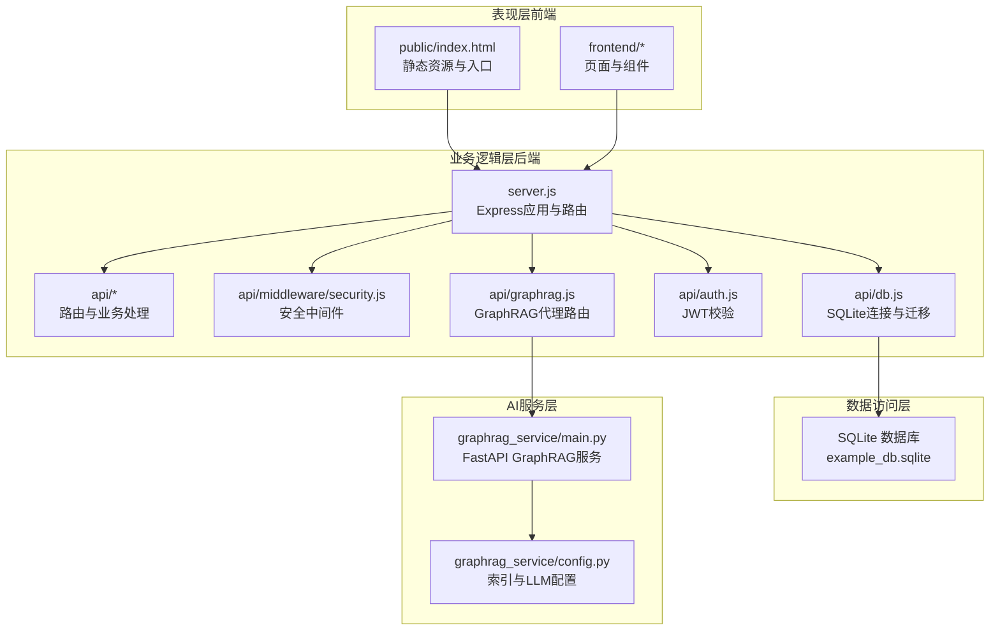
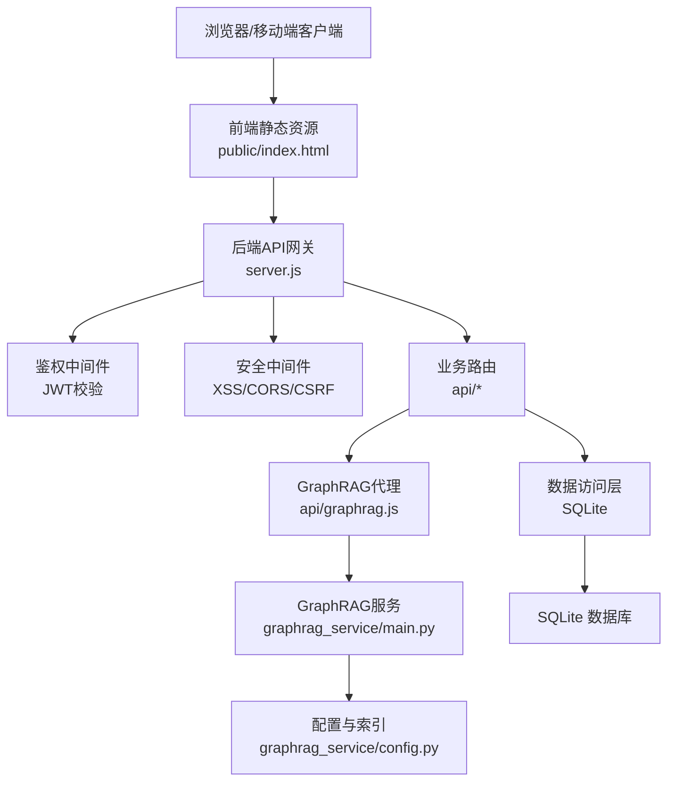
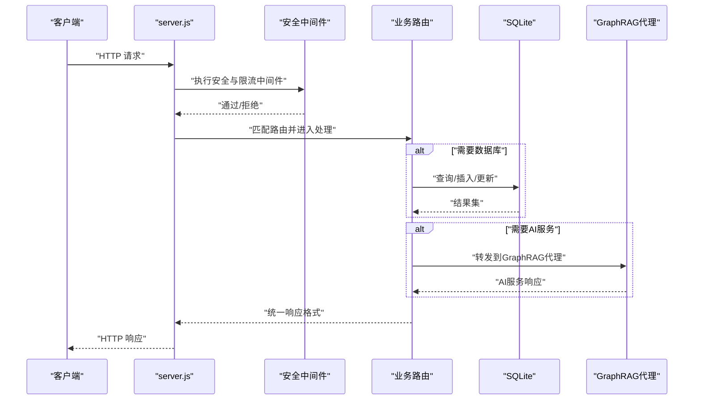
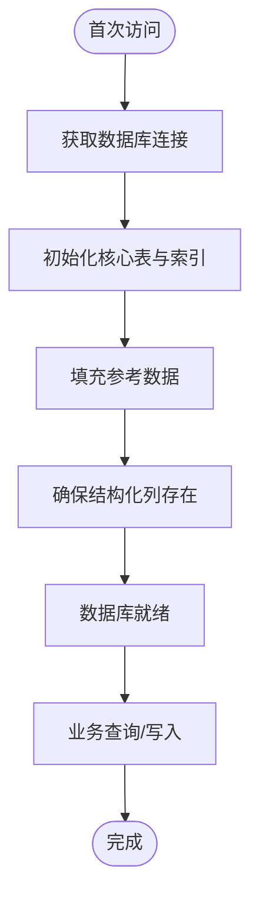
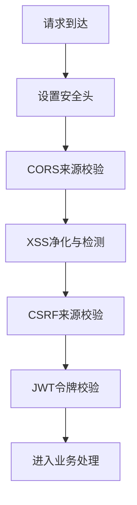
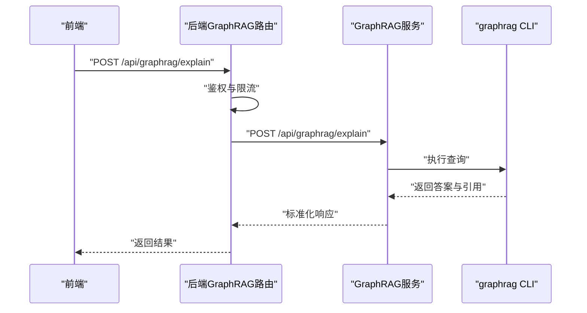
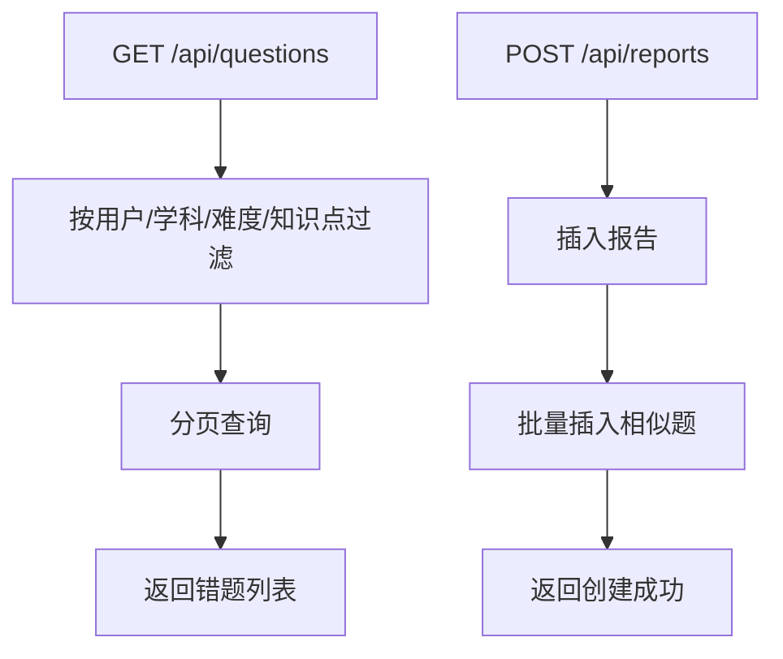
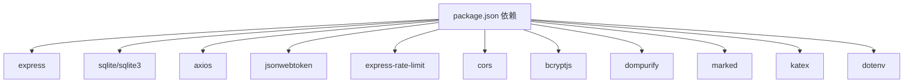

# 整体架构设计

<cite>
**本文档引用的文件**
- [package.json](file://package.json)
- [server.js](file://server.js)
- [docker-compose.yml](file://docker-compose.yml)
- [Dockerfile](file://Dockerfile)
- [api/db.js](file://api/db.js)
- [api/auth.js](file://api/auth.js)
- [api/middleware/security.js](file://api/middleware/security.js)
- [api/utils/response.js](file://api/utils/response.js)
- [api/graphrag.js](file://api/graphrag.js)
- [graphrag_service/main.py](file://graphrag_service/main.py)
- [graphrag_service/config.py](file://graphrag_service/config.py)
- [deploy/uibe-graphrag.service](file://deploy/uibe-graphrag.service)
- [scripts/setup_graphrag.sh](file://scripts/setup_graphrag.sh)
- [frontend/components.js](file://frontend/components.js)
- [public/index.html](file://public/index.html)
- [api/questions.js](file://api/questions.js)
- [api/reports.js](file://api/reports.js)
</cite>

## 目录
1. [引言](#引言)
2. [项目结构](#项目结构)
3. [核心组件](#核心组件)
4. [架构总览](#架构总览)
5. [详细组件分析](#详细组件分析)
6. [依赖关系分析](#依赖关系分析)
7. [性能考量](#性能考量)
8. [故障排查指南](#故障排查指南)
9. [结论](#结论)
10. [附录](#附录)

## 引言
本项目为“AI家教”系统，目标是通过拍照解题、错题管理、个性化学习路径与AI智能问答等能力，辅助学生进行高效复习与能力提升。系统采用分层架构与微服务理念，将表现层（前端Web应用）、业务逻辑层（Express.js后端API）、数据访问层（SQLite数据库）与AI服务层（Python GraphRAG服务）清晰分离，实现职责单一、边界明确、易于扩展与维护。

## 项目结构
系统采用前后端同源部署的单体容器化架构，核心目录与职责如下：
- api：后端Express路由与业务处理模块，统一对外提供REST接口
- database：SQLite数据库与GraphRAG知识图谱相关数据
- graphrag_service：独立的Python FastAPI服务，负责GraphRAG查询与索引管理
- frontend/public：前端静态资源与页面，支持移动端与桌面端
- deploy/scripts：系统服务与部署脚本
- tests：测试套件（按阶段分层）

图表来源
- [server.js:1-221](file://server.js#L1-L221)
- [api/db.js:1-478](file://api/db.js#L1-L478)
- [api/graphrag.js:1-224](file://api/graphrag.js#L1-L224)
- [graphrag_service/main.py:1-462](file://graphrag_service/main.py#L1-L462)
- [graphrag_service/config.py:1-59](file://graphrag_service/config.py#L1-L59)

章节来源
- [server.js:1-221](file://server.js#L1-L221)
- [package.json:1-43](file://package.json#L1-L43)

## 核心组件
- 表现层（前端Web应用）
  - public/index.html：移动端/桌面端统一入口，集成Service Worker与预加载资源
  - frontend/components.js：导航、二维码弹窗、页脚等通用组件渲染
- 业务逻辑层（Express.js后端API）
  - server.js：应用启动、中间件、静态资源、路由注册与健康检查
  - api/db.js：SQLite连接、表结构初始化、索引与参考数据填充
  - api/auth.js：JWT密钥校验与鉴权中间件
  - api/middleware/security.js：XSS净化、XSS检测、CORS与CSRF保护
  - api/graphrag.js：GraphRAG代理路由，统一鉴权、限流与转发
  - api/utils/response.js：统一响应格式与校验
- 数据访问层（SQLite数据库）
  - 用户、科目、题型、年级、错题、报告、练习记录、模拟考试会话、省/区、任务队列等核心表
  - 大量复合索引与外键约束保障查询性能与数据一致性
- AI服务层（Python GraphRAG服务）
  - graphrag_service/main.py：FastAPI服务，提供查询、解释、相似题、知识图谱、试卷溯源等接口
  - graphrag_service/config.py：索引配置、LLM接入参数与速率限制

章节来源
- [public/index.html:1-43](file://public/index.html#L1-L43)
- [frontend/components.js:1-145](file://frontend/components.js#L1-L145)
- [server.js:1-221](file://server.js#L1-L221)
- [api/db.js:1-478](file://api/db.js#L1-L478)
- [api/auth.js:1-47](file://api/auth.js#L1-L47)
- [api/middleware/security.js:1-114](file://api/middleware/security.js#L1-L114)
- [api/graphrag.js:1-224](file://api/graphrag.js#L1-L224)
- [api/utils/response.js:1-69](file://api/utils/response.js#L1-L69)
- [graphrag_service/main.py:1-462](file://graphrag_service/main.py#L1-L462)
- [graphrag_service/config.py:1-59](file://graphrag_service/config.py#L1-L59)

## 架构总览
系统采用“前端静态托管 + 后端API网关 + AI服务代理 + SQLite存储”的分层架构，并通过Docker与systemd实现容器化与服务化部署。后端API作为统一入口，对内聚合业务逻辑与数据访问，对外提供REST接口；AI服务作为独立子系统，通过HTTP协议被后端代理调用，实现低耦合与可扩展。

图表来源
- [server.js:1-221](file://server.js#L1-L221)
- [api/graphrag.js:1-224](file://api/graphrag.js#L1-L224)
- [graphrag_service/main.py:1-462](file://graphrag_service/main.py#L1-L462)
- [graphrag_service/config.py:1-59](file://graphrag_service/config.py#L1-L59)

## 详细组件分析

### 组件A：后端API网关（server.js）
- 职责
  - 应用启动与中间件装配（安全头、CORS、XSS净化、CSRF、速率限制）
  - 静态资源托管（public/frontend）
  - 路由注册与健康检查
  - 启动任务调度器与数据库连接
- 关键流程
  - 路由注册：登录、注册、重置密码、省/市、真题、练习、考试、自适应难度、班级分析、游戏化、GraphRAG代理等
  - 错误处理：全局错误中间件与包装器
  - 健康检查：/api/health 检查数据库可用性

图表来源
- [server.js:115-205](file://server.js#L115-L205)
- [api/middleware/security.js:1-114](file://api/middleware/security.js#L1-L114)
- [api/utils/response.js:1-69](file://api/utils/response.js#L1-L69)

章节来源
- [server.js:1-221](file://server.js#L1-L221)

### 组件B：数据访问层（SQLite）
- 职责
  - 统一数据库连接与事务控制
  - 初始化核心表与索引，填充参考数据
  - 提供查询封装与结构化列兼容处理
- 关键表
  - 用户、科目、题型、年级、省/区、错题、报告、练习记录、模拟考试会话、任务队列、任务指标等
  - 大量复合索引覆盖高频查询维度（省/年/学科/难度/用户等）
- 性能特性
  - WAL模式、超时与外键约束
  - 结构化列动态补齐，保证历史数据兼容

图表来源
- [api/db.js:15-365](file://api/db.js#L15-L365)

章节来源
- [api/db.js:1-478](file://api/db.js#L1-L478)

### 组件C：安全与鉴权（JWT/CORS/XSS/CSRF）
- 职责
  - 安全头注入与敏感信息移除
  - 输入净化与XSS检测
  - CORS白名单校验与CSRF防护
  - JWT密钥校验与令牌解析
- 设计要点
  - 对GET/HEAD/OPTIONS放行，其余方法严格校验来源
  - 默认密钥检测与长度告警，生产需强密钥

图表来源
- [api/middleware/security.js:73-114](file://api/middleware/security.js#L73-L114)
- [api/auth.js:12-46](file://api/auth.js#L12-L46)

章节来源
- [api/middleware/security.js:1-114](file://api/middleware/security.js#L1-L114)
- [api/auth.js:1-47](file://api/auth.js#L1-L47)

### 组件D：GraphRAG代理与AI服务
- 后端代理（api/graphrag.js）
  - 统一鉴权、限流（每用户每分钟10次）
  - 智能索引选择（根据学科/地区/考试类型）
  - 将请求转发至本地GraphRAG服务（默认127.0.0.1:8100）
- AI服务（graphrag_service/main.py）
  - FastAPI服务，提供查询、解释、相似题、知识图谱、试卷溯源等接口
  - 通过graphrag CLI执行查询，解析引用与实体，记录查询日志
  - 管理员接口：作业状态、统计信息、触发重建索引
- 配置（graphrag_service/config.py）
  - LLM接入参数（API Key/Base/Model）、服务主机与端口
  - 多索引配置与速率限制（每小时420次）

图表来源
- [api/graphrag.js:88-130](file://api/graphrag.js#L88-L130)
- [graphrag_service/main.py:191-273](file://graphrag_service/main.py#L191-L273)

章节来源
- [api/graphrag.js:1-224](file://api/graphrag.js#L1-L224)
- [graphrag_service/main.py:1-462](file://graphrag_service/main.py#L1-L462)
- [graphrag_service/config.py:1-59](file://graphrag_service/config.py#L1-L59)

### 组件E：业务示例（错题与报告）
- 错题管理（api/questions.js）
  - 支持按用户、学科、难度、知识点过滤查询
  - 支持分页与数据大小限制
  - 支持新增与删除
- 报告管理（api/reports.js）
  - 获取用户历史报告列表
  - 新增报告并关联相似题
  - 删除报告

图表来源
- [api/questions.js:12-114](file://api/questions.js#L12-L114)
- [api/reports.js:4-67](file://api/reports.js#L4-L67)

章节来源
- [api/questions.js:1-114](file://api/questions.js#L1-L114)
- [api/reports.js:1-67](file://api/reports.js#L1-L67)

## 依赖关系分析
- 技术栈与选择理由
  - 后端：Express.js（轻量、生态丰富、适合REST API）、SQLite（嵌入式、零运维、开发友好）
  - 前端：静态托管（无需复杂框架，便于缓存与CDN分发）
  - AI服务：Python FastAPI（高性能、OpenAPI友好），GraphRAG CLI（成熟检索增强方案）
  - 容器化：Docker（隔离运行环境）、systemd（服务守护与健康检查）
- 外部依赖
  - LLM服务（通过环境变量配置）
  - GraphRAG索引与CLI工具
- 架构决策权衡
  - 单体容器化：简化部署与运维，适合中小规模；若并发与AI查询压力增大，可拆分为独立服务并通过消息队列解耦
  - SQLite：开发与演示友好；生产如需高并发读写，可迁移到PostgreSQL/MySQL并引入连接池与读写分离

图表来源
- [package.json:17-30](file://package.json#L17-L30)

章节来源
- [package.json:1-43](file://package.json#L1-L43)

## 性能考量
- 后端性能
  - 速率限制：登录/代理/通用接口分别限流，避免滥用
  - 中间件顺序：先安全再业务，减少无效处理
  - 静态资源缓存：前端资源与JS按需缓存策略
- 数据库性能
  - WAL模式、超时与外键约束提升稳定性
  - 大量复合索引覆盖高频查询维度
  - 结构化列动态补齐，降低迁移成本
- AI服务性能
  - 本地GraphRAG服务仅内网暴露，减少网络延迟
  - 限流与超时控制（默认120秒），防止阻塞
  - 管理员接口支持异步重建索引，避免阻塞主线程

## 故障排查指南
- 健康检查
  - /api/health：检查数据库连接状态
- 常见问题定位
  - JWT密钥：启动前强制校验，避免默认密钥与长度不足
  - CORS/CSRF：确认ALLOWED_ORIGINS配置与来源域名一致
  - GraphRAG服务：检查服务状态与端口（默认127.0.0.1:8100），查看systemd日志
  - SQLite：确认数据库文件路径与权限，关注索引与外键报错
- 日志与监控
  - 后端：统一错误捕获与日志输出
  - AI服务：查询日志与统计接口，便于追踪性能与异常

章节来源
- [server.js:126-136](file://server.js#L126-L136)
- [api/auth.js:12-27](file://api/auth.js#L12-L27)
- [api/middleware/security.js:83-114](file://api/middleware/security.js#L83-L114)
- [deploy/uibe-graphrag.service:1-19](file://deploy/uibe-graphrag.service#L1-L19)

## 结论
本项目通过清晰的分层架构与微服务理念，实现了从前端静态资源到后端API网关、数据库与AI服务的有序协作。Express.js与SQLite组合满足快速迭代需求，GraphRAG服务提供强大的知识检索能力。未来可在高并发与AI负载场景下，进一步拆分服务、引入消息队列与缓存层，以提升可扩展性与稳定性。

## 附录
- 部署与运行
  - Docker镜像构建与健康检查
  - systemd服务守护GraphRAG服务
  - 一键部署脚本自动化安装与启动
- 前端入口
  - public/index.html：移动端/桌面端统一入口
  - frontend/components.js：导航与二维码弹窗组件

章节来源
- [Dockerfile:1-26](file://Dockerfile#L1-L26)
- [docker-compose.yml:1-26](file://docker-compose.yml#L1-L26)
- [deploy/uibe-graphrag.service:1-19](file://deploy/uibe-graphrag.service#L1-L19)
- [scripts/setup_graphrag.sh:1-94](file://scripts/setup_graphrag.sh#L1-L94)
- [public/index.html:1-43](file://public/index.html#L1-L43)
- [frontend/components.js:1-145](file://frontend/components.js#L1-L145)