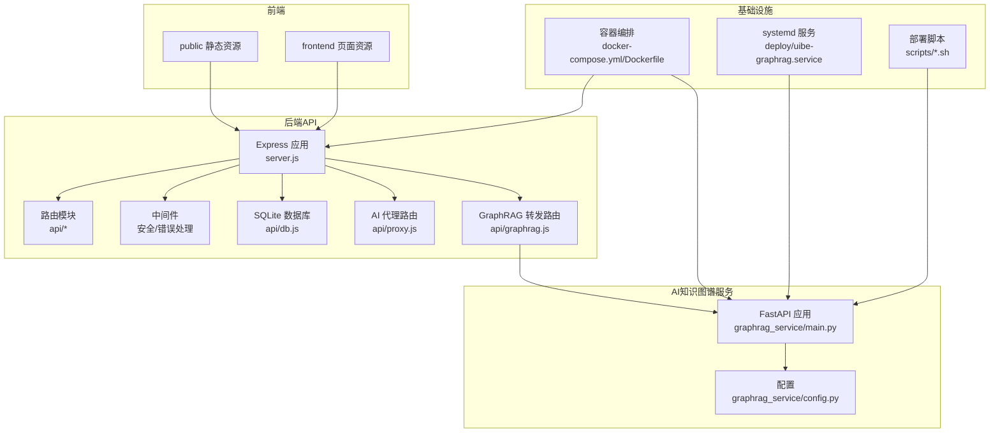
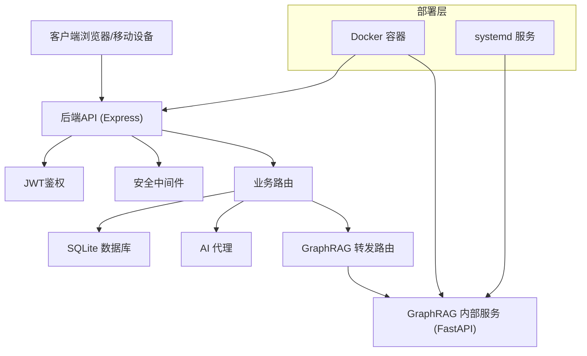
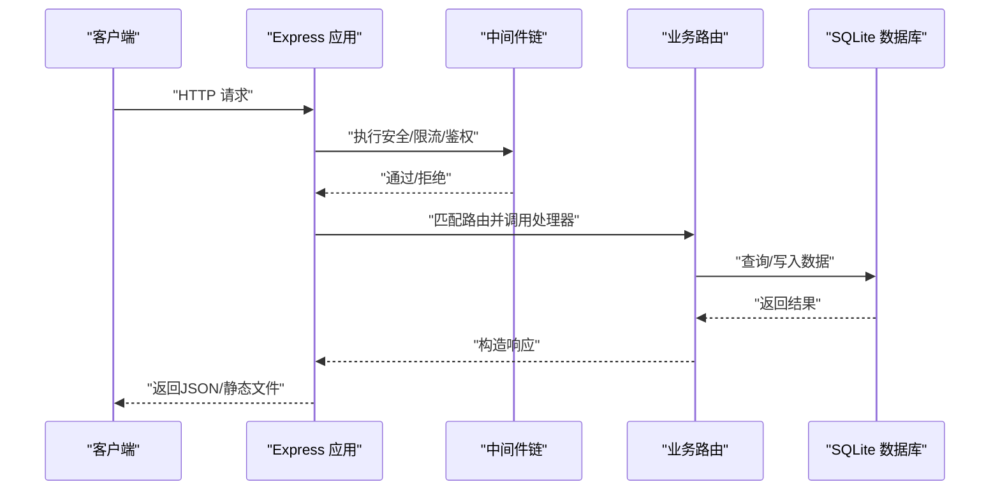
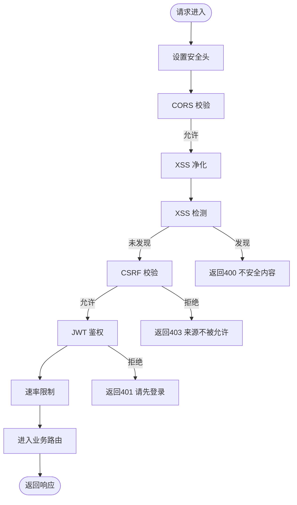
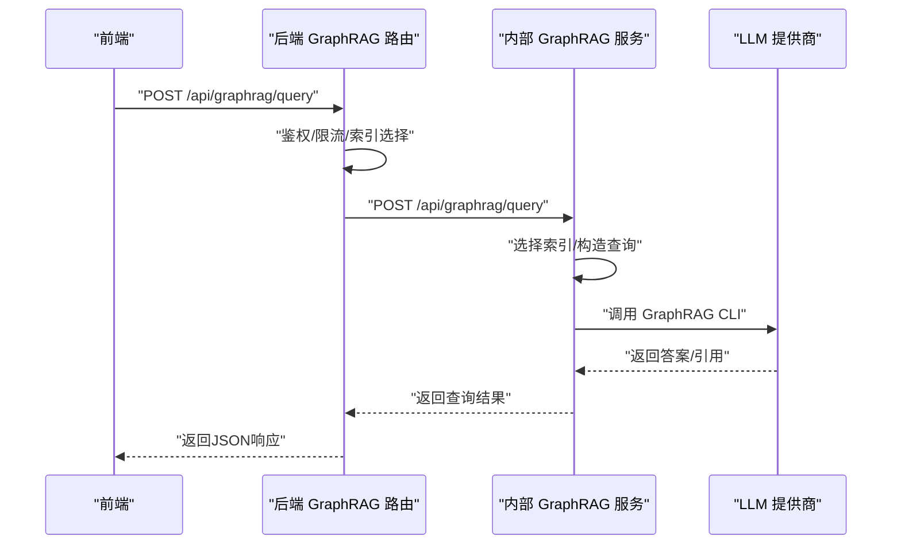
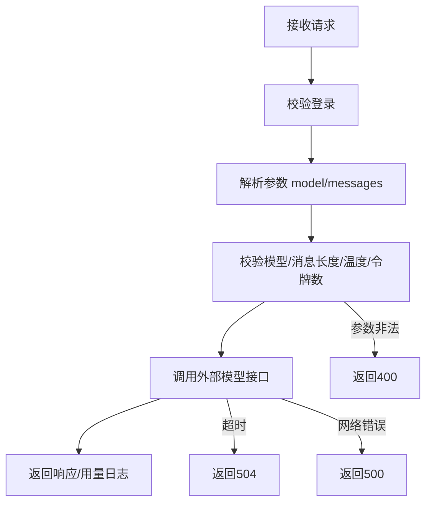
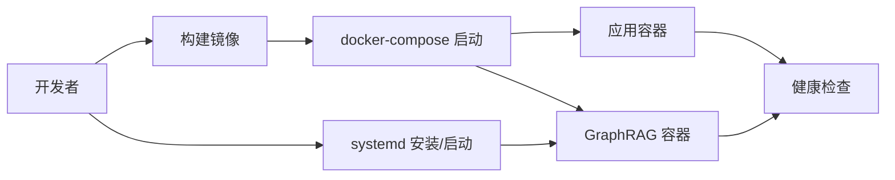
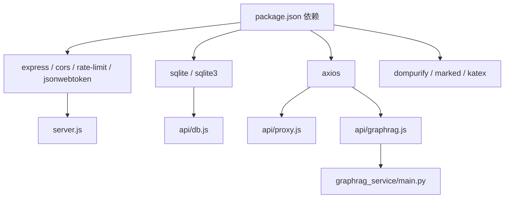

# 系统架构

<cite>
**本文档引用的文件**
- [package.json](file://package.json)
- [server.js](file://server.js)
- [docker-compose.yml](file://docker-compose.yml)
- [Dockerfile](file://Dockerfile)
- [api/db.js](file://api/db.js)
- [api/middleware/security.js](file://api/middleware/security.js)
- [api/middleware/errorHandler.js](file://api/middleware/errorHandler.js)
- [api/auth.js](file://api/auth.js)
- [api/graphrag.js](file://api/graphrag.js)
- [api/proxy.js](file://api/proxy.js)
- [graphrag_service/main.py](file://graphrag_service/main.py)
- [graphrag_service/config.py](file://graphrag_service/config.py)
- [deploy/uibe-graphrag.service](file://deploy/uibe-graphrag.service)
- [scripts/setup_graphrag.sh](file://scripts/setup_graphrag.sh)
- [scripts/init_graphrag_service.sh](file://scripts/init_graphrag_service.sh)
</cite>

## 目录
1. [简介](#简介)
2. [项目结构](#项目结构)
3. [核心组件](#核心组件)
4. [架构总览](#架构总览)
5. [详细组件分析](#详细组件分析)
6. [依赖分析](#依赖分析)
7. [性能考量](#性能考量)
8. [故障排查指南](#故障排查指南)
9. [结论](#结论)
10. [附录](#附录)

## 简介
本项目是一个基于前后端分离的AI家教系统，采用Express.js后端提供REST API与业务逻辑，SQLite数据库存储结构化数据，内置GraphRAG知识图谱服务（FastAPI）进行智能问答与知识检索，并通过代理路由统一转发至外部大模型服务（如DashScope、DeepSeek）。系统支持移动端与桌面端访问，具备完善的中间件安全体系、速率限制与错误处理机制。部署采用容器化与systemd服务管理，便于在单机或多机环境下稳定运行。

## 项目结构
系统按功能域划分清晰，主要分为四层：
- 前端Web应用：静态资源与页面入口，位于public与frontend目录
- 后端API服务：Express.js应用，集中处理路由、鉴权、限流与错误处理
- AI知识图谱服务：独立的FastAPI服务，负责GraphRAG查询与索引管理
- 数据库层：SQLite文件数据库，提供结构化数据持久化与索引优化

图表来源
- [server.js:1-221](file://server.js#L1-L221)
- [api/db.js:1-478](file://api/db.js#L1-L478)
- [api/middleware/security.js:1-114](file://api/middleware/security.js#L1-L114)
- [api/middleware/errorHandler.js:1-75](file://api/middleware/errorHandler.js#L1-L75)
- [api/proxy.js:1-106](file://api/proxy.js#L1-L106)
- [api/graphrag.js:1-224](file://api/graphrag.js#L1-L224)
- [graphrag_service/main.py:1-462](file://graphrag_service/main.py#L1-L462)
- [graphrag_service/config.py:1-59](file://graphrag_service/config.py#L1-L59)
- [docker-compose.yml:1-26](file://docker-compose.yml#L1-L26)
- [Dockerfile:1-26](file://Dockerfile#L1-L26)
- [deploy/uibe-graphrag.service:1-19](file://deploy/uibe-graphrag.service#L1-L19)
- [scripts/setup_graphrag.sh:1-94](file://scripts/setup_graphrag.sh#L1-L94)
- [scripts/init_graphrag_service.sh:1-72](file://scripts/init_graphrag_service.sh#L1-L72)

章节来源
- [server.js:1-221](file://server.js#L1-L221)
- [docker-compose.yml:1-26](file://docker-compose.yml#L1-L26)
- [Dockerfile:1-26](file://Dockerfile#L1-L26)

## 核心组件
- Express.js后端：统一入口、路由组织、中间件链路、数据库连接与任务队列
- 中间件体系：安全头、CORS、XSS净化与检测、CSRF防护、速率限制
- 安全机制：JWT鉴权、密钥校验、错误分类与统一响应
- AI代理路由：统一接入外部大模型，参数校验与超时控制
- GraphRAG转发路由：鉴权、限流、索引选择与错误回退
- GraphRAG知识图谱服务：FastAPI查询接口、索引管理、查询日志与健康检查
- 数据库层：SQLite WAL模式、外键约束、索引优化与参考数据种子
- 部署与运维：Docker容器化、systemd服务、一键部署脚本

章节来源
- [server.js:1-221](file://server.js#L1-L221)
- [api/middleware/security.js:1-114](file://api/middleware/security.js#L1-L114)
- [api/middleware/errorHandler.js:1-75](file://api/middleware/errorHandler.js#L1-L75)
- [api/auth.js:1-47](file://api/auth.js#L1-L47)
- [api/proxy.js:1-106](file://api/proxy.js#L1-L106)
- [api/graphrag.js:1-224](file://api/graphrag.js#L1-L224)
- [graphrag_service/main.py:1-462](file://graphrag_service/main.py#L1-L462)
- [graphrag_service/config.py:1-59](file://graphrag_service/config.py#L1-L59)
- [api/db.js:1-478](file://api/db.js#L1-L478)

## 架构总览
系统采用“前端静态托管 + 后端API + AI知识图谱服务”的三层架构，后端通过路由聚合业务能力，数据库提供结构化数据支撑，AI知识图谱服务独立部署并通过HTTP进行内部通信。容器化与systemd确保服务稳定性与可观测性。

图表来源
- [server.js:141-205](file://server.js#L141-L205)
- [api/auth.js:29-46](file://api/auth.js#L29-L46)
- [api/middleware/security.js:73-81](file://api/middleware/security.js#L73-L81)
- [api/graphrag.js:38-59](file://api/graphrag.js#L38-L59)
- [graphrag_service/main.py:178-189](file://graphrag_service/main.py#L178-L189)
- [docker-compose.yml:4-25](file://docker-compose.yml#L4-L25)
- [deploy/uibe-graphrag.service:5-18](file://deploy/uibe-graphrag.service#L5-L18)

## 详细组件分析

### Express.js后端架构
- 应用初始化：dotenv加载环境变量、速率限制器、CORS与安全头注入、静态资源挂载
- 路由组织：登录/注册/重置密码、省市区/趋势、练习与报告、任务队列、考试会话、学习路径、Gamification等
- 中间件链：安全头、CORS、XSS净化与检测、CSRF保护、JWT鉴权、统一错误处理
- 数据库连接：SQLite打开、WAL模式、外键启用、索引创建与参考数据种子
- 健康检查：/api/health返回数据库可用性
- 任务队列：worker启动与异步处理

图表来源
- [server.js:41-205](file://server.js#L41-L205)
- [api/db.js:15-365](file://api/db.js#L15-L365)
- [api/middleware/security.js:23-81](file://api/middleware/security.js#L23-L81)
- [api/middleware/errorHandler.js:13-37](file://api/middleware/errorHandler.js#L13-L37)

章节来源
- [server.js:1-221](file://server.js#L1-L221)
- [api/db.js:1-478](file://api/db.js#L1-L478)
- [api/middleware/security.js:1-114](file://api/middleware/security.js#L1-L114)
- [api/middleware/errorHandler.js:1-75](file://api/middleware/errorHandler.js#L1-L75)

### 中间件体系与安全机制
- 安全头注入：X-Content-Type-Options、X-Frame-Options、X-XSS-Protection、Referrer-Policy、Permissions-Policy
- CORS：基于ALLOWED_ORIGINS环境变量，支持多Origin白名单
- XSS防护：DOMPurify净化输入，正则检测常见XSS模式
- CSRF防护：仅对非GET/HEAD/OPTIONS方法校验Origin/Referer
- 速率限制：针对认证、代理与通用API分别设置窗口与上限
- JWT鉴权：校验JWT_SECRET合法性，解析Bearer Token并注入用户信息
- 错误处理：统一AppError封装，区分JWT过期/数据库错误/端口占用等场景

图表来源
- [api/middleware/security.js:73-113](file://api/middleware/security.js#L73-L113)
- [api/middleware/security.js:23-71](file://api/middleware/security.js#L23-L71)
- [api/auth.js:12-27](file://api/auth.js#L12-L27)
- [server.js:44-46](file://server.js#L44-L46)

章节来源
- [api/middleware/security.js:1-114](file://api/middleware/security.js#L1-L114)
- [api/auth.js:1-47](file://api/auth.js#L1-L47)
- [server.js:44-54](file://server.js#L44-L54)

### GraphRAG服务架构与通信
- 服务定位：FastAPI应用监听127.0.0.1:8100，仅内网访问
- 查询接口：通用问答、题目讲解、相似真题、知识图谱、试卷溯源
- 索引管理：健康检查、作业状态、统计信息、触发重建索引
- 限速与超时：内部查询超时控制与请求限速配置
- 与后端通信：后端通过axios转发请求，带用户标识与限流控制

图表来源
- [api/graphrag.js:88-112](file://api/graphrag.js#L88-L112)
- [graphrag_service/main.py:191-224](file://graphrag_service/main.py#L191-L224)
- [graphrag_service/main.py:98-157](file://graphrag_service/main.py#L98-L157)

章节来源
- [api/graphrag.js:1-224](file://api/graphrag.js#L1-L224)
- [graphrag_service/main.py:1-462](file://graphrag_service/main.py#L1-L462)
- [graphrag_service/config.py:1-59](file://graphrag_service/config.py#L1-L59)

### AI代理路由与外部模型集成
- 支持模型：DashScope（Qwen系列）、DeepSeek（DeepSeek系列）
- 参数校验：model、messages、temperature、max_tokens
- 超时控制：统一30秒超时，避免阻塞
- 错误处理：缺失API Key、超时、网络异常统一返回

图表来源
- [api/proxy.js:33-105](file://api/proxy.js#L33-L105)

章节来源
- [api/proxy.js:1-106](file://api/proxy.js#L1-L106)

### 数据库层设计
- 数据库：SQLite文件，WAL模式提升并发写入，外键启用保证参照完整性
- 表结构：涵盖用户、科目、题型、年级、错题、报告、任务队列、知识点、省市区、试卷与题目、练习记录、省区知识点统计、用户偏好、考试会话、签到积分徽章等
- 索引：为高频查询字段建立复合索引，优化统计与分析
- 参考数据：种子插入科目、题型、年级等基础字典
- 列迁移：动态添加结构化列并进行反规范化补全

```mermaid
erDiagram
USERS {
integer id PK
varchar email UK
varchar password
varchar grade
varchar province
varchar exam_level
datetime created_at
datetime updated_at
}
SUBJECTS {
integer id PK
varchar code UK
varchar name UK
varchar category
integer sort_order
integer is_active
datetime created_at
}
EXAM_LEVELS {
integer id PK
varchar code UK
varchar name
integer sort_order
integer is_active
datetime created_at
}
QUESTION_TYPES {
integer id PK
varchar code UK
varchar name
varchar category
integer has_options
integer sort_order
integer is_active
datetime created_at
}
GRADES {
integer id PK
varchar code UK
varchar name
varchar level
integer sort_order
integer is_active
datetime created_at
}
EXAM_PAPERS {
integer id PK
varchar province_code
integer year
varchar subject
varchar exam_level
varchar paper_file_path
integer question_count
integer total_score
decimal difficulty_avg
datetime created_at
datetime updated_at
}
EXAM_QUESTIONS {
integer id PK
integer paper_id FK
integer question_number
varchar question_type
text stem
text options
text answer
text analysis
text knowledge_points
integer difficulty
text ability_tags
integer score
varchar subject_code
varchar province_code
integer year
datetime created_at
datetime updated_at
}
KNOWLEDGE_POINTS {
varchar id PK
varchar subject
varchar name
text subtopics
integer difficulty
varchar frequency
text description
varchar level
datetime updated_at
}
PROVINCES {
integer id PK
varchar code UK
varchar name
varchar exam_type
varchar paper_type
varchar region
datetime created_at
datetime updated_at
}
REPORTS {
integer id PK
varchar user_email
text data
varchar subject_code
decimal score
integer difficulty
varchar knowledge_point_id
datetime timestamp
}
WRONG_QUESTIONS {
integer id PK
varchar user_email
text data
varchar subject_code
varchar knowledge_point_id
integer difficulty
integer question_id
integer is_correct
varchar exam_level
text user_answer
text correct_answer
varchar session_id
datetime timestamp
}
PRACTICE_RECORDS {
integer id PK
varchar user_email
integer question_id
varchar subject_code
varchar knowledge_point_id
integer difficulty
integer is_correct
text user_answer
text correct_answer
integer time_spent_ms
varchar session_id
varchar exam_level
datetime created_at
}
EXAM_SESSIONS {
varchar id PK
varchar user_email
varchar subject
varchar province_code
integer time_limit
integer question_count
varchar status
decimal accuracy
integer score
integer total_score
integer correct_count
datetime started_at
datetime completed_at
}
USER_PROVINCE_PREFS {
integer id PK
varchar user_email
varchar exam_level
varchar province_code
integer target_score
datetime created_at
datetime updated_at
}
PERSONALIZED_PAPERS {
integer id PK
varchar user_email
varchar subject
text data
datetime created_at
}
SIMILAR_QUESTIONS {
integer id PK
integer report_id FK
varchar user_email
text data
datetime created_at
}
PROVINCE_KNOWLEDGE_STATS {
integer id PK
varchar province_code
integer year
varchar subject
varchar knowledge_point_id
integer frequency
decimal avg_difficulty
integer total_score
datetime created_at
}
TASK_QUEUE {
integer id PK
varchar user_email
varchar subject
varchar grade
text image_data
varchar status
text result
integer retry_count
datetime created_at
datetime updated_at
}
USER_CHECKINS {
integer id PK
varchar user_email
date checkin_date
integer streak_days
}
USER_POINTS {
integer id PK
varchar user_email
integer points
varchar reason
datetime created_at
}
USER_BADGES {
integer id PK
varchar user_email
varchar badge_id
datetime earned_at
}
TASK_METRICS {
integer id PK
integer task_id FK
integer processing_time_ms
varchar model
varchar prompt_version
integer quality_score
integer is_fallback
integer token_prompt
integer token_completion
integer token_total
datetime created_at
}
EXAM_PAPERS }o--|| PROVINCES : "外键"
EXAM_QUESTIONS }o--|| EXAM_PAPERS : "外键"
SIMILAR_QUESTIONS }o--|| REPORTS : "外键"
PRACTICE_RECORDS }o--|| EXAM_QUESTIONS : "可选外键"
EXAM_SESSIONS }o--|| EXAM_QUESTIONS : "会话关联"
```

图表来源
- [api/db.js:27-302](file://api/db.js#L27-L302)

章节来源
- [api/db.js:1-478](file://api/db.js#L1-L478)

### 部署与运维
- 容器化：Dockerfile指定基础镜像、安装Python工具链、复制依赖与源码、健康检查、暴露端口、CMD启动
- 编排：docker-compose挂载数据库卷、注入环境变量、健康检查与重启策略
- systemd服务：GraphRAG服务以systemd托管，限制内存/CPU配额，自动重启
- 一键部署：setup_graphrag.sh安装Python依赖、初始化数据库、安装systemd服务、启动服务并提示后续索引流程

图表来源
- [Dockerfile:1-26](file://Dockerfile#L1-L26)
- [docker-compose.yml:4-25](file://docker-compose.yml#L4-L25)
- [deploy/uibe-graphrag.service:5-18](file://deploy/uibe-graphrag.service#L5-L18)
- [scripts/setup_graphrag.sh:60-75](file://scripts/setup_graphrag.sh#L60-L75)

章节来源
- [Dockerfile:1-26](file://Dockerfile#L1-L26)
- [docker-compose.yml:1-26](file://docker-compose.yml#L1-L26)
- [deploy/uibe-graphrag.service:1-19](file://deploy/uibe-graphrag.service#L1-L19)
- [scripts/setup_graphrag.sh:1-94](file://scripts/setup_graphrag.sh#L1-L94)

## 依赖分析
- 外部依赖：Express、CORS、rate-limit、jsonwebtoken、sqlite/sqlite3、axios、dompurify、marked、katex等
- 内部依赖：路由模块依赖auth中间件、db连接、utils工具；GraphRAG路由依赖axios与后端配置；GraphRAG服务依赖FastAPI、GraphRAG CLI、PostgreSQL/数据库表
- 环境变量：JWT_SECRET、ALLOWED_ORIGINS、DASHSCOPE_API_KEY、DEEPSEEK_API_KEY、GRAPHRAG_*、DATABASE_URL等

图表来源
- [package.json:17-29](file://package.json#L17-L29)
- [server.js:6-35](file://server.js#L6-L35)
- [api/db.js:10-11](file://api/db.js#L10-L11)
- [api/proxy.js:1](file://api/proxy.js#L1)
- [api/graphrag.js:5-8](file://api/graphrag.js#L5-L8)
- [graphrag_service/main.py:17-29](file://graphrag_service/main.py#L17-L29)

章节来源
- [package.json:1-43](file://package.json#L1-L43)
- [server.js:1-35](file://server.js#L1-L35)

## 性能考量
- 数据库性能：WAL模式、外键启用、大量复合索引覆盖高频查询；建议定期分析统计与维护索引
- API限流：针对认证、代理与通用API设置不同窗口与上限，防止滥用
- GraphRAG查询：内部CLI调用带超时控制，建议在上游增加缓存与预热策略
- 静态资源：前端静态资源缓存策略与CDN部署可进一步优化首屏加载
- 容器资源：systemd限制内存/CPU配额，避免资源争用

## 故障排查指南
- 启动失败：检查JWT_SECRET是否设置且非默认值；确认端口未被占用
- 数据库问题：查看/api/health健康检查返回；确认数据库文件存在与权限正确
- GraphRAG服务：检查systemd状态与日志；确认索引是否存在且构建完成
- AI代理：确认DASHSCOPE_API_KEY或DEEPSEEK_API_KEY已配置；关注超时与429限流
- CORS/CSRF：核对ALLOWED_ORIGINS与请求来源；确保Cookie与凭证传递正确

章节来源
- [api/auth.js:12-27](file://api/auth.js#L12-L27)
- [server.js:126-136](file://server.js#L126-L136)
- [deploy/uibe-graphrag.service:5-18](file://deploy/uibe-graphrag.service#L5-L18)
- [api/proxy.js:23-64](file://api/proxy.js#L23-L64)
- [api/middleware/security.js:83-113](file://api/middleware/security.js#L83-L113)

## 结论
该系统采用清晰的分层架构与中间件安全体系，结合SQLite与GraphRAG实现教育场景下的智能问答与个性化学习支持。通过容器化与systemd服务管理，具备良好的可运维性与可扩展性。建议在生产环境中强化密钥管理、引入缓存与CDN、完善监控告警，并持续优化索引与查询策略以提升用户体验。

## 附录
- 技术选型与权衡
  - 后端：Express.js提供轻量、灵活的API开发体验，适合中小规模应用
  - 数据库：SQLite满足本地部署与低运维成本，适合起步阶段；后期可平滑迁移到PostgreSQL/MySQL
  - AI服务：GraphRAG通过CLI与外部LLM集成，具备较强的领域知识抽取与检索能力
  - 部署：Docker与systemd组合兼顾开发效率与生产稳定性
- 系统边界
  - 前端边界：public与frontend目录内的静态资源与页面
  - 后端边界：/api/*路由与内部服务通信
  - AI服务边界：GraphRAG内部服务仅对内网暴露
- 数据流向图
  - 用户请求经后端路由与中间件，访问数据库或调用AI服务，最终返回响应
- 集成模式
  - 后端通过axios与GraphRAG内部服务通信，遵循统一鉴权与限流策略
  - AI代理路由统一接入外部模型，参数校验与超时控制保障稳定性