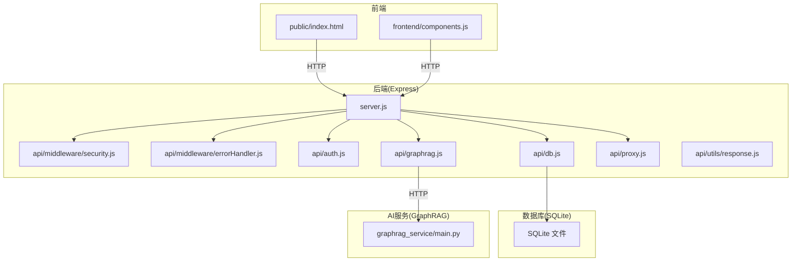
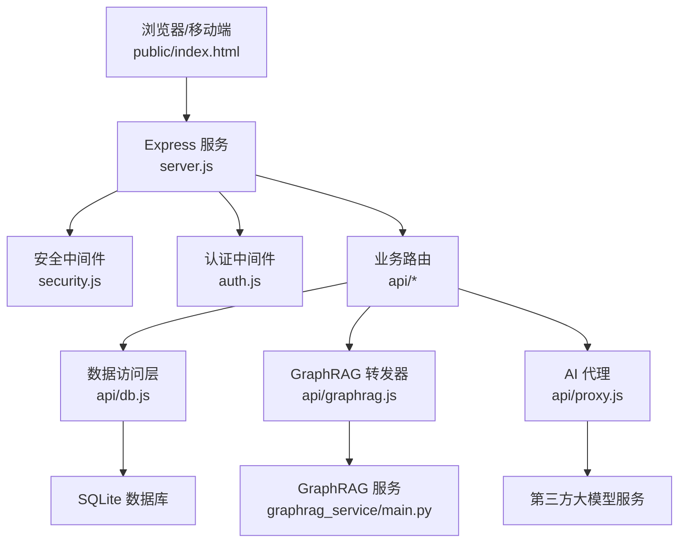
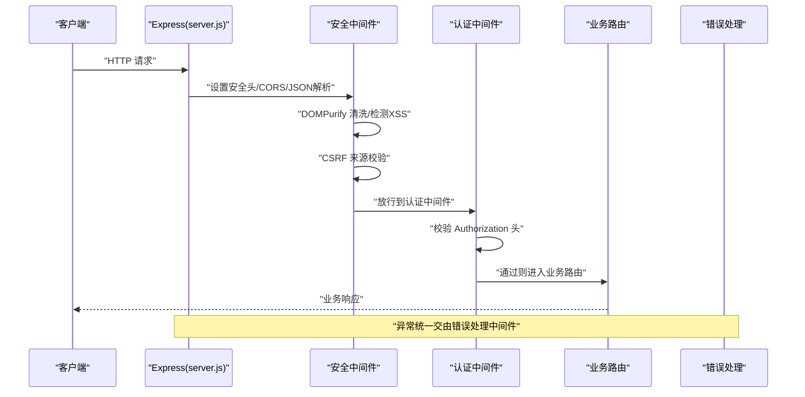
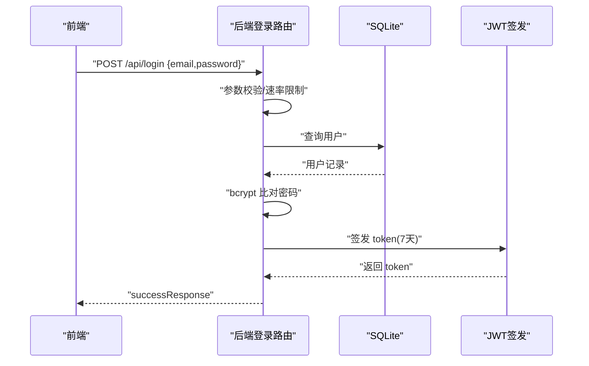
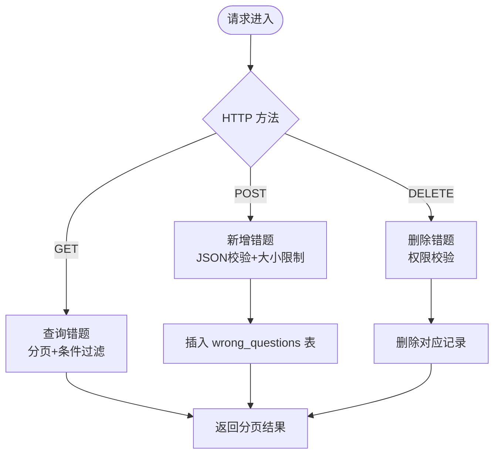
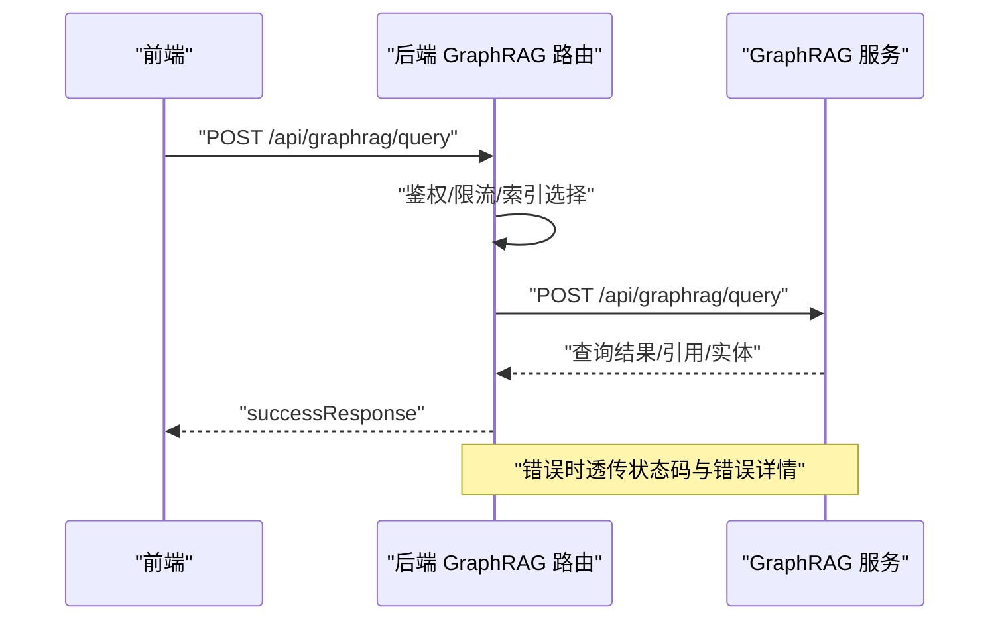
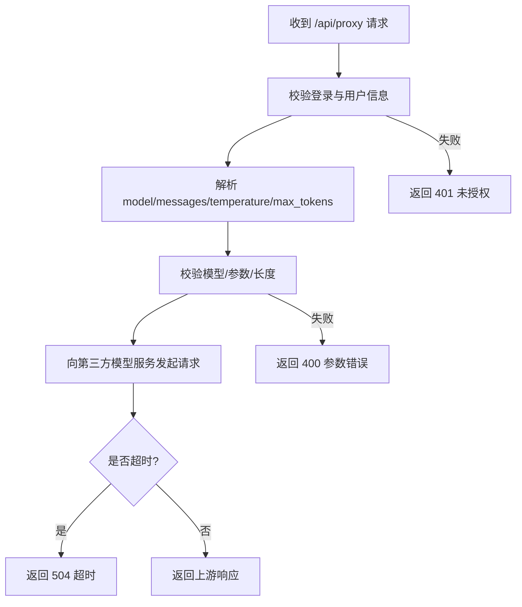
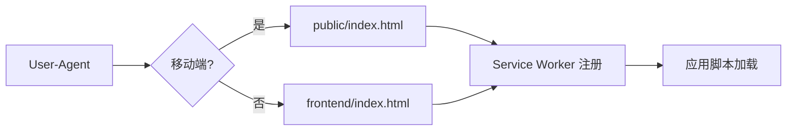
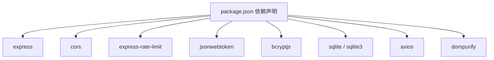

# 组件交互关系

<cite>
**本文档引用的文件**
- [server.js](file://server.js)
- [api/db.js](file://api/db.js)
- [api/middleware/security.js](file://api/middleware/security.js)
- [api/middleware/errorHandler.js](file://api/middleware/errorHandler.js)
- [api/auth.js](file://api/auth.js)
- [api/graphrag.js](file://api/graphrag.js)
- [graphrag_service/main.py](file://graphrag_service/main.py)
- [api/proxy.js](file://api/proxy.js)
- [api/utils/response.js](file://api/utils/response.js)
- [frontend/components.js](file://frontend/components.js)
- [public/index.html](file://public/index.html)
- [package.json](file://package.json)
</cite>

## 目录
1. [简介](#简介)
2. [项目结构](#项目结构)
3. [核心组件](#核心组件)
4. [架构总览](#架构总览)
5. [详细组件分析](#详细组件分析)
6. [依赖关系分析](#依赖关系分析)
7. [性能考量](#性能考量)
8. [故障排查指南](#故障排查指南)
9. [结论](#结论)

## 简介
本文件面向AI家教项目，系统化梳理前端应用、Express后端、SQLite数据库、GraphRAG服务与安全中间件之间的交互关系。文档覆盖请求处理流程、数据传输协议、错误处理机制，并通过多种图示展示组件间的消息传递模式与同步/异步调用策略。同时阐述中间件在请求生命周期中的作用，以及各组件如何协作完成用户认证、数据查询与AI服务调用等关键功能。

## 项目结构
项目采用前后端分离架构：
- 前端静态资源位于 public 与 frontend 目录，通过 Express 提供静态文件服务。
- 后端使用 Express 提供 REST API，路由集中于 server.js 并按功能拆分至 api 子目录。
- 数据持久化使用 SQLite，通过 api/db.js 封装连接与表结构初始化。
- GraphRAG 服务独立运行于 Python FastAPI 应用，后端通过 HTTP 转发调用。
- 安全中间件负责头部设置、CORS、XSS 清洗与检测、CSRF 校验与速率限制。
- 错误处理中间件统一捕获异常并格式化响应。

图表来源
- [server.js:1-221](file://server.js#L1-L221)
- [api/db.js:1-478](file://api/db.js#L1-L478)
- [api/middleware/security.js:1-114](file://api/middleware/security.js#L1-L114)
- [api/middleware/errorHandler.js:1-75](file://api/middleware/errorHandler.js#L1-L75)
- [api/auth.js:1-47](file://api/auth.js#L1-L47)
- [api/graphrag.js:1-224](file://api/graphrag.js#L1-L224)
- [graphrag_service/main.py:1-462](file://graphrag_service/main.py#L1-L462)
- [api/proxy.js:1-106](file://api/proxy.js#L1-L106)
- [api/utils/response.js:1-69](file://api/utils/response.js#L1-L69)
- [public/index.html:1-43](file://public/index.html#L1-L43)
- [frontend/components.js:1-145](file://frontend/components.js#L1-L145)

章节来源
- [server.js:1-221](file://server.js#L1-L221)
- [api/db.js:1-478](file://api/db.js#L1-L478)
- [api/middleware/security.js:1-114](file://api/middleware/security.js#L1-L114)
- [api/middleware/errorHandler.js:1-75](file://api/middleware/errorHandler.js#L1-L75)
- [api/auth.js:1-47](file://api/auth.js#L1-L47)
- [api/graphrag.js:1-224](file://api/graphrag.js#L1-L224)
- [graphrag_service/main.py:1-462](file://graphrag_service/main.py#L1-L462)
- [api/proxy.js:1-106](file://api/proxy.js#L1-L106)
- [api/utils/response.js:1-69](file://api/utils/response.js#L1-L69)
- [public/index.html:1-43](file://public/index.html#L1-L43)
- [frontend/components.js:1-145](file://frontend/components.js#L1-L145)

## 核心组件
- Express 服务入口与路由注册：集中于 server.js，配置中间件、静态资源、路由与错误处理。
- 安全中间件：统一设置安全头、清洗与检测输入、CSRF 校验与多级速率限制。
- 认证中间件：校验 JWT，注入用户信息到请求上下文。
- 数据访问层：封装 SQLite 连接、表初始化、索引与查询工具。
- GraphRAG 转发器：鉴权后将请求转发至本地 GraphRAG 服务，内置简单限流。
- AI 代理：统一路由到第三方大模型服务，进行参数校验与超时控制。
- 响应工具：标准化成功/错误/分页/创建/删除响应格式。
- 前端静态页面与导航组件：提供移动端适配与基础交互。

章节来源
- [server.js:1-221](file://server.js#L1-L221)
- [api/middleware/security.js:1-114](file://api/middleware/security.js#L1-L114)
- [api/auth.js:1-47](file://api/auth.js#L1-L47)
- [api/db.js:1-478](file://api/db.js#L1-L478)
- [api/graphrag.js:1-224](file://api/graphrag.js#L1-L224)
- [api/proxy.js:1-106](file://api/proxy.js#L1-L106)
- [api/utils/response.js:1-69](file://api/utils/response.js#L1-L69)
- [public/index.html:1-43](file://public/index.html#L1-L43)
- [frontend/components.js:1-145](file://frontend/components.js#L1-L145)

## 架构总览
下图展示从浏览器到后端、数据库与外部AI服务的整体交互路径，包括认证、安全防护、数据持久化与AI能力调用。

图表来源
- [server.js:1-221](file://server.js#L1-L221)
- [api/middleware/security.js:1-114](file://api/middleware/security.js#L1-L114)
- [api/auth.js:1-47](file://api/auth.js#L1-L47)
- [api/db.js:1-478](file://api/db.js#L1-L478)
- [api/graphrag.js:1-224](file://api/graphrag.js#L1-L224)
- [api/proxy.js:1-106](file://api/proxy.js#L1-L106)
- [graphrag_service/main.py:1-462](file://graphrag_service/main.py#L1-L462)

## 详细组件分析

### Express 服务与中间件链路
- 中间件执行顺序：安全头设置 → CORS → JSON 解析 → 输入清洗 → XSS 检测 → CSRF 校验 → 路由处理 → 自定义包装器 → 错误处理。
- 路由保护：多数业务路由需经 authMiddleware；部分路由（如登录、注册）使用独立速率限制器。
- 静态资源：优先返回移动端页面，否则返回前端页面；对特定目录提供静态缓存策略。

图表来源
- [server.js:48-205](file://server.js#L48-L205)
- [api/middleware/security.js:73-114](file://api/middleware/security.js#L73-L114)
- [api/auth.js:29-46](file://api/auth.js#L29-L46)
- [api/middleware/errorHandler.js:13-37](file://api/middleware/errorHandler.js#L13-L37)

章节来源
- [server.js:48-205](file://server.js#L48-L205)
- [api/middleware/security.js:1-114](file://api/middleware/security.js#L1-L114)
- [api/auth.js:1-47](file://api/auth.js#L1-L47)
- [api/middleware/errorHandler.js:1-75](file://api/middleware/errorHandler.js#L1-L75)

### 用户认证与会话
- 登录流程：校验参数 → 查询用户 → 密码比对 → 签发 JWT（含过期时间）。
- 认证中间件：从 Authorization 头提取 Bearer Token，验证签名并注入用户信息。
- 安全校验：禁止默认密钥、长度不足警告；JWT Secret 必须在启动前校验通过。

图表来源
- [api/login.js:1-41](file://api/login.js#L1-L41)
- [api/auth.js:12-27](file://api/auth.js#L12-L27)
- [api/db.js:15-365](file://api/db.js#L15-L365)
- [api/utils/response.js:1-69](file://api/utils/response.js#L1-L69)

章节来源
- [api/login.js:1-41](file://api/login.js#L1-L41)
- [api/auth.js:1-47](file://api/auth.js#L1-L47)
- [api/db.js:1-478](file://api/db.js#L1-L478)
- [api/utils/response.js:1-69](file://api/utils/response.js#L1-L69)

### 数据查询与存储（错题与报告）
- 错题管理：支持分页查询、新增与删除；自动解析/序列化 JSON 字段；限制单条大小。
- 报告管理：关联相似题目表，支持列表、创建与删除。
- 数据一致性：外键约束与索引优化；WAL 模式提升并发写入性能。

图表来源
- [api/questions.js:12-114](file://api/questions.js#L12-L114)
- [api/reports.js:4-67](file://api/reports.js#L4-L67)
- [api/db.js:79-302](file://api/db.js#L79-L302)

章节来源
- [api/questions.js:1-114](file://api/questions.js#L1-L114)
- [api/reports.js:1-67](file://api/reports.js#L1-L67)
- [api/db.js:1-478](file://api/db.js#L1-L478)

### GraphRAG 服务集成
- 转发器职责：鉴权、限流、参数选择与索引智能匹配、错误透传。
- GraphRAG 服务：接收查询/解释/相似题/知识图谱/试卷溯源等请求，调用底层 CLI 并记录查询日志。
- 管理接口：仅管理员可访问，支持查看任务状态、统计信息与触发重建索引。

图表来源
- [api/graphrag.js:8-112](file://api/graphrag.js#L8-L112)
- [graphrag_service/main.py:191-224](file://graphrag_service/main.py#L191-L224)

章节来源
- [api/graphrag.js:1-224](file://api/graphrag.js#L1-L224)
- [graphrag_service/main.py:1-462](file://graphrag_service/main.py#L1-L462)

### AI 代理与第三方模型
- 代理路由：统一入口，校验模型与消息数组，注入安全温度与最大 token 数。
- 超时控制：AbortController 控制请求超时，避免阻塞。
- 错误处理：缺失 API Key 返回服务不可用；超时返回 504；其他错误返回 500。

图表来源
- [api/proxy.js:33-106](file://api/proxy.js#L33-L106)

章节来源
- [api/proxy.js:1-106](file://api/proxy.js#L1-L106)

### 前端应用与导航
- 页面入口：根据 UA 判断移动/桌面，加载不同目录下的 index.html。
- 导航组件：根据登录状态动态渲染菜单；提供登出与二维码弹窗。
- PWA 支持：注册 Service Worker，预加载关键资源。

图表来源
- [server.js:77-105](file://server.js#L77-L105)
- [public/index.html:1-43](file://public/index.html#L1-43)
- [frontend/components.js:1-145](file://frontend/components.js#L1-L145)

章节来源
- [server.js:77-105](file://server.js#L77-L105)
- [public/index.html:1-43](file://public/index.html#L1-L43)
- [frontend/components.js:1-145](file://frontend/components.js#L1-L145)

## 依赖关系分析
- 后端依赖：Express、CORS、速率限制、JWT、bcrypt、sqlite/sqlite3、axios、DOMPurify。
- GraphRAG 服务：FastAPI、subprocess 调用 graphrag CLI、数据库日志表。
- 前端依赖：marked、katex、DOMPurify 等静态资源。

图表来源
- [package.json:17-30](file://package.json#L17-L30)

章节来源
- [package.json:1-43](file://package.json#L1-43)

## 性能考量
- 数据库：WAL 模式、BUSY_TIMEOUT、外键开启；大量索引覆盖常见查询字段，减少排序与全表扫描。
- 速率限制：针对登录、代理与通用 API 设置不同窗口与阈值，防止滥用。
- 缓存策略：前端 JS 资源禁用缓存，确保更新及时；静态图片与样式启用缓存。
- 超时控制：GraphRAG 查询与 AI 代理均设置超时，避免长时间阻塞。
- 建议：对高频查询增加二级缓存（如 Redis），对大对象分页返回，避免一次性传输过大数据。

## 故障排查指南
- 认证失败：检查 Authorization 头格式、JWT_SECRET 是否正确且非默认值。
- 数据库错误：确认数据库文件存在、表结构初始化完成、索引存在。
- GraphRAG 服务不可用：检查服务监听地址、端口、索引是否存在、CLI 可执行权限。
- AI 代理错误：确认第三方 API Key 配置、网络连通性、超时时间设置。
- XSS/CSRF 拦截：检查请求来源与头部，确认 Allowed Origins 配置。

章节来源
- [api/middleware/errorHandler.js:1-75](file://api/middleware/errorHandler.js#L1-L75)
- [api/middleware/security.js:1-114](file://api/middleware/security.js#L1-L114)
- [api/auth.js:12-27](file://api/auth.js#L12-L27)
- [api/db.js:15-365](file://api/db.js#L15-L365)
- [api/graphrag.js:1-224](file://api/graphrag.js#L1-L224)
- [api/proxy.js:1-106](file://api/proxy.js#L1-L106)

## 结论
本项目通过清晰的中间件链路与模块化路由设计，实现了从前端到后端、数据库与外部AI服务的稳定交互。认证与安全中间件贯穿请求生命周期，保障系统安全性；GraphRAG 与 AI 代理作为能力扩展点，通过统一转发与错误处理提升可用性。建议持续完善缓存策略与监控告警，进一步提升性能与可观测性。