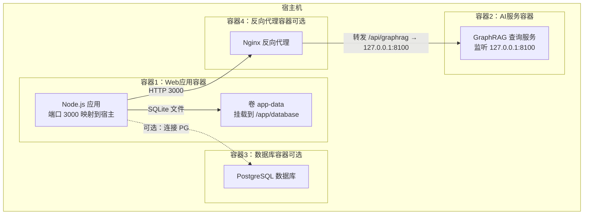
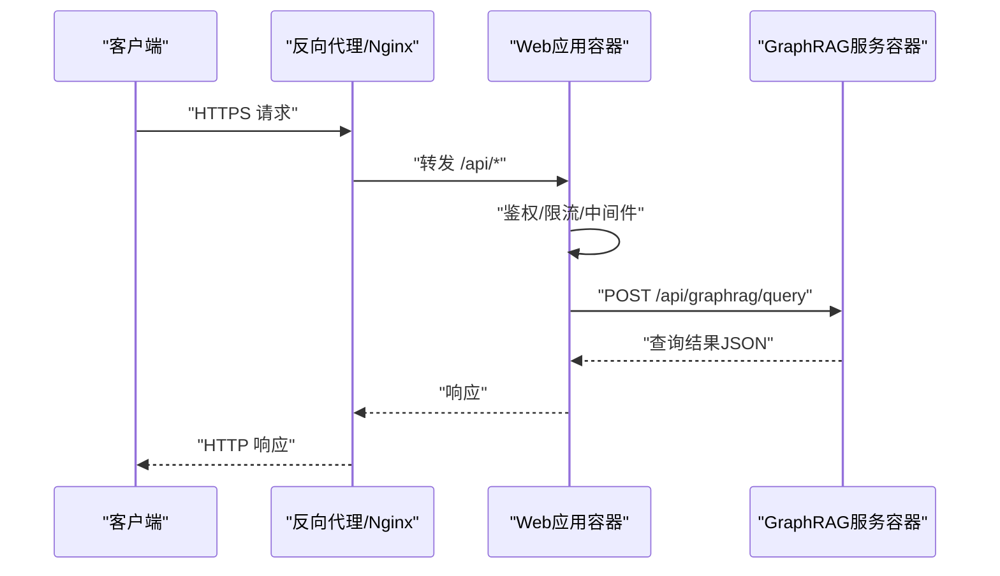
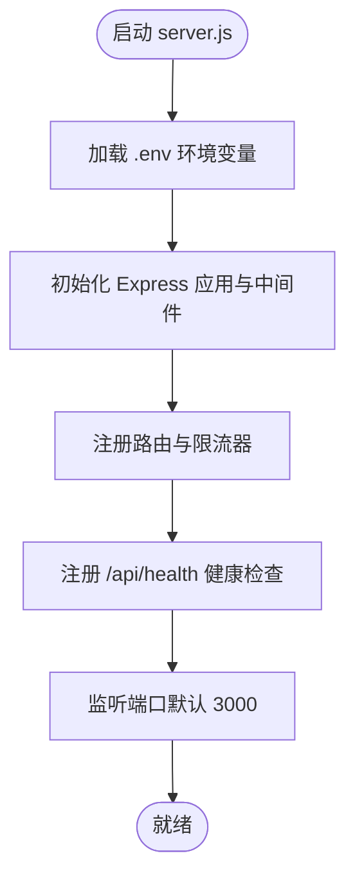
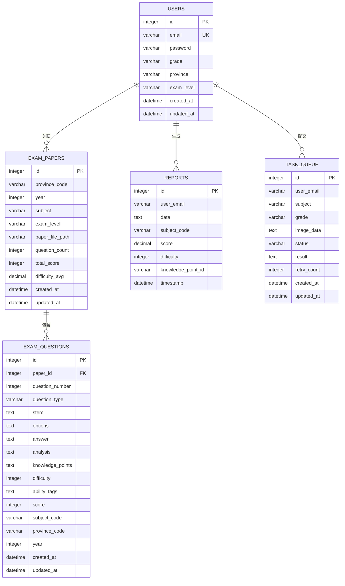
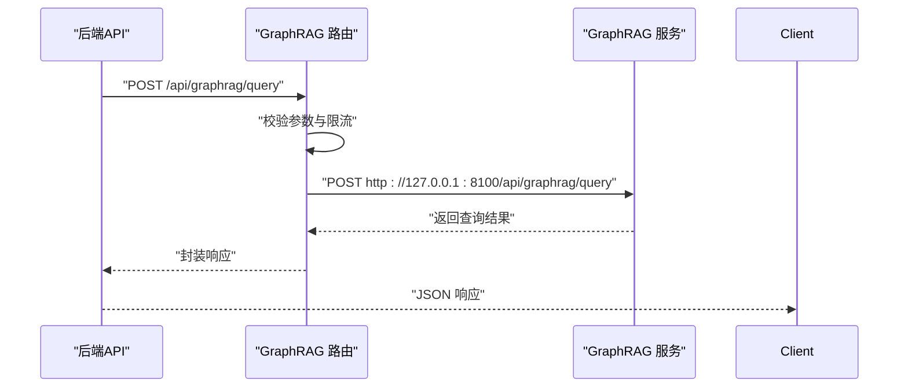
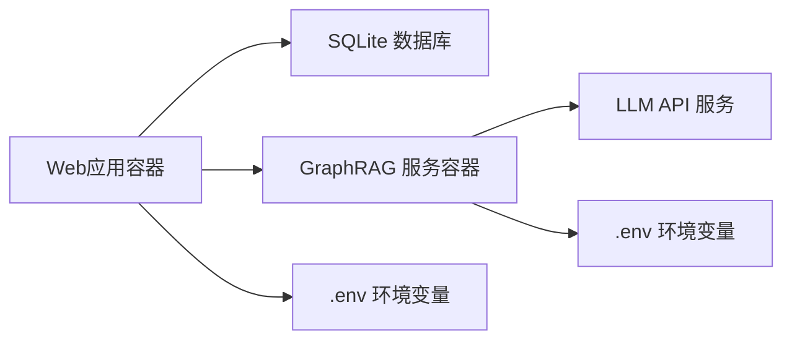

# 部署拓扑

<cite>
**本文档引用的文件**
- [docker-compose.yml](file://docker-compose.yml)
- [Dockerfile](file://Dockerfile)
- [server.js](file://server.js)
- [package.json](file://package.json)
- [api/db.js](file://api/db.js)
- [api/graphrag.js](file://api/graphrag.js)
- [graphrag_service/main.py](file://graphrag_service/main.py)
- [graphrag_service/config.py](file://graphrag_service/config.py)
- [scripts/setup_graphrag.sh](file://scripts/setup_graphrag.sh)
- [scripts/init_graphrag_service.sh](file://scripts/init_graphrag_service.sh)
- [uibe-tutor.service](file://uibe-tutor.service)
- [deploy/uibe-graphrag.service](file://deploy/uibe-graphrag.service)
</cite>

## 目录
1. [简介](#简介)
2. [项目结构](#项目结构)
3. [核心组件](#核心组件)
4. [架构总览](#架构总览)
5. [详细组件分析](#详细组件分析)
6. [依赖关系分析](#依赖关系分析)
7. [性能考虑](#性能考虑)
8. [故障排查指南](#故障排查指南)
9. [结论](#结论)
10. [附录](#附录)

## 简介
本部署拓扑文档面向AI家教项目的容器化与系统化部署，覆盖Docker容器编排、服务发现与负载均衡策略、网络与端口映射、数据持久化、环境配置与运维监控，并提供生产环境部署指南与故障恢复策略。系统采用前后端一体化的Node.js后端服务，配合独立的GraphRAG内部查询服务，通过反向代理实现统一入口与访问控制。

## 项目结构
项目采用多容器协作模式：
- Web应用容器：运行Node.js后端服务，提供API与静态资源。
- 数据库容器：使用SQLite（开发/演示场景），生产可替换为PostgreSQL。
- AI服务容器：独立的GraphRAG查询服务（FastAPI + Uvicorn），监听本地回环。
- 反向代理容器：可选Nginx或同机反向代理，负责TLS终止、静态资源与上游路由。

图表来源
- [docker-compose.yml:3-26](file://docker-compose.yml#L3-L26)
- [Dockerfile:1-26](file://Dockerfile#L1-L26)
- [graphrag_service/main.py:50-65](file://graphrag_service/main.py#L50-L65)

章节来源
- [docker-compose.yml:1-26](file://docker-compose.yml#L1-L26)
- [Dockerfile:1-26](file://Dockerfile#L1-L26)

## 核心组件
- Web应用容器
  - 基于Node.js 22镜像，安装Python工具链用于GraphRAG文档处理。
  - 暴露端口3000，默认监听3000；支持环境变量PORT覆盖。
  - 健康检查通过GET /api/health探测数据库可用性。
  - 数据持久化：通过命名卷app-data挂载到/app/database，存储SQLite数据库文件。
  - 关键环境变量：NODE_ENV、JWT_SECRET、DASHSCOPE_API_KEY、DEEPSEEK_API_KEY等。
- AI服务容器
  - 基于Python虚拟环境，运行FastAPI应用，监听127.0.0.1:8100。
  - 通过systemd服务管理，具备内存上限与CPU配额限制。
  - 索引与查询能力由GraphRAG CLI驱动，支持多索引与查询方法。
- 数据库
  - 默认SQLite（开发/演示），表结构在首次连接时自动创建与迁移。
  - 生产环境可替换为PostgreSQL，通过环境变量DATABASE_URL配置。
- 反向代理
  - 可选Nginx容器，负责静态资源、CORS、速率限制与上游转发。
  - 若无外部反向代理，Web应用直接对外提供服务。

章节来源
- [server.js:126-136](file://server.js#L126-L136)
- [api/db.js:15-365](file://api/db.js#L15-L365)
- [graphrag_service/main.py:178-189](file://graphrag_service/main.py#L178-L189)
- [graphrag_service/config.py:15-59](file://graphrag_service/config.py#L15-L59)

## 架构总览
系统采用“单体后端 + 内部AI服务”的混合架构：
- Web应用容器统一对外提供REST API与静态资源。
- GraphRAG查询通过内部HTTP转发至127.0.0.1:8100，避免直接暴露LLM服务。
- 健康检查与限流策略贯穿应用层与AI服务层，确保稳定性。

图表来源
- [api/graphrag.js:37-59](file://api/graphrag.js#L37-L59)
- [graphrag_service/main.py:191-224](file://graphrag_service/main.py#L191-L224)

## 详细组件分析

### Web应用容器（Node.js）
职责与特性
- 提供认证、业务API、静态资源托管与Swagger文档。
- 内置CORS、XSS防护、CSRF保护与速率限制。
- 健康检查端点：GET /api/health，检测数据库连接状态。
- 端口映射：默认3000，可通过环境变量PORT覆盖。
- 数据持久化：挂载卷app-data到/app/database，保存SQLite文件。

图表来源
- [server.js:37-221](file://server.js#L37-L221)
- [Dockerfile:22-25](file://Dockerfile#L22-L25)

章节来源
- [server.js:126-136](file://server.js#L126-L136)
- [Dockerfile:20-25](file://Dockerfile#L20-L25)

### 数据库（SQLite）
职责与特性
- 自动创建核心业务表与索引，支持动态列迁移。
- WAL模式、超时与外键约束优化并发与一致性。
- 开发/演示默认SQLite，生产建议替换为PostgreSQL。

图表来源
- [api/db.js:27-302](file://api/db.js#L27-L302)

章节来源
- [api/db.js:15-365](file://api/db.js#L15-L365)

### AI服务容器（GraphRAG）
职责与特性
- FastAPI服务，监听127.0.0.1:8100，仅对内网暴露。
- 支持多索引与查询方法（local/global/drift/basic），自动选择索引。
- 提供查询、题目讲解、相似真题、知识图谱、试卷溯源等接口。
- 管理员接口：作业状态、统计信息、触发重新索引。
- systemd服务管理，具备内存上限与CPU配额限制。

图表来源
- [api/graphrag.js:88-112](file://api/graphrag.js#L88-L112)
- [graphrag_service/main.py:191-224](file://graphrag_service/main.py#L191-L224)

章节来源
- [api/graphrag.js:12-224](file://api/graphrag.js#L12-L224)
- [graphrag_service/main.py:178-224](file://graphrag_service/main.py#L178-L224)
- [graphrag_service/config.py:23-59](file://graphrag_service/config.py#L23-L59)

### 反向代理容器（可选）
职责与特性
- 终止TLS、提供静态资源、统一CORS与速率限制。
- 将/api/graphrag转发至127.0.0.1:8100。
- 可与Web应用在同一容器内运行，减少网络跳数。

章节来源
- [graphrag_service/main.py:57-64](file://graphrag_service/main.py#L57-L64)

## 依赖关系分析
- Web应用依赖
  - SQLite数据库：首次连接自动初始化。
  - GraphRAG服务：通过内部HTTP转发进行查询。
  - 环境变量：JWT密钥、AI服务API密钥、端口等。
- GraphRAG服务依赖
  - Python虚拟环境与GraphRAG CLI。
  - 环境变量：LLM API密钥、基础地址、模型、服务端口等。
  - 索引工作区：graphrag_workspace目录下的索引文件。

图表来源
- [api/db.js:15-365](file://api/db.js#L15-L365)
- [graphrag_service/config.py:8-17](file://graphrag_service/config.py#L8-L17)

章节来源
- [package.json:17-30](file://package.json#L17-L30)
- [graphrag_service/config.py:8-17](file://graphrag_service/config.py#L8-L17)

## 性能考虑
- 端口与网络
  - Web应用：3000/tcp（可映射到宿主任意端口）。
  - GraphRAG：127.0.0.1:8100（仅内网访问，避免外部暴露）。
- 数据持久化
  - 使用命名卷app-data挂载数据库目录，确保容器重建不丢失数据。
- 限流与健康检查
  - 应用层：登录、代理、API三档限流。
  - 容器层：Docker健康检查与systemd重启策略。
- 资源限制
  - GraphRAG systemd服务配置了内存上限与CPU配额，防止资源滥用。

章节来源
- [docker-compose.yml:6-22](file://docker-compose.yml#L6-L22)
- [server.js:44-46](file://server.js#L44-L46)
- [uibe-graphrag.service:13-15](file://uibe-graphrag.service#L13-L15)

## 故障排查指南
常见问题与定位
- Web应用无法启动
  - 检查环境变量是否完整（JWT_SECRET、AI服务密钥等）。
  - 查看容器日志与健康检查结果。
- GraphRAG服务不可用
  - 确认systemd服务状态与日志。
  - 检查索引是否存在与构建完成。
- 数据库异常
  - SQLite文件权限与路径正确性。
  - 表结构与索引是否按版本初始化。

运维命令
- 启动/停止/重启服务
  - Web应用：systemd服务 uibe-tutor。
  - GraphRAG：systemd服务 uibe-graphrag。
- 查看日志
  - Web应用：journalctl -u uibe-tutor -f。
  - GraphRAG：journalctl -u uibe-graphrag -f。
- 健康检查
  - Web应用：curl http://localhost:3000/api/health。
  - GraphRAG：curl http://localhost:8100/health。

章节来源
- [uibe-tutor.service:10-15](file://uibe-tutor.service#L10-L15)
- [deploy/uibe-graphrag.service:8-11](file://deploy/uibe-graphrag.service#L8-L11)
- [server.js:126-136](file://server.js#L126-L136)
- [graphrag_service/main.py:178-189](file://graphrag_service/main.py#L178-L189)

## 结论
该部署拓扑以“单体后端 + 内部AI服务”为核心，结合Docker容器编排与systemd服务管理，实现了开发到生产的平滑过渡。通过明确的网络边界（内网仅127.0.0.1:8100）、严格的限流与健康检查、以及可扩展的卷与环境变量机制，系统具备良好的可维护性与可扩展性。生产部署建议引入反向代理、替换SQLite为PostgreSQL，并完善监控与告警体系。

## 附录

### 环境配置清单
- Web应用关键环境变量
  - NODE_ENV：运行环境（如production）。
  - JWT_SECRET：JWT签名密钥。
  - DASHSCOPE_API_KEY / DEEPSEEK_API_KEY：AI服务API密钥。
  - PORT：应用监听端口（默认3000）。
  - ALLOWED_ORIGINS：允许的前端域名列表。
- GraphRAG服务关键环境变量
  - GRAPHRAG_API_KEY：LLM API密钥。
  - GRAPHRAG_API_BASE：LLM API基础地址。
  - GRAPHRAG_MODEL / GRAPHRAG_CODING_MODEL：模型名称。
  - GRAPHRAG_SERVICE_HOST / GRAPHRAG_SERVICE_PORT：服务监听地址与端口。
  - DATABASE_URL：PostgreSQL连接串（可选）。

章节来源
- [docker-compose.yml:8-13](file://docker-compose.yml#L8-L13)
- [graphrag_service/config.py:8-17](file://graphrag_service/config.py#L8-L17)

### 生产环境部署指南
- 基础设施准备
  - 准备两台服务器：一台运行Web应用与反向代理，另一台运行GraphRAG服务。
  - 在Web服务器上安装Docker与systemd服务文件。
- 步骤
  - 配置 .env 文件，填充所有必要环境变量。
  - 启动GraphRAG服务：systemctl enable uibe-graphrag && systemctl start uibe-graphrag。
  - 启动Web应用：systemctl enable uibe-tutor && systemctl start uibe-tutor。
  - 验证健康检查与日志输出。
  - 如需反向代理，部署Nginx并配置上游转发。
- 数据迁移
  - SQLite生产迁移至PostgreSQL，使用数据库迁移脚本或工具。
  - 更新Web应用的DATABASE_URL与GraphRAG的DATABASE_URL。

章节来源
- [scripts/setup_graphrag.sh:60-75](file://scripts/setup_graphrag.sh#L60-L75)
- [scripts/init_graphrag_service.sh:15-42](file://scripts/init_graphrag_service.sh#L15-L42)
- [uibe-tutor.service:10-11](file://uibe-tutor.service#L10-L11)
- [deploy/uibe-graphrag.service:7-11](file://deploy/uibe-graphrag.service#L7-L11)