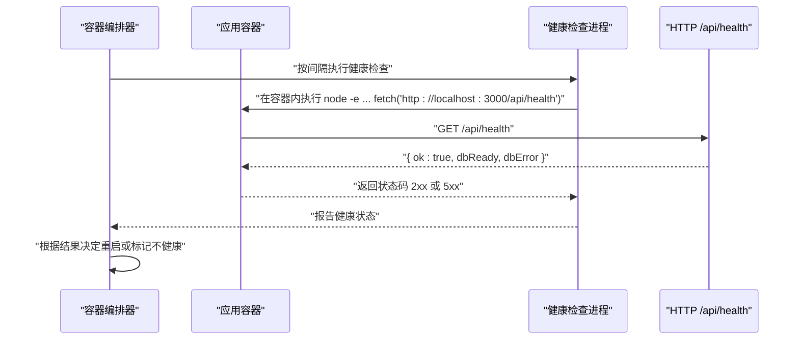
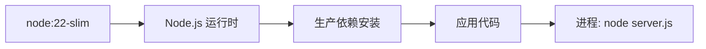

# 容器化部署

<cite>
**本文引用的文件**
- [Dockerfile](file://Dockerfile)
- [docker-compose.yml](file://docker-compose.yml)
- [.dockerignore](file://.dockerignore)
- [package.json](file://package.json)
- [server.js](file://server.js)
</cite>

## 目录
1. [简介](#简介)
2. [项目结构](#项目结构)
3. [核心组件](#核心组件)
4. [架构总览](#架构总览)
5. [详细组件分析](#详细组件分析)
6. [依赖关系分析](#依赖关系分析)
7. [性能与资源考虑](#性能与资源考虑)
8. [故障排查指南](#故障排查指南)
9. [结论](#结论)
10. [附录](#附录)

## 简介
本文件面向AI家教项目的容器化部署，围绕Docker镜像构建、多阶段优化、镜像安全配置、docker-compose服务编排、网络与数据卷管理、环境变量与健康检查、资源限制以及生产最佳实践展开。内容基于仓库中现有的Dockerfile、docker-compose.yml、.dockerignore、package.json与后端入口文件进行分析与总结，帮助读者在生产环境中稳定、安全地运行该应用。

## 项目结构
AI家教项目采用单体后端（Node.js + Express）+ SQLite数据库的架构，前端静态资源由后端统一托管。容器化部署通过单一Dockerfile构建应用镜像，并使用docker-compose编排服务，挂载数据库目录为命名卷以持久化数据。

```mermaid
graph TB
subgraph "宿主机"
HostVol["命名卷 app-data<br/>持久化数据库"]
end
subgraph "容器"
App["应用容器<br/>Node.js 22-slim"]
DBVol["/app/database<br/>映射到宿主机命名卷"]
end
App -- "端口映射" --> Port["3000/tcp"]
App -- "数据卷挂载" --> DBVol
HostVol <- --> DBVol
```

图表来源
- [docker-compose.yml:1-26](file://docker-compose.yml#L1-L26)
- [Dockerfile:1-26](file://Dockerfile#L1-L26)

章节来源
- [Dockerfile:1-26](file://Dockerfile#L1-L26)
- [docker-compose.yml:1-26](file://docker-compose.yml#L1-L26)
- [.dockerignore:1-17](file://.dockerignore#L1-L17)
- [package.json:1-43](file://package.json#L1-L43)

## 核心组件
- 应用镜像构建：基于node:22-slim基础镜像，安装Python3/编译工具链，执行npm ci仅安装生产依赖，复制源码并切换非root用户运行，暴露端口3000，配置健康检查，启动命令为node server.js。
- docker-compose编排：定义单服务app，构建上下文为当前目录，映射宿主机端口（默认3000），注入生产环境变量（JWT_SECRET、DASHSCOPE_API_KEY、DEEPSEEK_API_KEY等），挂载数据库目录为命名卷app-data，启用健康检查与重启策略。
- 健康检查：通过HTTP GET /api/health探测数据库连接状态，作为容器存活与就绪判断依据。
- 数据持久化：通过命名卷app-data将/app/database映射到宿主机，避免容器删除导致数据丢失。
- 安全基线：使用非root用户运行；镜像层最小化；.dockerignore排除开发与日志文件；健康检查减少无效流量。

章节来源
- [Dockerfile:1-26](file://Dockerfile#L1-L26)
- [docker-compose.yml:1-26](file://docker-compose.yml#L1-L26)
- [server.js:126-136](file://server.js#L126-L136)

## 架构总览
下图展示容器化部署的整体交互：客户端访问容器内3000端口，后端路由处理业务逻辑并访问SQLite数据库；docker-compose负责服务编排、网络与卷管理；健康检查保障容器可用性。

```mermaid
graph TB
Client["客户端浏览器/调用方"] --> Nginx["可选反向代理/Nginx"]
Nginx --> Port["容器端口 3000"]
Port --> App["Node.js 应用进程"]
App --> Health["健康检查 /api/health"]
App --> DB["SQLite 数据库<br/>位于 /app/database"]
Compose["docker-compose 编排"] --> App
Compose --> Vol["命名卷 app-data"]
Vol <- --> DB
```

图表来源
- [docker-compose.yml:1-26](file://docker-compose.yml#L1-L26)
- [server.js:126-136](file://server.js#L126-L136)

## 详细组件分析

### 镜像构建与多阶段优化
- 基础镜像选择：使用node:22-slim，具备较小体积与较新Node版本，适合生产部署。
- 构建步骤要点：
  - 安装Python3/编译工具链用于某些原生模块的构建。
  - 使用npm ci安装生产依赖并清理缓存，减少镜像层数与体积。
  - 复制源码后创建database目录并变更属主，确保后续写入权限。
  - 切换至非root用户运行，降低权限风险。
  - 暴露端口3000，设置健康检查与启动命令。
- 多阶段优化建议（当前未实现）：
  - 引入第二阶段仅拷贝运行时产物（如dist或已构建的包），进一步缩小镜像体积。
  - 使用更小的基础镜像（如Alpine）并精简系统包。
  - 合理利用缓存层顺序，使依赖更新不破坏后续层缓存。
  - 在CI中分阶段构建并推送镜像，结合镜像签名与漏洞扫描。

章节来源
- [Dockerfile:1-26](file://Dockerfile#L1-L26)
- [package.json:17-30](file://package.json#L17-L30)

### docker-compose服务编排
- 服务定义：app服务，build指向当前目录，端口映射${PORT:-3000}:3000，注入NODE_ENV=production与多个第三方API密钥。
- 存储与网络：
  - volumes挂载/app/database到命名卷app-data，实现数据持久化。
  - 默认网络由compose创建，容器间可通过服务名通信（若后续扩展）。
- 健康检查与重启策略：启用健康检查与unless-stopped重启策略，提升可用性。
- 环境变量：通过环境变量注入JWT_SECRET、DASHSCOPE_API_KEY、DEEPSEEK_API_KEY等，建议在外部配置文件或密钥管理服务中管理。

章节来源
- [docker-compose.yml:1-26](file://docker-compose.yml#L1-L26)

### 健康检查流程
健康检查通过HTTP访问/api/health，该接口会尝试获取数据库连接并返回状态。健康检查失败将触发重启策略，保证服务自愈。



图表来源
- [docker-compose.yml:17-22](file://docker-compose.yml#L17-L22)
- [Dockerfile:22-23](file://Dockerfile#L22-L23)
- [server.js:126-136](file://server.js#L126-L136)

### 数据卷与持久化
- 命名卷app-data映射到/app/database，确保容器重建或删除后数据不丢失。
- .dockerignore排除node_modules、测试与日志等目录，避免污染镜像层。

章节来源
- [docker-compose.yml:14-16](file://docker-compose.yml#L14-L16)
- [.dockerignore:1-17](file://.dockerignore#L1-L17)

### 网络与端口
- 容器暴露3000端口，docker-compose默认将宿主机端口映射到3000（可通过环境变量覆盖）。
- 生产环境建议：
  - 使用反向代理（Nginx/Traefik）统一入口，开启TLS与限流。
  - 将容器置于隔离网络，仅开放必要端口。
  - 为容器设置只读根文件系统与最小权限能力。

章节来源
- [Dockerfile:20](file://Dockerfile#L20)
- [docker-compose.yml:6-7](file://docker-compose.yml#L6-L7)

### 环境变量与安全配置
- 必需环境变量：NODE_ENV、JWT_SECRET、DASHSCOPE_API_KEY、DEEPSEEK_API_KEY、PORT。
- 安全建议：
  - 使用密钥管理服务（如Vault/KMS）注入敏感信息，避免硬编码。
  - 在compose中使用外部env文件或secrets功能。
  - 启用只读根文件系统、drop多余Linux capabilities、限制设备访问。

章节来源
- [docker-compose.yml:8-13](file://docker-compose.yml#L8-L13)
- [server.js:40-54](file://server.js#L40-L54)

## 依赖关系分析
- 运行时依赖：Express、sqlite3、bcryptjs、jsonwebtoken、axios、cors、marked、katex等。
- 开发依赖：ESLint、Prettier、Vitest等，构建阶段已通过npm ci排除。
- 依赖安装与缓存：使用npm ci与缓存清理，减少镜像体积与构建时间。



图表来源
- [Dockerfile:11-14](file://Dockerfile#L11-L14)
- [package.json:17-30](file://package.json#L17-L30)

章节来源
- [package.json:17-30](file://package.json#L17-L30)
- [Dockerfile:11-14](file://Dockerfile#L11-L14)

## 性能与资源考虑
- 镜像体积优化：
  - 使用多阶段构建分离构建与运行时。
  - 清理包管理器缓存与无用文件。
  - 仅保留运行所需二进制与依赖。
- 进程与并发：
  - 使用PM2或内置cluster模式（需配合环境变量与进程数控制）。
  - 合理设置最大请求体大小与速率限制，避免资源耗尽。
- 资源限制（建议）：
  - 在docker-compose中添加deploy.resources限制CPU/内存。
  - 设置容器重启策略与健康检查阈值，避免雪崩效应。
- 数据库性能：
  - SQLite适合中小规模场景；高并发建议迁移到PostgreSQL/MySQL并使用连接池。
  - 控制数据库文件大小与事务粒度，定期维护索引。

章节来源
- [Dockerfile:11-14](file://Dockerfile#L11-L14)
- [server.js:44-46](file://server.js#L44-L46)

## 故障排查指南
- 健康检查失败：
  - 查看容器日志，确认/api/health返回的dbReady与dbError。
  - 检查数据库目录权限与卷挂载是否正确。
- 端口冲突：
  - 确认宿主机端口映射是否被占用，调整PORT环境变量。
- 权限问题：
  - 确保/app/database目录属主为node用户，或在启动前chown。
- 环境变量缺失：
  - 补充JWT_SECRET、DASHSCOPE_API_KEY、DEEPSEEK_API_KEY等。
- 依赖安装失败：
  - 清理缓存并重试；检查网络与registry可达性。
- 日志收集与监控：
  - 使用Docker日志驱动输出到集中式日志系统（如ELK/Fluentd）。
  - 配置指标导出（如Prometheus），结合Grafana可视化。

章节来源
- [docker-compose.yml:17-22](file://docker-compose.yml#L17-L22)
- [Dockerfile:16](file://Dockerfile#L16)
- [server.js:126-136](file://server.js#L126-L136)

## 结论
当前部署方案以单镜像+单容器的方式满足快速上线需求，具备健康检查与数据卷持久化。建议在生产环境中引入多阶段构建、密钥管理、资源限制与反向代理，进一步提升安全性、稳定性与可观测性。

## 附录

### 环境变量清单
- NODE_ENV：生产环境标识
- JWT_SECRET：JWT密钥
- DASHSCOPE_API_KEY：DashScope API密钥
- DEEPSEEK_API_KEY：DeepSeek API密钥
- PORT：应用监听端口（默认3000）

章节来源
- [docker-compose.yml:8-13](file://docker-compose.yml#L8-L13)