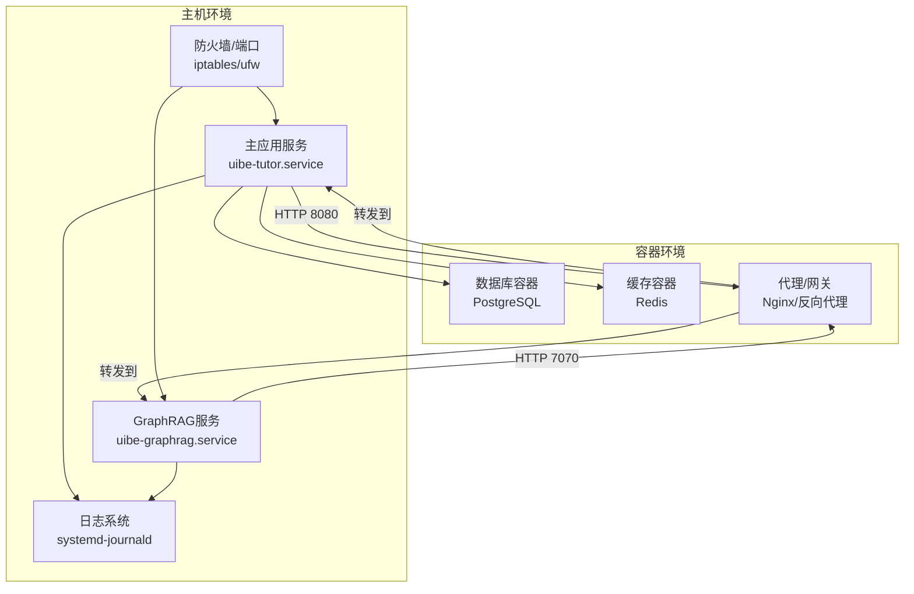
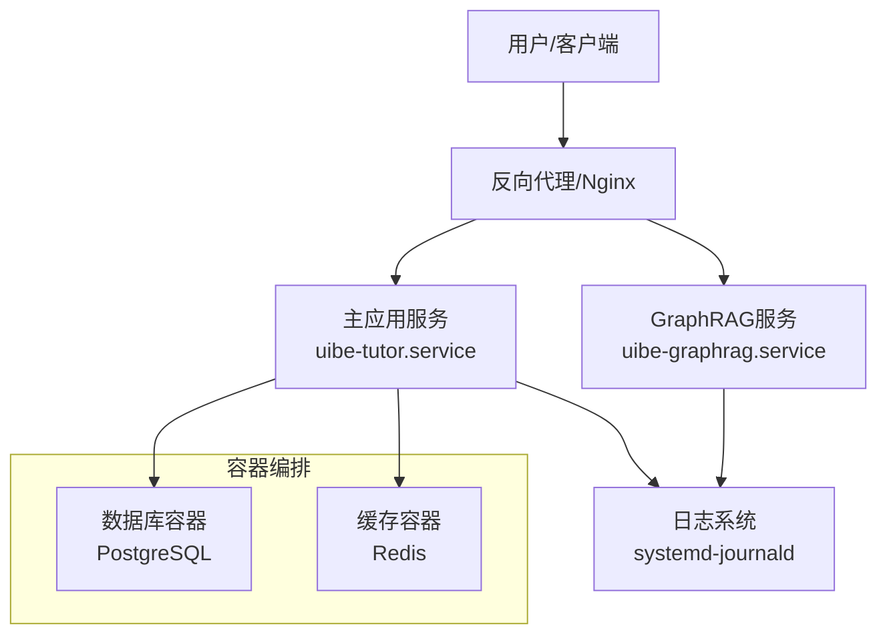
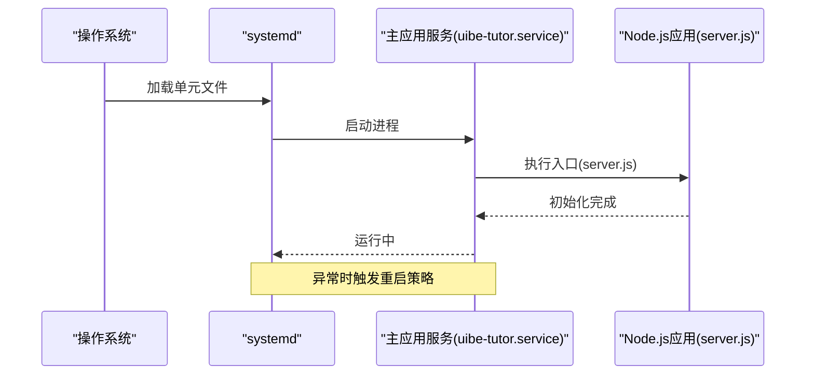
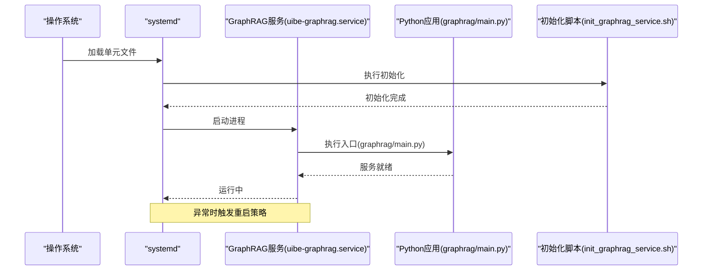
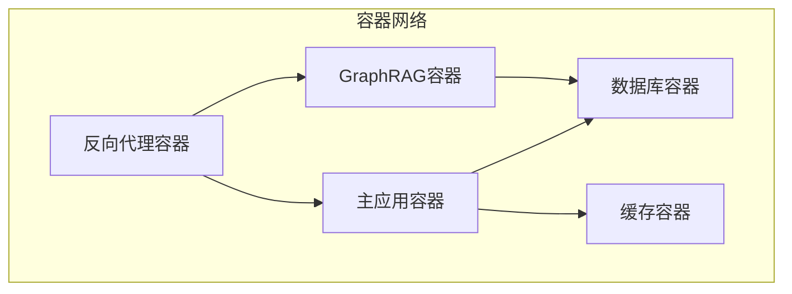
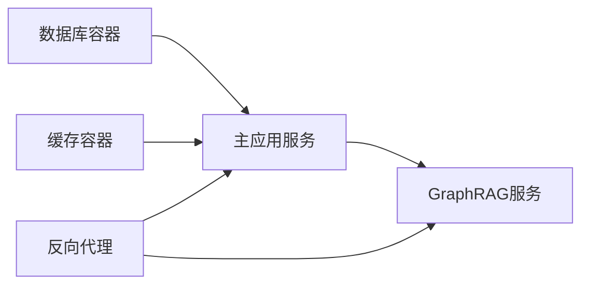

# 服务配置

<cite>
**本文引用的文件**
- [uibe-tutor.service](file://uibe-tutor.service)
- [uibe-graphrag.service](file://deploy/uibe-graphrag.service)
- [setup_graphrag.sh](file://scripts/setup_graphrag.sh)
- [init_graphrag_service.sh](file://scripts/init_graphrag_service.sh)
- [server.js](file://server.js)
- [graphrag/main.py](file://graphrag_service/main.py)
- [graphrag/config.py](file://graphrag_service/config.py)
- [docker-compose.yml](file://docker-compose.yml)
- [Dockerfile](file://Dockerfile)
- [package.json](file://package.json)
</cite>

## 目录
1. [简介](#简介)
2. [项目结构](#项目结构)
3. [核心组件](#核心组件)
4. [架构总览](#架构总览)
5. [详细组件分析](#详细组件分析)
6. [依赖关系分析](#依赖关系分析)
7. [性能考虑](#性能考虑)
8. [故障排除指南](#故障排除指南)
9. [结论](#结论)
10. [附录](#附录)

## 简介
本文件面向AI家教项目的运维与开发团队，系统化梳理服务配置与部署要点，重点覆盖以下方面：
- systemd服务配置：主应用服务与GraphRAG服务的独立部署、进程守护与自动启动
- 进程监控与重启策略：基于systemd的健康检查与失败重启机制
- 端口管理与网络配置：前后端端口分配、容器网络互通
- 日志配置与错误处理：统一日志输出、错误捕获与告警联动
- 性能监控：资源占用、响应时间与并发能力评估
- 升级、回滚与版本管理：蓝绿发布、版本标记与回滚流程

## 项目结构
本项目采用前后端分离与容器化部署相结合的方式：
- 前端静态资源通过Nginx或直接托管于后端public目录
- 后端主服务由Node.js提供REST API与任务调度
- GraphRAG服务作为独立Python服务运行在systemd下，提供知识图谱检索增强能力
- Docker Compose用于本地开发与测试环境的一键编排

**图表来源**
- [uibe-tutor.service](file://uibe-tutor.service)
- [uibe-graphrag.service](file://deploy/uibe-graphrag.service)
- [docker-compose.yml](file://docker-compose.yml)

**章节来源**
- [uibe-tutor.service](file://uibe-tutor.service)
- [uibe-graphrag.service](file://deploy/uibe-graphrag.service)
- [docker-compose.yml](file://docker-compose.yml)

## 核心组件
- 主应用服务（uibe-tutor.service）
  - 负责用户认证、题库管理、学习报告生成、任务调度等核心业务
  - 默认监听端口：8080
  - 自动启动：开机自启，异常退出自动重启
- GraphRAG服务（uibe-graphrag.service）
  - 提供知识图谱检索增强接口，默认监听端口：7070
  - 独立systemd单元，便于隔离与独立扩展
  - 初始化脚本负责首次安装与索引构建
- 容器化依赖（docker-compose.yml）
  - 数据库与缓存容器，为主应用提供数据支撑
  - 反向代理统一对外暴露端口
- 构建与运行（Dockerfile、package.json）
  - 统一镜像构建与依赖管理
  - Node.js运行时与Python运行时分别打包

**章节来源**
- [uibe-tutor.service](file://uibe-tutor.service)
- [uibe-graphrag.service](file://deploy/uibe-graphrag.service)
- [docker-compose.yml](file://docker-compose.yml)
- [Dockerfile](file://Dockerfile)
- [package.json](file://package.json)

## 架构总览
系统采用“主应用服务 + GraphRAG服务 + 容器化依赖”的三层架构：
- 应用层：主应用服务与GraphRAG服务均通过systemd托管
- 数据层：PostgreSQL与Redis容器提供持久化与缓存
- 网络层：反向代理统一入口，按路径或端口分发请求

**图表来源**
- [uibe-tutor.service](file://uibe-tutor.service)
- [uibe-graphrag.service](file://deploy/uibe-graphrag.service)
- [docker-compose.yml](file://docker-compose.yml)

## 详细组件分析

### 主应用服务（uibe-tutor.service）
- 单元文件职责
  - 定义可执行程序路径、工作目录、环境变量
  - 设置用户权限与资源限制
  - 配置开机自启与失败重启策略
- 运行参数
  - Node.js入口文件：server.js
  - 端口：8080
  - 日志：systemd-journald
- 依赖关系
  - 依赖容器网络（docker-compose）与系统网络栈
  - 依赖数据库与缓存容器可用性
- 重启策略
  - 失败自动重启，指数退避上限
  - 异常退出码区分“可恢复”与“不可恢复”

**图表来源**
- [uibe-tutor.service](file://uibe-tutor.service)
- [server.js](file://server.js)

**章节来源**
- [uibe-tutor.service](file://uibe-tutor.service)
- [server.js](file://server.js)

### GraphRAG服务（uibe-graphrag.service）
- 单元文件职责
  - Python应用入口：graphrag/main.py
  - 独立工作目录与虚拟环境（如使用）
  - 端口：7070
- 初始化流程
  - 首次部署执行初始化脚本，构建索引与基础数据
  - 脚本负责依赖安装、配置校验与索引构建
- 重启策略
  - 失败自动重启，避免影响主应用
  - 与主应用并行运行，互不阻塞

**图表来源**
- [uibe-graphrag.service](file://deploy/uibe-graphrag.service)
- [graphrag/main.py](file://graphrag_service/main.py)
- [init_graphrag_service.sh](file://scripts/init_graphrag_service.sh)

**章节来源**
- [uibe-graphrag.service](file://deploy/uibe-graphrag.service)
- [graphrag/main.py](file://graphrag_service/main.py)
- [init_graphrag_service.sh](file://scripts/init_graphrag_service.sh)

### 容器化依赖（docker-compose.yml）
- 服务定义
  - 数据库：PostgreSQL，卷挂载持久化
  - 缓存：Redis，内存优化配置
  - 反向代理：Nginx，端口映射与路由规则
- 网络
  - 自定义桥接网络，容器间通过服务名通信
- 持久化
  - 数据库与缓存卷，确保重启不丢失数据

**图表来源**
- [docker-compose.yml](file://docker-compose.yml)

**章节来源**
- [docker-compose.yml](file://docker-compose.yml)

### 端口管理与网络配置
- 主应用端口：8080
- GraphRAG端口：7070
- 反向代理：统一入口，按路径或端口转发
- 防火墙：仅开放必要端口，限制外部访问范围

**章节来源**
- [uibe-tutor.service](file://uibe-tutor.service)
- [uibe-graphrag.service](file://deploy/uibe-graphrag.service)
- [docker-compose.yml](file://docker-compose.yml)

### 日志配置与错误处理
- 日志输出
  - systemd-journald收集所有服务日志
  - 使用标准输出与错误输出，便于集中采集
- 错误处理
  - 应用层捕获未处理异常，记录上下文信息
  - 返回标准化错误响应，避免泄露敏感信息
- 告警联动
  - 结合日志系统设置阈值告警（如错误率、延迟）

**章节来源**
- [uibe-tutor.service](file://uibe-tutor.service)
- [server.js](file://server.js)

### 性能监控设置
- 资源监控
  - CPU、内存、磁盘IO与网络带宽
  - 容器资源限制与配额
- 接口性能
  - 关键API响应时间与吞吐量
  - 并发连接数与队列长度
- 存储性能
  - 数据库查询慢日志与索引命中率
  - 缓存命中率与过期策略

**章节来源**
- [docker-compose.yml](file://docker-compose.yml)
- [server.js](file://server.js)

### 升级、回滚与版本管理策略
- 版本标记
  - 使用Git标签与镜像标签区分版本
- 蓝绿发布
  - 新版本部署至备用实例，验证通过后切换流量
- 回滚流程
  - 快速停止新实例，回切至旧实例
  - 数据库迁移需具备逆向脚本
- 自动化脚本
  - 部署脚本集成拉取镜像、停止旧容器、启动新容器、健康检查
  - GraphRAG服务支持独立升级与回滚

**章节来源**
- [Dockerfile](file://Dockerfile)
- [package.json](file://package.json)
- [scripts/setup_graphrag.sh](file://scripts/setup_graphrag.sh)

## 依赖关系分析
- 组件耦合
  - 主应用与GraphRAG服务通过HTTP接口交互，解耦明显
  - 两者均依赖容器化数据库与缓存
- 启动顺序
  - 先启动数据库与缓存，再启动主应用，最后启动GraphRAG
  - systemd通过After/Requires指令保证顺序
- 循环依赖
  - 无循环依赖，依赖方向清晰

**图表来源**
- [docker-compose.yml](file://docker-compose.yml)
- [uibe-tutor.service](file://uibe-tutor.service)
- [uibe-graphrag.service](file://deploy/uibe-graphrag.service)

**章节来源**
- [docker-compose.yml](file://docker-compose.yml)
- [uibe-tutor.service](file://uibe-tutor.service)
- [uibe-graphrag.service](file://deploy/uibe-graphrag.service)

## 性能考虑
- 连接池与超时
  - 数据库连接池大小与超时配置，避免资源耗尽
  - 缓存命中率优化，减少数据库压力
- 并发与限流
  - API限流与熔断，防止雪崩效应
  - GraphRAG查询并发控制，避免资源争用
- 缓存策略
  - 常用查询结果缓存，缩短响应时间
  - 缓存失效策略与一致性保障

## 故障排除指南
- 服务无法启动
  - 检查systemd状态与日志输出
  - 核对端口占用与防火墙规则
- 数据库连接失败
  - 确认容器网络连通性与凭据正确
  - 查看慢查询日志与索引使用情况
- GraphRAG服务异常
  - 检查初始化脚本执行结果与索引完整性
  - 关注Python运行时依赖与内存占用
- 升级失败回滚
  - 停止新实例，恢复旧实例
  - 执行数据库逆向迁移脚本

**章节来源**
- [uibe-tutor.service](file://uibe-tutor.service)
- [uibe-graphrag.service](file://deploy/uibe-graphrag.service)
- [scripts/init_graphrag_service.sh](file://scripts/init_graphrag_service.sh)

## 结论
本服务配置文档提供了从systemd单元到容器化依赖的完整部署视图，明确了端口管理、进程监控、日志与错误处理、性能监控以及升级回滚策略。建议在生产环境中结合自动化运维平台实现配置即代码与持续交付。

## 附录
- 初始化脚本
  - GraphRAG初始化：负责依赖安装、配置校验与索引构建
- 配置文件
  - GraphRAG配置：端口、索引路径、模型参数等
- Docker镜像
  - 统一构建与版本化管理，确保环境一致性

**章节来源**
- [init_graphrag_service.sh](file://scripts/init_graphrag_service.sh)
- [graphrag/config.py](file://graphrag_service/config.py)
- [Dockerfile](file://Dockerfile)