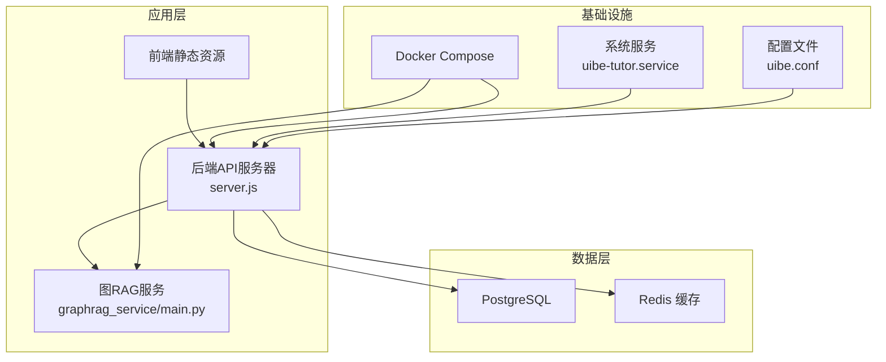
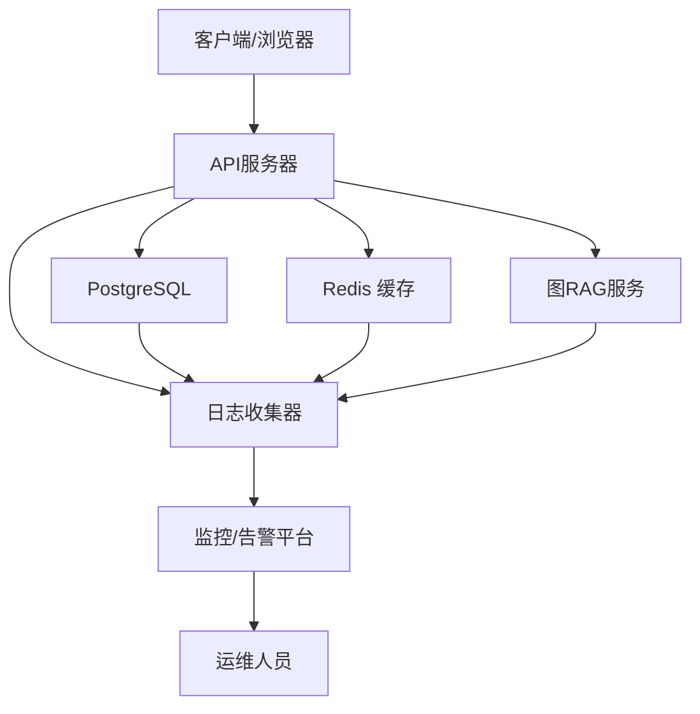
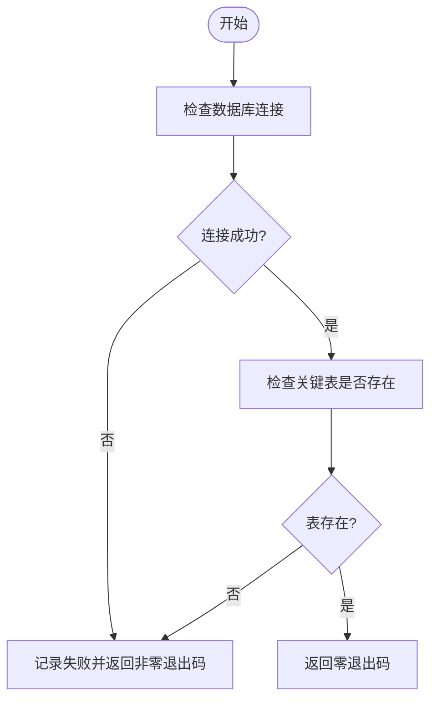
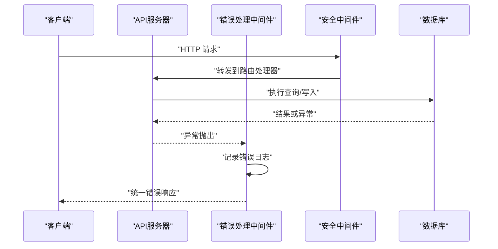
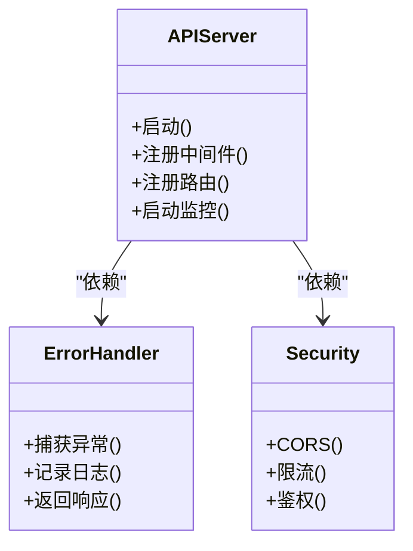
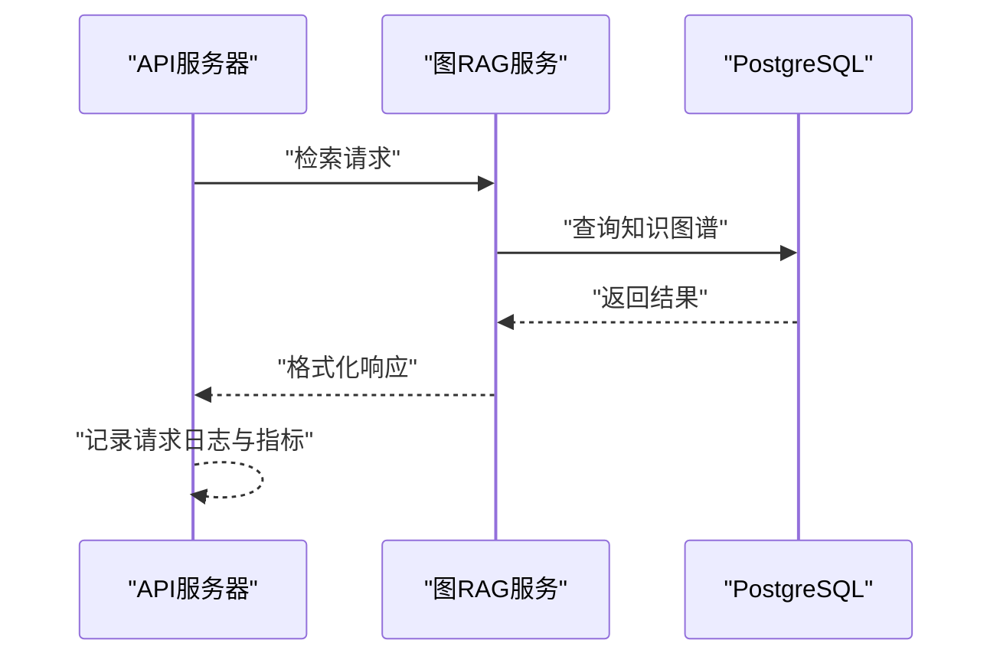
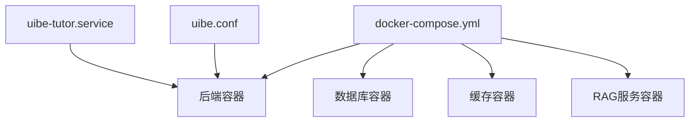
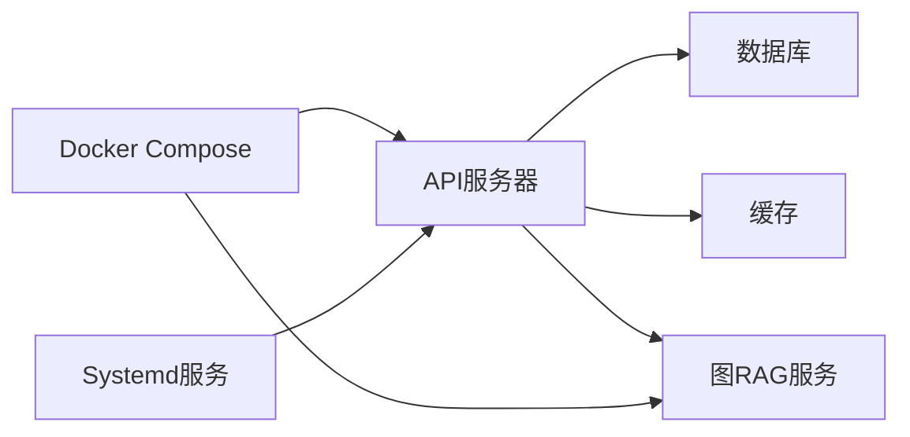

# 监控与日志

<cite>
**本文引用的文件**
- [server.js](file://server.js)
- [check-db.cjs](file://check-db.cjs)
- [check-db.js](file://check-db.js)
- [check-tables.cjs](file://check-tables.cjs)
- [docker-compose.yml](file://docker-compose.yml)
- [errorHandler.js](file://api/middleware/errorHandler.js)
- [security.js](file://api/middleware/security.js)
- [db.js](file://api/db.js)
- [cache.js](file://api/utils/cache.js)
- [response.js](file://api/utils/response.js)
- [prompts.js](file://api/utils/prompts.js)
- [llmParser.js](file://api/utils/llmParser.js)
- [validator.js](file://api/utils/validator.js)
- [swagger.js](file://api/swagger.js)
- [taskWorker.js](file://api/taskWorker.js)
- [tasks.js](file://api/tasks.js)
- [graphrag_service/main.py](file://graphrag_service/main.py)
- [graphrag_service/config.py](file://graphrag_service/config.py)
- [graphrag_service/db.py](file://graphrag_service/db.py)
- [graphrag_service/indexer.py](file://graphrag_service/indexer.py)
- [uibe-tutor.service](file://uibe-tutor.service)
- [uibe.conf](file://uibe.conf)
- [package.json](file://package.json)
</cite>

## 目录
1. [简介](#简介)
2. [项目结构](#项目结构)
3. [核心组件](#核心组件)
4. [架构总览](#架构总览)
5. [详细组件分析](#详细组件分析)
6. [依赖关系分析](#依赖关系分析)
7. [性能考量](#性能考量)
8. [故障排查指南](#故障排查指南)
9. [结论](#结论)
10. [附录](#附录)

## 简介
本文件面向AI家教项目的运维与开发团队，系统化梳理监控与日志管理方案，覆盖数据库健康检查、性能监控与异常告警、日志收集与轮转、关键指标监控与容量规划、故障检测与自动恢复、应急响应流程，以及监控工具集成与可视化仪表板配置建议。文档以仓库现有实现为基础，结合可扩展的最佳实践，帮助在生产环境中稳定运行AI家教系统。

## 项目结构
AI家教项目采用前后端分离架构：前端为静态资源与交互页面；后端基于Node.js（Hono）提供REST API；数据库为PostgreSQL；图RAG服务独立部署为Python进程；容器编排通过Docker Compose管理。监控与日志相关的关键位置包括：
- 后端服务入口与中间件：server.js、errorHandler.js、security.js
- 数据库健康检查脚本：check-db.cjs、check-db.js、check-tables.cjs
- 容器编排与服务定义：docker-compose.yml
- 图RAG服务：graphrag_service/
- 进程与系统服务：uibe-tutor.service、uibe.conf
- 包管理与依赖：package.json

**图表来源**
- [server.js](file://server.js)
- [docker-compose.yml](file://docker-compose.yml)
- [graphrag_service/main.py](file://graphrag_service/main.py)
- [uibe-tutor.service](file://uibe-tutor.service)
- [uibe.conf](file://uibe.conf)

**章节来源**
- [server.js](file://server.js)
- [docker-compose.yml](file://docker-compose.yml)
- [graphrag_service/main.py](file://graphrag_service/main.py)
- [uibe-tutor.service](file://uibe-tutor.service)
- [uibe.conf](file://uibe.conf)

## 核心组件
- 数据库健康检查：提供独立脚本用于检测数据库连通性与表存在性，便于CI/CD或运维巡检。
- 错误处理与安全中间件：统一错误捕获与安全策略，为日志与告警提供基础。
- API网关与路由：集中暴露业务接口，承载请求统计与错误计数等监控数据。
- 图RAG服务：独立的Python服务，需纳入统一监控与日志采集。
- 容器编排：通过Compose统一管理后端、数据库、缓存与RAG服务。
- 系统服务：通过systemd服务管理后端进程生命周期。

**章节来源**
- [check-db.cjs](file://check-db.cjs)
- [check-db.js](file://check-db.js)
- [check-tables.cjs](file://check-tables.cjs)
- [errorHandler.js](file://api/middleware/errorHandler.js)
- [security.js](file://api/middleware/security.js)
- [server.js](file://server.js)
- [graphrag_service/main.py](file://graphrag_service/main.py)
- [docker-compose.yml](file://docker-compose.yml)
- [uibe-tutor.service](file://uibe-tutor.service)

## 架构总览
下图展示监控与日志在系统中的位置与交互关系：API层负责业务请求与错误统计；数据库与缓存作为数据源被监控；图RAG服务独立运行并通过网络与API通信；容器编排与系统服务负责部署与进程管理；日志由各组件输出至标准输出/错误，统一由容器日志驱动收集。

**图表来源**
- [server.js](file://server.js)
- [db.js](file://api/db.js)
- [cache.js](file://api/utils/cache.js)
- [graphrag_service/main.py](file://graphrag_service/main.py)

## 详细组件分析

### 数据库健康检查
数据库健康检查脚本用于验证数据库连通性与关键表存在性，适合在启动前、定时巡检或CI阶段执行。建议将其纳入容器健康探针或cron任务中，失败时触发告警。

**图表来源**
- [check-db.cjs](file://check-db.cjs)
- [check-db.js](file://check-db.js)
- [check-tables.cjs](file://check-tables.cjs)

**章节来源**
- [check-db.cjs](file://check-db.cjs)
- [check-db.js](file://check-db.js)
- [check-tables.cjs](file://check-tables.cjs)

### 错误处理与安全中间件
错误处理中间件负责捕获未处理异常，生成统一错误响应，并记录错误上下文；安全中间件提供通用安全策略（如CORS、速率限制等）。二者共同为日志与告警提供基础数据。

**图表来源**
- [errorHandler.js](file://api/middleware/errorHandler.js)
- [security.js](file://api/middleware/security.js)
- [db.js](file://api/db.js)

**章节来源**
- [errorHandler.js](file://api/middleware/errorHandler.js)
- [security.js](file://api/middleware/security.js)
- [db.js](file://api/db.js)

### API服务器与路由
API服务器作为统一入口，承载所有业务路由与中间件链路。建议在此处埋点关键指标（请求量、成功率、延迟分位数、错误类型分布），并与日志关联。

**图表来源**
- [server.js](file://server.js)
- [errorHandler.js](file://api/middleware/errorHandler.js)
- [security.js](file://api/middleware/security.js)

**章节来源**
- [server.js](file://server.js)

### 图RAG服务
图RAG服务为独立Python进程，负责知识图谱索引与检索。建议将其纳入统一监控与日志采集，设置健康检查端点与性能指标（索引耗时、查询延迟、内存占用）。

**图表来源**
- [graphrag_service/main.py](file://graphrag_service/main.py)
- [graphrag_service/db.py](file://graphrag_service/db.py)

**章节来源**
- [graphrag_service/main.py](file://graphrag_service/main.py)
- [graphrag_service/db.py](file://graphrag_service/db.py)

### 容器编排与系统服务
Docker Compose统一管理后端、数据库、缓存与RAG服务；systemd服务文件负责后端进程的开机自启与重启策略。建议在Compose中配置健康检查与资源限制，并启用容器日志驱动进行集中采集。

**图表来源**
- [docker-compose.yml](file://docker-compose.yml)
- [uibe-tutor.service](file://uibe-tutor.service)
- [uibe.conf](file://uibe.conf)

**章节来源**
- [docker-compose.yml](file://docker-compose.yml)
- [uibe-tutor.service](file://uibe-tutor.service)
- [uibe.conf](file://uibe.conf)

## 依赖关系分析
- API服务器依赖数据库与缓存；同时对外提供服务，是监控与日志的核心节点。
- 图RAG服务独立于API，但通过网络与API交互，需要独立的健康检查与性能指标。
- 容器编排与系统服务为部署与运维提供支撑，影响可用性与可观测性。

**图表来源**
- [server.js](file://server.js)
- [db.js](file://api/db.js)
- [cache.js](file://api/utils/cache.js)
- [graphrag_service/main.py](file://graphrag_service/main.py)
- [docker-compose.yml](file://docker-compose.yml)
- [uibe-tutor.service](file://uibe-tutor.service)

**章节来源**
- [server.js](file://server.js)
- [db.js](file://api/db.js)
- [cache.js](file://api/utils/cache.js)
- [graphrag_service/main.py](file://graphrag_service/main.py)
- [docker-compose.yml](file://docker-compose.yml)
- [uibe-tutor.service](file://uibe-tutor.service)

## 性能考量
- 数据库性能：通过连接池大小、查询优化与索引设计控制延迟与吞吐；定期执行健康检查脚本验证表结构与连通性。
- 缓存命中率：提升热点数据访问性能，降低数据库压力；监控缓存命中率与淘汰率。
- API延迟与吞吐：在API层埋点P50/P95延迟、QPS与错误率；对慢查询与异常进行分类统计。
- 图RAG服务：监控索引构建耗时、检索延迟与内存使用；必要时引入异步队列与重试机制。
- 资源限制：在容器编排中设置CPU/内存限制与重启策略，避免级联故障。

[本节为通用指导，无需列出具体文件来源]

## 故障排查指南
- 数据库连通性问题：优先运行数据库健康检查脚本，确认连接参数与网络可达性；若失败，检查数据库状态与防火墙策略。
- API异常与错误：查看错误处理中间件的日志输出，定位异常类型与堆栈信息；结合请求ID追踪完整调用链。
- 缓存不可用：检查缓存服务状态与连接参数；评估降级策略（如禁用缓存或回退到数据库）。
- 图RAG服务异常：检查服务健康端点与日志；关注索引构建与查询超时；必要时临时关闭相关功能。
- 容器与进程：通过systemd服务状态与容器日志定位启动失败原因；核对配置文件与环境变量。

**章节来源**
- [check-db.cjs](file://check-db.cjs)
- [check-db.js](file://check-db.js)
- [check-tables.cjs](file://check-tables.cjs)
- [errorHandler.js](file://api/middleware/errorHandler.js)
- [security.js](file://api/middleware/security.js)
- [uibe-tutor.service](file://uibe-tutor.service)
- [uibe.conf](file://uibe.conf)

## 结论
通过将数据库健康检查、API中间件、图RAG服务与容器编排有机结合，AI家教项目可以建立完善的监控与日志体系。建议在现有基础上补充统一的日志采集与轮转、关键指标埋点与可视化仪表板、以及自动化告警与应急响应流程，以进一步提升系统的稳定性与可维护性。

[本节为总结性内容，无需列出具体文件来源]

## 附录

### 日志收集策略与轮转
- 统一输出：确保所有组件（API、数据库、缓存、RAG服务）将日志输出到标准输出/错误，便于容器日志驱动采集。
- 集中采集：使用日志代理（如Filebeat/Fluent Bit）或容器运行时日志驱动收集到集中式日志平台（如ELK/ECS/Cloud Logging）。
- 轮转策略：按大小与时间轮转，保留7–14天的滚动日志，关键错误与审计日志单独归档。
- 结构化日志：统一字段（请求ID、时间戳、级别、模块、消息、上下文），便于检索与分析。

[本节为通用指导，无需列出具体文件来源]

### 关键指标监控与容量规划
- 指标清单：请求总量、错误率、P50/P95延迟、并发连接数、缓存命中率、数据库查询耗时、RAG检索延迟、内存/CPU使用率。
- 告警阈值：基于历史基线与SLA设定阈值；区分警告与严重级别；对突发流量与异常波动设置弹性阈值。
- 容量规划：根据峰值QPS与延迟目标估算数据库与缓存实例规格；为RAG服务预留充足内存与I/O资源。

[本节为通用指导，无需列出具体文件来源]

### 故障检测、自动恢复与应急响应
- 健康检查：在容器编排中配置健康探针；对API与RAG服务暴露健康端点；数据库与缓存分别执行专用探针。
- 自动恢复：设置容器重启策略与systemd自动重启；对可重试操作（如网络抖动）增加指数退避重试。
- 应急响应：建立值班与升级流程；准备快速回滚与降级预案；记录事件与复盘报告。

[本节为通用指导，无需列出具体文件来源]

### 监控工具集成与可视化
- 平台选择：Prometheus/Grafana或云厂商监控平台；结合日志平台（如ELK/Cloud Logging）实现日志与指标一体化。
- 仪表板：为API、数据库、缓存与RAG服务分别创建仪表板；包含实时趋势、告警面板与慢查询分析。
- 告警规则：基于阈值与异常检测设置规则；支持静默窗口与抑制策略，减少噪声。

[本节为通用指导，无需列出具体文件来源]