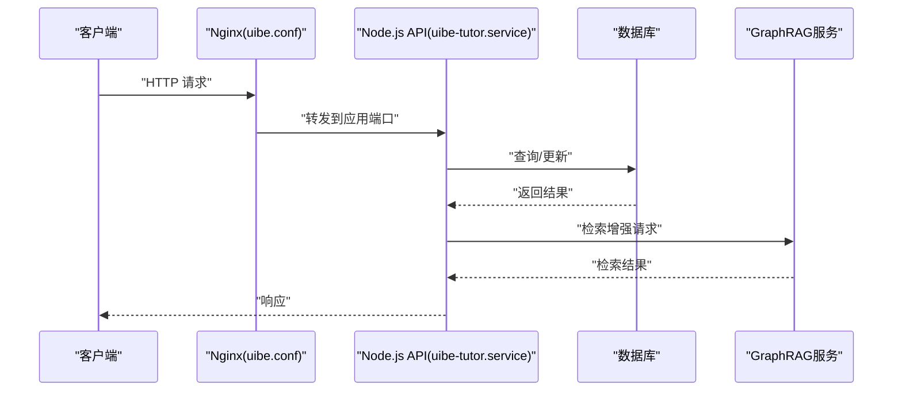
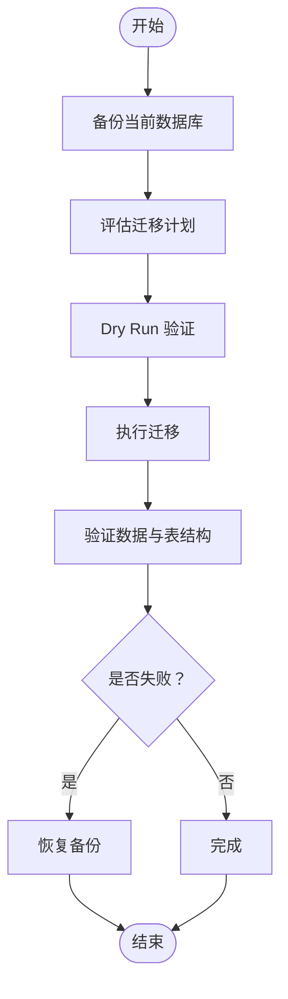
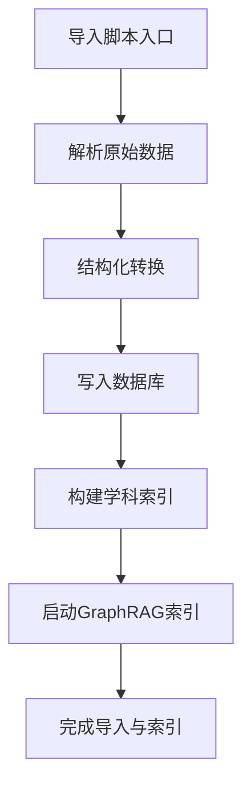
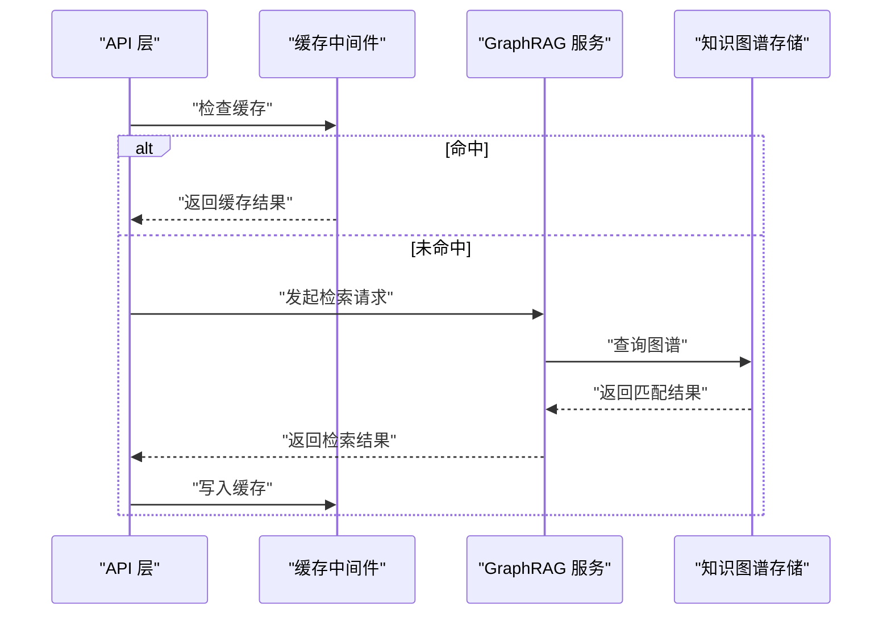
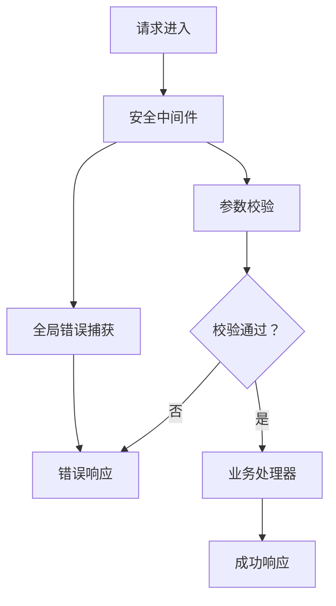
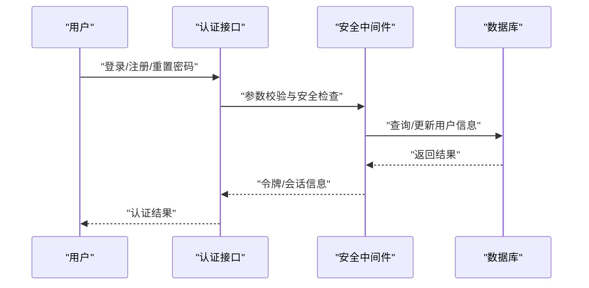
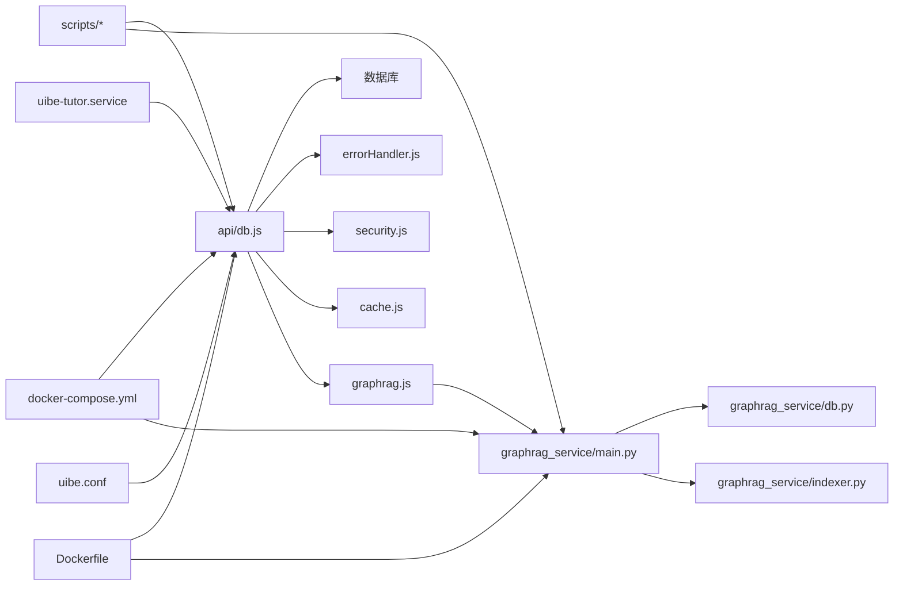
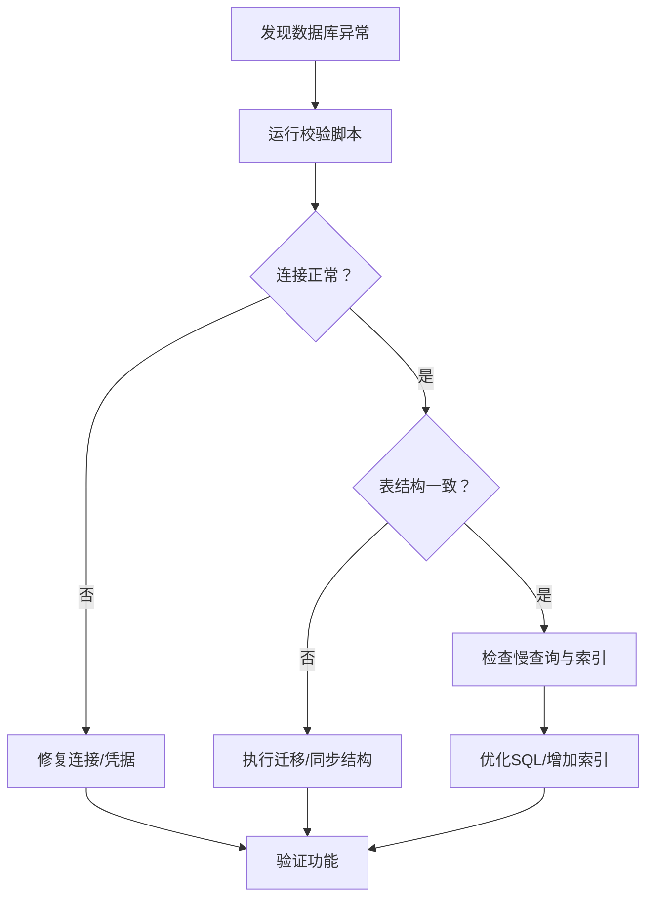
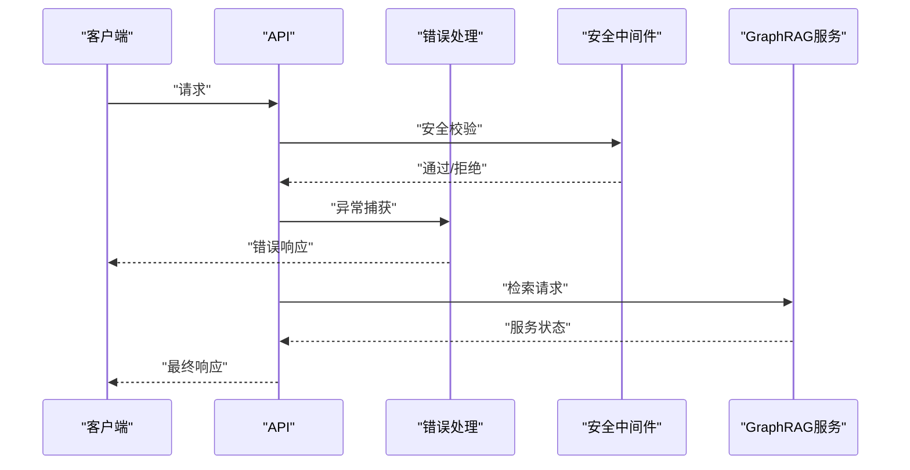

# 维护与故障排除

<cite>
**本文引用的文件**
- [check-db.js](file://check-db.js)
- [check-db.cjs](file://check-db.cjs)
- [check-tables.cjs](file://check-tables.cjs)
- [scripts/db-migrate.js](file://scripts/db-migrate.js)
- [scripts/setup_graphrag.sh](file://scripts/setup_graphrag.sh)
- [scripts/init_graphrag_service.sh](file://scripts/init_graphrag_service.sh)
- [scripts/import-hunan-physics.js](file://scripts/import-hunan-physics.js)
- [scripts/import-papers.js](file://scripts/import-papers.js)
- [scripts/parse-questions.js](file://scripts/parse-questions.js)
- [scripts/split_by_subject.py](file://scripts/split_by_subject.py)
- [scripts/build_subject_indexes.py](file://scripts/build_subject_indexes.py)
- [scripts/run_graphrag_index.py](file://scripts/run_graphrag_index.py)
- [scripts/convert_documents.py](file://scripts/convert_documents.py)
- [api/db.js](file://api/db.js)
- [api/middleware/errorHandler.js](file://api/middleware/errorHandler.js)
- [api/middleware/security.js](file://api/middleware/security.js)
- [api/utils/cache.js](file://api/utils/cache.js)
- [api/utils/response.js](file://api/utils/response.js)
- [api/utils/validator.js](file://api/utils/validator.js)
- [api/auth.js](file://api/auth.js)
- [api/login.js](file://api/login.js)
- [api/register.js](file://api/register.js)
- [api/reset-password.js](file://api/reset-password.js)
- [api/exam-session.js](file://api/exam-session.js)
- [api/tasks.js](file://api/tasks.js)
- [api/taskWorker.js](file://api/taskWorker.js)
- [api/gamification.js](file://api/gamification.js)
- [api/proxy.js](file://api/proxy.js)
- [api/graphrag.js](file://api/graphrag.js)
- [graphrag_service/main.py](file://graphrag_service/main.py)
- [graphrag_service/config.py](file://graphrag_service/config.py)
- [graphrag_service/db.py](file://graphrag_service/db.py)
- [graphrag_service/indexer.py](file://graphrag_service/indexer.py)
- [docker-compose.yml](file://docker-compose.yml)
- [Dockerfile](file://Dockerfile)
- [uibe-tutor.service](file://uibe-tutor.service)
- [uibe.conf](file://uibe.conf)
- [tests/api/auth.test.js](file://tests/api/auth.test.js)
- [tests/api/reset-password.test.js](file://tests/api/reset-password.test.js)
- [tests/api/db-and-json.test.js](file://tests/api/db-and-json.test.js)
- [vitest.config.js](file://vitest.config.js)
</cite>

## 目录
1. [简介](#简介)
2. [项目结构](#项目结构)
3. [核心组件](#核心组件)
4. [架构总览](#架构总览)
5. [详细组件分析](#详细组件分析)
6. [依赖关系分析](#依赖关系分析)
7. [性能考虑](#性能考虑)
8. [故障排除指南](#故障排除指南)
9. [结论](#结论)
10. [附录](#附录)

## 简介
本文件面向AI家教项目的运维与开发团队，提供系统化的维护与故障排除指南。内容涵盖数据库迁移策略、版本升级与数据备份恢复流程；常见故障场景、诊断方法与解决方案；性能调优、资源优化与瓶颈识别；运维脚本使用指南、批量操作与自动化工具；以及安全补丁、漏洞修复与合规检查流程。文档以仓库现有实现为依据，结合可执行脚本与服务配置，帮助在生产环境中稳定运行与快速恢复。

## 项目结构
项目采用前后端分离架构，后端以Node.js为主，配合Python GraphRAG服务与数据库校验脚本。运维相关的关键目录与文件包括：
- scripts：包含数据库迁移、数据导入、解析与索引构建等自动化脚本
- api：后端接口与中间件（错误处理、安全）
- graphrag_service：GraphRAG检索增强生成服务
- docker-compose.yml/Dockerfile：容器化部署
- uibe-tutor.service/uibe.conf：系统服务与Nginx配置
- tests：API测试用例

```mermaid
graph TB
subgraph "后端服务"
API["Node.js API 层<br/>api/*"]
MIG["数据库迁移脚本<br/>scripts/db-migrate.js"]
UTILS["工具与中间件<br/>api/utils/*"]
ERR["错误处理中间件<br/>api/middleware/errorHandler.js"]
SEC["安全中间件<br/>api/middleware/security.js"]
end
subgraph "图谱检索服务"
GR_MAIN["GraphRAG 主程序<br/>graphrag_service/main.py"]
GR_CFG["配置<br/>graphrag_service/config.py"]
GR_DB["数据库访问<br/>graphrag_service/db.py"]
GR_IDX["索引器<br/>graphrag_service/indexer.py"]
end
subgraph "容器与部署"
DC["Docker Compose<br/>docker-compose.yml"]
DF["Dockerfile<br/>Dockerfile"]
SVC["Systemd 服务<br/>uibe-tutor.service"]
CONF["Nginx 配置<br/>uibe.conf"]
end
subgraph "运维脚本"
IMP1["导入脚本<br/>scripts/import-hunan-physics.js"]
IMP2["导入脚本<br/>scripts/import-papers.js"]
PARSE["解析脚本<br/>scripts/parse-questions.js"]
SPLIT["拆分脚本<br/>scripts/split_by_subject.py"]
BUILDIDX["索引构建<br/>scripts/build_subject_indexes.py"]
RUNIDX["索引执行<br/>scripts/run_graphrag_index.py"]
CVT["文档转换<br/>scripts/convert_documents.py"]
SETUP["GraphRAG 初始化<br/>scripts/setup_graphrag.sh"]
INIT_SVC["服务初始化<br/>scripts/init_graphrag_service.sh"]
end
API --> GR_MAIN
API --> MIG
API --> UTILS
UTILS --> ERR
UTILS --> SEC
GR_MAIN --> GR_DB
GR_MAIN --> GR_IDX
GR_MAIN --> GR_CFG
DC --> API
DC --> GR_MAIN
DF --> API
DF --> GR_MAIN
SVC --> API
CONF --> API
API --> IMP1
API --> IMP2
API --> PARSE
API --> SPLIT
API --> BUILDIDX
API --> RUNIDX
API --> CVT
API --> SETUP
API --> INIT_SVC
```

**图表来源**
- [api/db.js](file://api/db.js)
- [scripts/db-migrate.js](file://scripts/db-migrate.js)
- [api/middleware/errorHandler.js](file://api/middleware/errorHandler.js)
- [api/middleware/security.js](file://api/middleware/security.js)
- [graphrag_service/main.py](file://graphrag_service/main.py)
- [graphrag_service/config.py](file://graphrag_service/config.py)
- [graphrag_service/db.py](file://graphrag_service/db.py)
- [graphrag_service/indexer.py](file://graphrag_service/indexer.py)
- [docker-compose.yml](file://docker-compose.yml)
- [Dockerfile](file://Dockerfile)
- [uibe-tutor.service](file://uibe-tutor.service)
- [uibe.conf](file://uibe.conf)
- [scripts/import-hunan-physics.js](file://scripts/import-hunan-physics.js)
- [scripts/import-papers.js](file://scripts/import-papers.js)
- [scripts/parse-questions.js](file://scripts/parse-questions.js)
- [scripts/split_by_subject.py](file://scripts/split_by_subject.py)
- [scripts/build_subject_indexes.py](file://scripts/build_subject_indexes.py)
- [scripts/run_graphrag_index.py](file://scripts/run_graphrag_index.py)
- [scripts/convert_documents.py](file://scripts/convert_documents.py)
- [scripts/setup_graphrag.sh](file://scripts/setup_graphrag.sh)
- [scripts/init_graphrag_service.sh](file://scripts/init_graphrag_service.sh)

**章节来源**
- [docker-compose.yml](file://docker-compose.yml)
- [Dockerfile](file://Dockerfile)
- [uibe-tutor.service](file://uibe-tutor.service)
- [uibe.conf](file://uibe.conf)

## 核心组件
- 数据库连接与校验：通过统一的数据库模块与校验脚本，确保连接可用性与表结构一致性
- 中间件体系：错误处理与安全中间件保障请求稳定性与安全性
- 图谱检索服务：独立的Python服务负责知识图谱索引与查询
- 运维脚本：覆盖数据导入、解析、索引构建与初始化流程
- 容器化与系统服务：Docker Compose与Systemd/Nginx配置实现标准化部署

**章节来源**
- [api/db.js](file://api/db.js)
- [check-db.js](file://check-db.js)
- [check-db.cjs](file://check-db.cjs)
- [check-tables.cjs](file://check-tables.cjs)
- [api/middleware/errorHandler.js](file://api/middleware/errorHandler.js)
- [api/middleware/security.js](file://api/middleware/security.js)
- [graphrag_service/main.py](file://graphrag_service/main.py)

## 架构总览
下图展示从客户端到后端API、数据库与GraphRAG服务的整体交互路径，以及运维脚本在数据准备阶段的作用。

**图表来源**
- [uibe.conf](file://uibe.conf)
- [uibe-tutor.service](file://uibe-tutor.service)
- [api/db.js](file://api/db.js)
- [graphrag_service/main.py](file://graphrag_service/main.py)

## 详细组件分析

### 数据库迁移与版本管理
- 迁移脚本：提供数据库结构变更与版本控制能力，建议在灰度或维护窗口执行
- 执行策略：先备份，再执行迁移，最后验证数据完整性
- 回滚机制：保留迁移历史与回滚脚本，确保可逆操作

**图表来源**
- [scripts/db-migrate.js](file://scripts/db-migrate.js)
- [check-db.js](file://check-db.js)
- [check-tables.cjs](file://check-tables.cjs)

**章节来源**
- [scripts/db-migrate.js](file://scripts/db-migrate.js)
- [check-db.js](file://check-db.js)
- [check-tables.cjs](file://check-tables.cjs)

### 数据导入与批处理
- 导入脚本：支持按地区/科目批量导入题目与试卷
- 解析与转换：对原始文档进行解析与格式转换，保证结构化入库
- 索引构建：基于学科维度构建索引，提升检索效率

**图表来源**
- [scripts/import-hunan-physics.js](file://scripts/import-hunan-physics.js)
- [scripts/import-papers.js](file://scripts/import-papers.js)
- [scripts/parse-questions.js](file://scripts/parse-questions.js)
- [scripts/split_by_subject.py](file://scripts/split_by_subject.py)
- [scripts/build_subject_indexes.py](file://scripts/build_subject_indexes.py)
- [scripts/run_graphrag_index.py](file://scripts/run_graphrag_index.py)
- [scripts/convert_documents.py](file://scripts/convert_documents.py)

**章节来源**
- [scripts/import-hunan-physics.js](file://scripts/import-hunan-physics.js)
- [scripts/import-papers.js](file://scripts/import-papers.js)
- [scripts/parse-questions.js](file://scripts/parse-questions.js)
- [scripts/split_by_subject.py](file://scripts/split_by_subject.py)
- [scripts/build_subject_indexes.py](file://scripts/build_subject_indexes.py)
- [scripts/run_graphrag_index.py](file://scripts/run_graphrag_index.py)
- [scripts/convert_documents.py](file://scripts/convert_documents.py)

### GraphRAG服务与缓存
- 服务初始化：提供GraphRAG服务的安装与初始化脚本
- 缓存中间件：封装通用缓存逻辑，降低重复计算与数据库压力
- 检索流程：API层发起检索请求，服务层执行图谱查询并返回结果

**图表来源**
- [api/utils/cache.js](file://api/utils/cache.js)
- [api/graphrag.js](file://api/graphrag.js)
- [graphrag_service/main.py](file://graphrag_service/main.py)
- [graphrag_service/db.py](file://graphrag_service/db.py)

**章节来源**
- [scripts/setup_graphrag.sh](file://scripts/setup_graphrag.sh)
- [scripts/init_graphrag_service.sh](file://scripts/init_graphrag_service.sh)
- [api/utils/cache.js](file://api/utils/cache.js)
- [api/graphrag.js](file://api/graphrag.js)
- [graphrag_service/main.py](file://graphrag_service/main.py)
- [graphrag_service/db.py](file://graphrag_service/db.py)

### 安全与错误处理
- 安全中间件：统一处理跨域、鉴权与输入校验
- 错误处理：捕获异常并返回标准化响应
- 校验工具：数据库与表结构校验脚本，保障运行时一致性

**图表来源**
- [api/middleware/security.js](file://api/middleware/security.js)
- [api/utils/validator.js](file://api/utils/validator.js)
- [api/middleware/errorHandler.js](file://api/middleware/errorHandler.js)
- [api/utils/response.js](file://api/utils/response.js)

**章节来源**
- [api/middleware/security.js](file://api/middleware/security.js)
- [api/utils/validator.js](file://api/utils/validator.js)
- [api/middleware/errorHandler.js](file://api/middleware/errorHandler.js)
- [api/utils/response.js](file://api/utils/response.js)
- [check-db.js](file://check-db.js)
- [check-db.cjs](file://check-db.cjs)
- [check-tables.cjs](file://check-tables.cjs)

### 认证与会话管理
- 登录/注册/重置密码：标准认证流程，建议启用多因素与密码强度策略
- 考试会话：模拟考试场景下的状态管理与数据隔离
- 任务队列：异步任务处理与工作线程

**图表来源**
- [api/auth.js](file://api/auth.js)
- [api/login.js](file://api/login.js)
- [api/register.js](file://api/register.js)
- [api/reset-password.js](file://api/reset-password.js)
- [api/middleware/security.js](file://api/middleware/security.js)
- [api/db.js](file://api/db.js)

**章节来源**
- [api/auth.js](file://api/auth.js)
- [api/login.js](file://api/login.js)
- [api/register.js](file://api/register.js)
- [api/reset-password.js](file://api/reset-password.js)
- [api/exam-session.js](file://api/exam-session.js)
- [api/tasks.js](file://api/tasks.js)
- [api/taskWorker.js](file://api/taskWorker.js)

## 依赖关系分析
- 后端API依赖数据库连接模块与中间件栈
- GraphRAG服务作为独立进程被API调用
- 运维脚本贯穿数据准备、索引构建与服务初始化
- 容器化与系统服务提供稳定的运行环境

**图表来源**
- [api/db.js](file://api/db.js)
- [api/middleware/errorHandler.js](file://api/middleware/errorHandler.js)
- [api/middleware/security.js](file://api/middleware/security.js)
- [api/utils/cache.js](file://api/utils/cache.js)
- [api/graphrag.js](file://api/graphrag.js)
- [graphrag_service/main.py](file://graphrag_service/main.py)
- [graphrag_service/db.py](file://graphrag_service/db.py)
- [graphrag_service/indexer.py](file://graphrag_service/indexer.py)
- [scripts/db-migrate.js](file://scripts/db-migrate.js)
- [scripts/import-hunan-physics.js](file://scripts/import-hunan-physics.js)
- [scripts/import-papers.js](file://scripts/import-papers.js)
- [scripts/parse-questions.js](file://scripts/parse-questions.js)
- [scripts/split_by_subject.py](file://scripts/split_by_subject.py)
- [scripts/build_subject_indexes.py](file://scripts/build_subject_indexes.py)
- [scripts/run_graphrag_index.py](file://scripts/run_graphrag_index.py)
- [scripts/convert_documents.py](file://scripts/convert_documents.py)
- [docker-compose.yml](file://docker-compose.yml)
- [Dockerfile](file://Dockerfile)
- [uibe-tutor.service](file://uibe-tutor.service)
- [uibe.conf](file://uibe.conf)

**章节来源**
- [docker-compose.yml](file://docker-compose.yml)
- [Dockerfile](file://Dockerfile)
- [uibe-tutor.service](file://uibe-tutor.service)
- [uibe.conf](file://uibe.conf)

## 性能考虑
- 缓存策略：利用缓存中间件减少重复查询与计算
- 索引优化：按学科维度构建索引，缩短检索延迟
- 异步任务：将耗时操作放入任务队列，避免阻塞主线程
- 数据库连接池：合理配置连接数与超时时间
- Nginx限流与健康检查：防止突发流量导致服务过载

[本节为通用指导，不直接分析具体文件]

## 故障排除指南

### 数据库类问题
- 连接失败：检查数据库服务状态、网络连通性与凭据
- 表结构不一致：使用校验脚本比对差异，必要时执行迁移
- 查询缓慢：检查索引是否存在、SQL是否可优化

**图表来源**
- [check-db.js](file://check-db.js)
- [check-db.cjs](file://check-db.cjs)
- [check-tables.cjs](file://check-tables.cjs)
- [scripts/db-migrate.js](file://scripts/db-migrate.js)

**章节来源**
- [check-db.js](file://check-db.js)
- [check-db.cjs](file://check-db.cjs)
- [check-tables.cjs](file://check-tables.cjs)
- [scripts/db-migrate.js](file://scripts/db-migrate.js)

### API与服务异常
- 5xx错误：查看错误处理中间件输出，定位异常堆栈
- 认证失败：确认安全中间件配置与令牌有效期
- GraphRAG不可用：检查服务日志与健康状态

**图表来源**
- [api/middleware/errorHandler.js](file://api/middleware/errorHandler.js)
- [api/middleware/security.js](file://api/middleware/security.js)
- [api/graphrag.js](file://api/graphrag.js)
- [graphrag_service/main.py](file://graphrag_service/main.py)

**章节来源**
- [api/middleware/errorHandler.js](file://api/middleware/errorHandler.js)
- [api/middleware/security.js](file://api/middleware/security.js)
- [api/graphrag.js](file://api/graphrag.js)
- [graphrag_service/main.py](file://graphrag_service/main.py)

### 容器与系统服务
- 容器无法启动：检查镜像构建日志与端口占用
- Systemd服务状态异常：查看服务日志与配置文件
- Nginx代理问题：核对反向代理规则与上游地址

**章节来源**
- [docker-compose.yml](file://docker-compose.yml)
- [Dockerfile](file://Dockerfile)
- [uibe-tutor.service](file://uibe-tutor.service)
- [uibe.conf](file://uibe.conf)

### 自动化脚本执行失败
- 权限不足：确保脚本具备执行权限与所需环境变量
- 依赖缺失：安装Python/Node依赖并验证版本
- 数据源异常：检查输入文件路径与格式

**章节来源**
- [scripts/setup_graphrag.sh](file://scripts/setup_graphrag.sh)
- [scripts/init_graphrag_service.sh](file://scripts/init_graphrag_service.sh)
- [scripts/import-hunan-physics.js](file://scripts/import-hunan-physics.js)
- [scripts/import-papers.js](file://scripts/import-papers.js)
- [scripts/parse-questions.js](file://scripts/parse-questions.js)
- [scripts/split_by_subject.py](file://scripts/split_by_subject.py)
- [scripts/build_subject_indexes.py](file://scripts/build_subject_indexes.py)
- [scripts/run_graphrag_index.py](file://scripts/run_graphrag_index.py)
- [scripts/convert_documents.py](file://scripts/convert_documents.py)

## 结论
本维护与故障排除文档基于仓库现有实现，提供了数据库迁移、版本升级与备份恢复策略；常见故障的诊断与解决路径；性能优化与资源调优建议；以及运维脚本与自动化工具的使用指南。建议在生产环境中遵循“先备份、后变更、再验证”的原则，并结合缓存、索引与异步任务等手段持续优化系统性能与稳定性。

## 附录

### 运维脚本清单与用途
- scripts/db-migrate.js：数据库迁移与版本管理
- scripts/import-hunan-physics.js：湖南省物理试题导入
- scripts/import-papers.js：试卷批量导入
- scripts/parse-questions.js：题目解析
- scripts/split_by_subject.py：按学科拆分文档
- scripts/build_subject_indexes.py：构建学科索引
- scripts/run_graphrag_index.py：执行GraphRAG索引
- scripts/convert_documents.py：文档格式转换
- scripts/setup_graphrag.sh：GraphRAG初始化
- scripts/init_graphrag_service.sh：GraphRAG服务初始化

**章节来源**
- [scripts/db-migrate.js](file://scripts/db-migrate.js)
- [scripts/import-hunan-physics.js](file://scripts/import-hunan-physics.js)
- [scripts/import-papers.js](file://scripts/import-papers.js)
- [scripts/parse-questions.js](file://scripts/parse-questions.js)
- [scripts/split_by_subject.py](file://scripts/split_by_subject.py)
- [scripts/build_subject_indexes.py](file://scripts/build_subject_indexes.py)
- [scripts/run_graphrag_index.py](file://scripts/run_graphrag_index.py)
- [scripts/convert_documents.py](file://scripts/convert_documents.py)
- [scripts/setup_graphrag.sh](file://scripts/setup_graphrag.sh)
- [scripts/init_graphrag_service.sh](file://scripts/init_graphrag_service.sh)

### 测试与质量保障
- 单元测试：使用Vitest配置与测试套件覆盖关键业务逻辑
- API测试：认证、密码重置与数据库一致性测试

**章节来源**
- [tests/api/auth.test.js](file://tests/api/auth.test.js)
- [tests/api/reset-password.test.js](file://tests/api/reset-password.test.js)
- [tests/api/db-and-json.test.js](file://tests/api/db-and-json.test.js)
- [vitest.config.js](file://vitest.config.js)