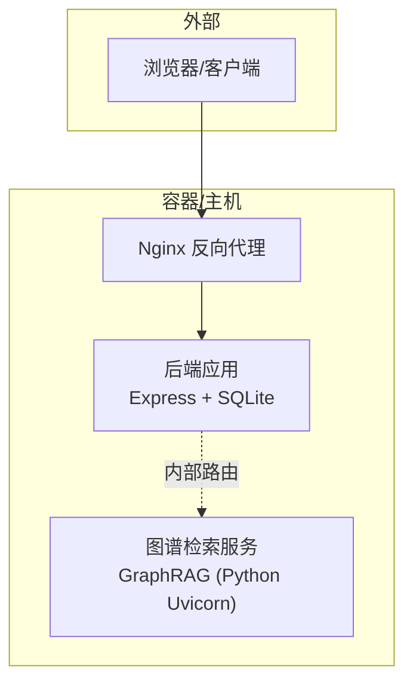
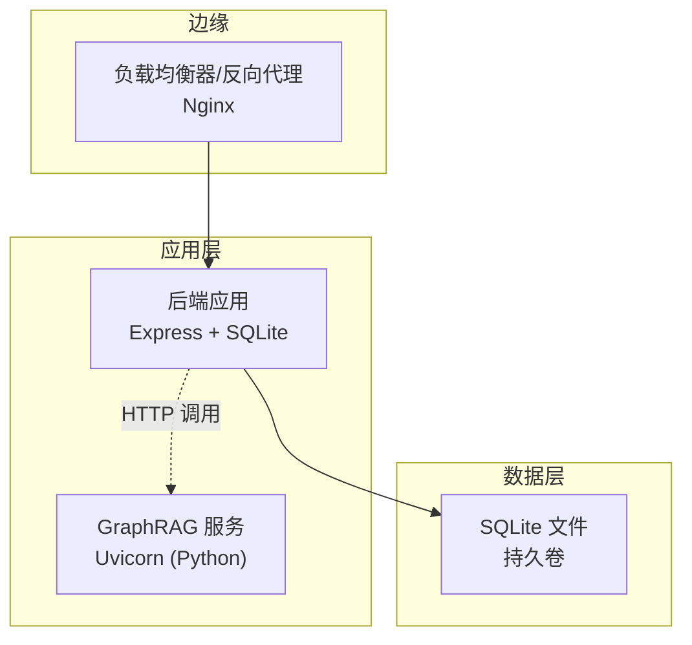
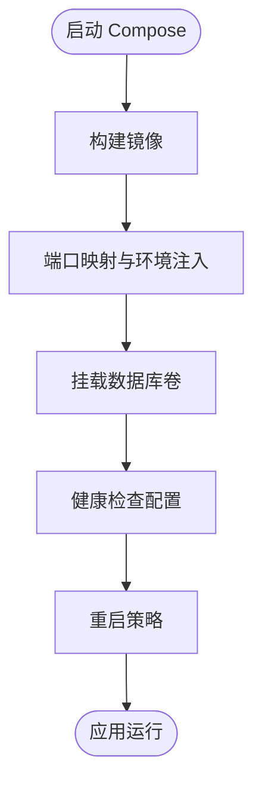
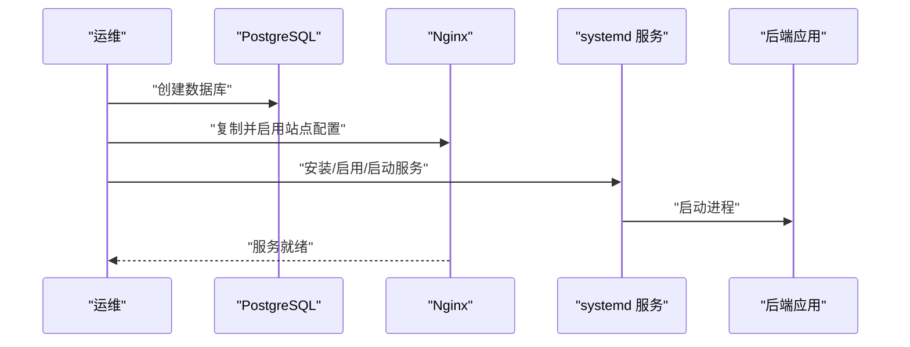
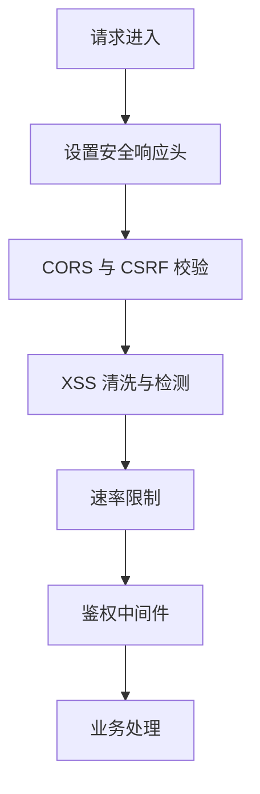
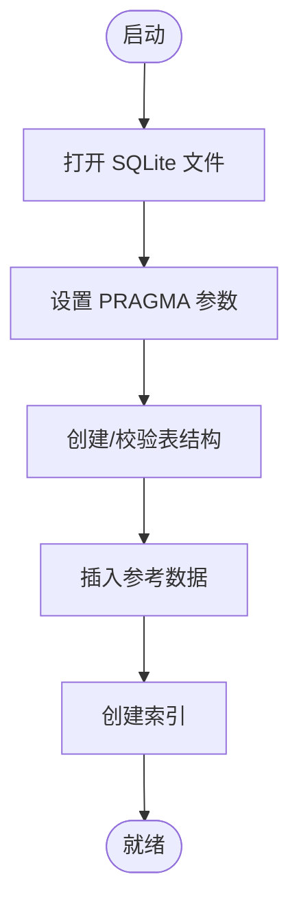
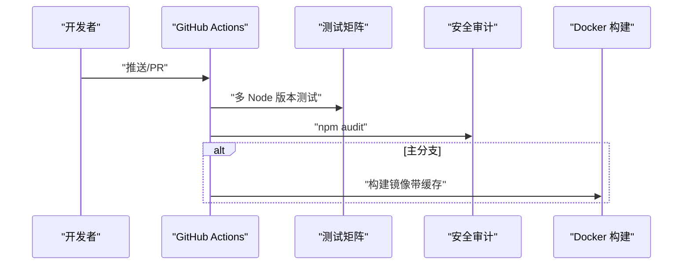
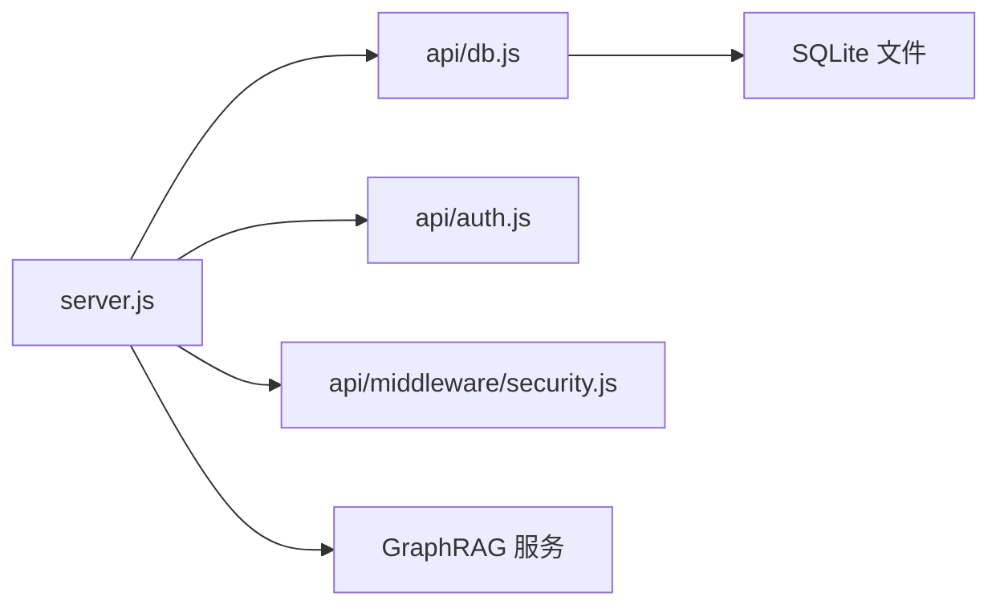
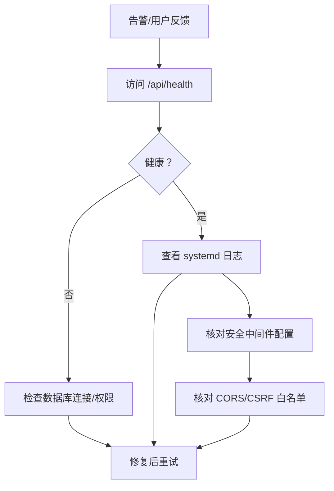

# 部署与运维

<cite>
**本文引用的文件**
- [Dockerfile](file://Dockerfile)
- [docker-compose.yml](file://docker-compose.yml)
- [package.json](file://package.json)
- [server.js](file://server.js)
- [api/db.js](file://api/db.js)
- [api/auth.js](file://api/auth.js)
- [api/middleware/security.js](file://api/middleware/security.js)
- [.github/workflows/ci.yml](file://.github/workflows/ci.yml)
- [setup.sh](file://setup.sh)
- [uibe-tutor.service](file://uibe-tutor.service)
- [uibe-graphrag.service](file://uibe-graphrag.service)
- [check-db.js](file://check-db.js)
- [deploy/uibe-graphrag.service](file://deploy/uibe-graphrag.service)
</cite>

## 目录
1. [简介](#简介)
2. [项目结构](#项目结构)
3. [核心组件](#核心组件)
4. [架构总览](#架构总览)
5. [详细组件分析](#详细组件分析)
6. [依赖关系分析](#依赖关系分析)
7. [性能考虑](#性能考虑)
8. [故障排查指南](#故障排查指南)
9. [结论](#结论)
10. [附录](#附录)

## 简介
本文件面向AI家教项目的部署与运维团队，系统化说明容器化部署、服务编排、环境配置、生产部署流程、负载均衡与高可用设计、监控与日志、故障排除、性能调优、备份与灾备、安全加固、CI/CD与自动化发布、版本管理策略以及运维最佳实践与工具推荐。文档以仓库现有配置与实现为基础，结合可扩展建议，帮助团队在生产环境中稳定运行系统。

## 项目结构
- 后端服务：基于 Node.js 的 Express 应用，提供 REST API、静态资源托管与健康检查接口。
- 数据层：SQLite 文件存储于应用卷中，通过统一的数据库初始化与索引策略保障查询效率。
- 图谱检索服务：独立的 Python/GraphRAG 服务，通过 systemd 管理并在本地监听端口。
- 部署方式：支持 Docker Compose 单实例快速部署；同时提供 systemd 服务脚本与 Nginx 配置用于生产环境。
- CI/CD：GitHub Actions 在推送主分支时构建测试、安全审计与镜像缓存。

图表来源
- [server.js:126-139](file://server.js#L126-L139)
- [uibe-tutor.service:10-15](file://uibe-tutor.service#L10-L15)
- [uibe-graphrag.service:7](file://uibe-graphrag.service#L7)

章节来源
- [Dockerfile:1-26](file://Dockerfile#L1-L26)
- [docker-compose.yml:1-26](file://docker-compose.yml#L1-L26)
- [server.js:101-113](file://server.js#L101-L113)
- [api/db.js:15-365](file://api/db.js#L15-L365)
- [uibe-tutor.service:1-19](file://uibe-tutor.service#L1-L19)
- [uibe-graphrag.service:1-19](file://uibe-graphrag.service#L1-L19)

## 核心组件
- Web 应用（Node.js/Express）
  - 提供静态资源、API 路由、健康检查、速率限制、CORS、CSRF/XSS 安全中间件。
  - 健康检查端点返回数据库可用性状态。
- 数据库（SQLite）
  - 启动时自动创建表、索引与参考数据，确保结构一致性。
- 图谱检索服务（GraphRAG）
  - 通过 systemd 管理，本地监听端口，作为后端内部服务使用。
- 反向代理与系统服务
  - Nginx 配置与 systemd 服务脚本用于生产部署与日志输出。

章节来源
- [server.js:126-139](file://server.js#L126-L139)
- [api/db.js:15-365](file://api/db.js#L15-L365)
- [uibe-tutor.service:14-15](file://uibe-tutor.service#L14-L15)
- [uibe-graphrag.service:7](file://uibe-graphrag.service#L7)

## 架构总览
下图展示生产环境典型拓扑：Nginx 作为反向代理与入口，后端应用提供 API 与静态资源，SQLite 存储在持久卷中，GraphRAG 服务作为内部子服务运行。

图表来源
- [server.js:126-139](file://server.js#L126-L139)
- [api/db.js:15-365](file://api/db.js#L15-L365)
- [uibe-tutor.service:14-15](file://uibe-tutor.service#L14-L15)
- [uibe-graphrag.service:7](file://uibe-graphrag.service#L7)

## 详细组件分析

### 容器化与编排
- Dockerfile
  - 基于 Node slim 镜像，安装 Python 工具链，复制依赖与源码，设置非 root 用户，暴露端口，配置健康检查，CMD 启动应用。
- docker-compose.yml
  - 构建镜像，映射端口，注入环境变量（含 JWT、模型 API Key），挂载数据库卷，定义健康检查与重启策略。

图表来源
- [Dockerfile:1-26](file://Dockerfile#L1-L26)
- [docker-compose.yml:4-25](file://docker-compose.yml#L4-L25)

章节来源
- [Dockerfile:1-26](file://Dockerfile#L1-L26)
- [docker-compose.yml:1-26](file://docker-compose.yml#L1-L26)

### 生产部署流程（systemd+Nginx）
- 部署脚本
  - 自动创建数据库、应用 Nginx 配置、启用并启动 systemd 服务。
- systemd 服务
  - 后端服务：指定工作目录、环境变量、标准输出/错误日志路径、重启策略。
  - GraphRAG 服务：本地监听端口、资源配额、从 .env 加载环境。
- Nginx 配置
  - 通过部署脚本复制并启用站点配置，reload Nginx。

图表来源
- [setup.sh:9-29](file://setup.sh#L9-L29)
- [uibe-tutor.service:10-15](file://uibe-tutor.service#L10-L15)
- [uibe-graphrag.service:14-15](file://uibe-graphrag.service#L14-L15)

章节来源
- [setup.sh:1-37](file://setup.sh#L1-L37)
- [uibe-tutor.service:1-19](file://uibe-tutor.service#L1-L19)
- [uibe-graphrag.service:1-19](file://uibe-graphrag.service#L1-L19)

### 安全与认证
- JWT 密钥校验
  - 启动前强制要求设置强密钥，避免使用默认值或弱密钥。
- 中间件
  - 安全响应头、CORS 白名单、XSS 清洗与检测、CSRF 检查。
- API 限流
  - 登录、代理与通用 API 分别设置不同窗口与阈值，防止滥用。

图表来源
- [api/middleware/security.js:73-113](file://api/middleware/security.js#L73-L113)
- [api/auth.js:12-27](file://api/auth.js#L12-L27)
- [server.js:44-46](file://server.js#L44-L46)
- [server.js:29-54](file://server.js#L29-L54)

章节来源
- [api/auth.js:1-47](file://api/auth.js#L1-L47)
- [api/middleware/security.js:1-114](file://api/middleware/security.js#L1-L114)
- [server.js:44-54](file://server.js#L44-L54)

### 数据库与索引
- 初始化流程
  - 连接 SQLite 文件，启用 WAL、busy_timeout、外键约束。
  - 创建核心表与复合索引，保证查询性能。
  - 插入参考数据（学科、题型、年级等）。
  - 确保结构化列存在，必要时进行列补充与去规范化迁移。
- 健康检查
  - /api/health 返回数据库可用性与错误信息。

图表来源
- [api/db.js:15-365](file://api/db.js#L15-L365)
- [server.js:126-139](file://server.js#L126-L139)

章节来源
- [api/db.js:15-365](file://api/db.js#L15-L365)
- [server.js:126-139](file://server.js#L126-L139)

### CI/CD 流程
- 测试矩阵：Node 版本多版本并行测试，SQLite 服务作为测试数据库。
- 安全审计：npm audit（中等及以上级别）。
- Docker 缓存：仅在主分支触发镜像构建，使用 GitHub Actions 缓存加速。

图表来源
- [.github/workflows/ci.yml:9-85](file://.github/workflows/ci.yml#L9-L85)

章节来源
- [.github/workflows/ci.yml:1-85](file://.github/workflows/ci.yml#L1-L85)

## 依赖关系分析
- 组件耦合
  - 后端应用依赖 SQLite 文件与 GraphRAG 内部服务；Nginx 作为外部入口。
- 外部依赖
  - Node 运行时、SQLite3、CORS、Rate Limit、JWT、DOMPurify、marked、KaTeX 等。
- 环境变量
  - JWT_SECRET、DASHSCOPE_API_KEY、DEEPSEEK_API_KEY、ALLOWED_ORIGINS、NODE_ENV 等。

图表来源
- [server.js:1-35](file://server.js#L1-L35)
- [api/db.js:1-11](file://api/db.js#L1-L11)
- [api/auth.js:1-10](file://api/auth.js#L1-L10)
- [api/middleware/security.js:1-3](file://api/middleware/security.js#L1-L3)

章节来源
- [package.json:17-30](file://package.json#L17-L30)
- [server.js:1-35](file://server.js#L1-L35)

## 性能考虑
- 数据库优化
  - WAL 模式、超时与外键约束已启用；建议定期维护索引与统计信息。
- API 限流
  - 不同端点采用差异化限流策略，避免热点接口被刷爆。
- 静态资源
  - 前端与公共资源静态托管，合理设置缓存控制与压缩。
- 容器与资源
  - GraphRAG 服务设置了内存上限与 CPU 配额，建议根据并发与吞吐评估调整。
- 监控与容量规划
  - 建议引入应用指标（QPS、P95/P99、错误率）、数据库慢查询、队列长度、内存/CPU 使用率，并建立容量基线与告警阈值。

章节来源
- [api/db.js:23-25](file://api/db.js#L23-L25)
- [server.js:44-46](file://server.js#L44-L46)
- [uibe-graphrag.service:14-15](file://uibe-graphrag.service#L14-L15)

## 故障排查指南
- 健康检查
  - 通过 /api/health 快速判断应用与数据库状态。
- 日志定位
  - systemd 日志：journalctl -u uibe-tutor -f。
  - 后端标准输出/错误重定向到指定文件，便于离线分析。
- 数据库诊断
  - 使用提供的脚本检查表结构与示例行，确认数据完整性。
- 常见问题
  - JWT_SECRET 未设置或为默认值导致启动失败。
  - CORS/CSRF 拦截导致跨域请求失败。
  - SQLite 文件权限或路径异常导致无法写入。

图表来源
- [server.js:126-139](file://server.js#L126-L139)
- [uibe-tutor.service:14-15](file://uibe-tutor.service#L14-L15)
- [check-db.js:1-34](file://check-db.js#L1-L34)
- [api/auth.js:12-27](file://api/auth.js#L12-L27)
- [api/middleware/security.js:83-113](file://api/middleware/security.js#L83-L113)

章节来源
- [server.js:126-139](file://server.js#L126-L139)
- [uibe-tutor.service:14-15](file://uibe-tutor.service#L14-L15)
- [check-db.js:1-34](file://check-db.js#L1-L34)
- [api/auth.js:12-27](file://api/auth.js#L12-L27)
- [api/middleware/security.js:83-113](file://api/middleware/security.js#L83-L113)

## 结论
本项目提供了从单机到生产的完整部署路径：Compose 快速验证、systemd+nginx 生产部署、完善的健康检查与安全中间件、以及 CI/CD 缓存加速。建议在生产中进一步完善高可用、负载均衡、监控告警、备份与灾备、安全加固与容量规划，以满足持续增长的业务需求。

## 附录

### 生产环境部署清单
- 系统准备
  - 安装 Node、Nginx、systemd、PostgreSQL（如需）。
- 部署步骤
  - 执行部署脚本创建数据库、应用 Nginx 配置并启动服务。
  - 验证 /api/health 与日志输出。
- 高可用与负载均衡
  - 前置多实例反向代理（Nginx HAProxy 或云 LB），健康检查指向 /api/health。
  - 数据库建议迁移到 PostgreSQL 并启用主从复制。
- 监控与日志
  - 应用指标：QPS、响应时间、错误率、队列长度。
  - 数据库：慢查询、连接数、锁等待。
  - 日志：stdout/stderr、Nginx 访问/错误日志、应用错误日志。
- 备份与灾备
  - SQLite 文件定期快照；GraphRAG 服务配置独立备份策略。
  - 制定恢复演练计划与回滚策略。
- 安全加固
  - 强制 JWT 密钥、最小权限原则、HTTPS/TLS、定期安全扫描。
- CI/CD 与版本管理
  - 主干受保护、PR 审查、自动化测试与安全审计、镜像缓存加速。
- 运维工具推荐
  - 监控：Prometheus/Grafana 或云监控。
  - 日志：ELK/EFK 或云日志服务。
  - 容器编排：Kubernetes（可选）。
  - 安全：SAST/Secrets 扫描、漏洞扫描。

章节来源
- [setup.sh:1-37](file://setup.sh#L1-L37)
- [docker-compose.yml:1-26](file://docker-compose.yml#L1-L26)
- [uibe-tutor.service:1-19](file://uibe-tutor.service#L1-L19)
- [uibe-graphrag.service:1-19](file://uibe-graphrag.service#L1-L19)
- [.github/workflows/ci.yml:1-85](file://.github/workflows/ci.yml#L1-L85)