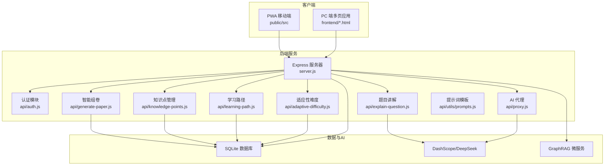
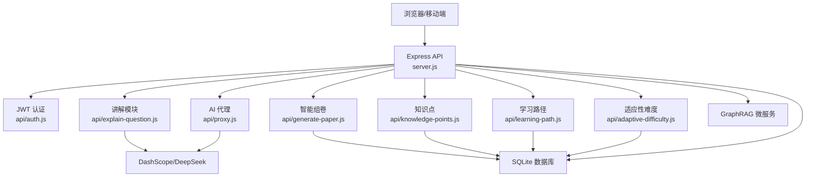
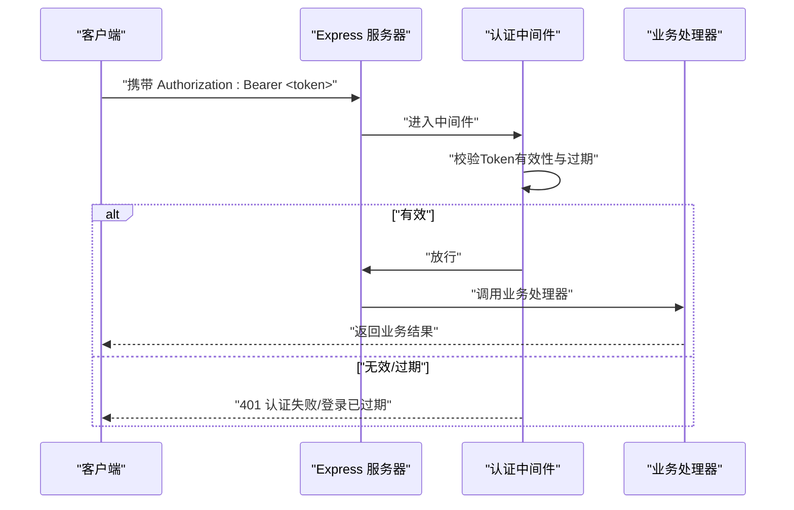
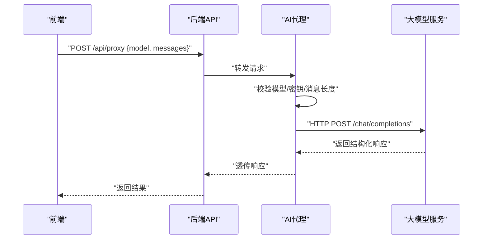
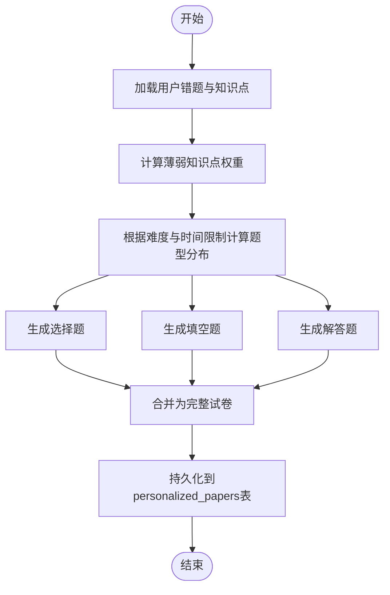
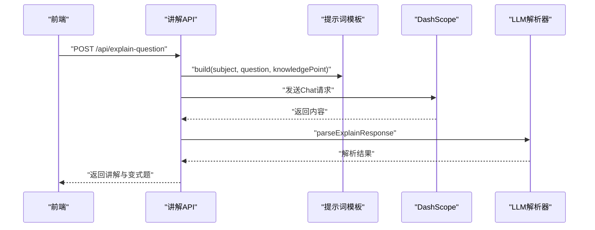
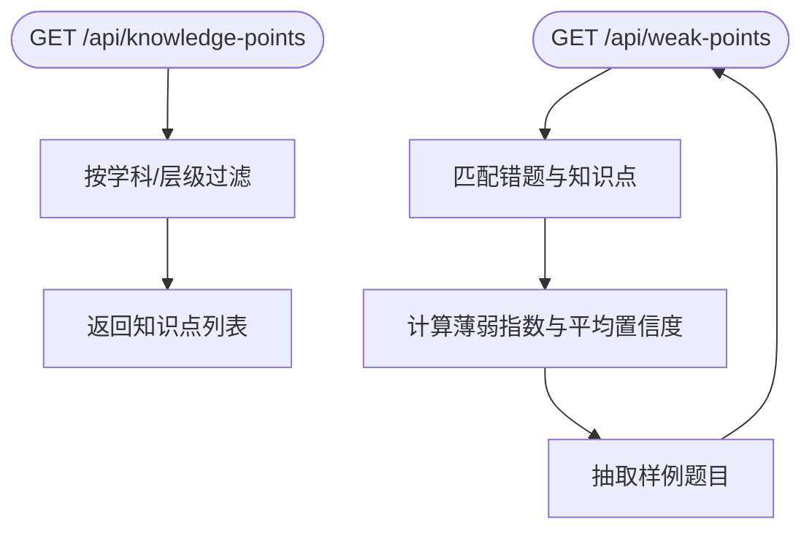
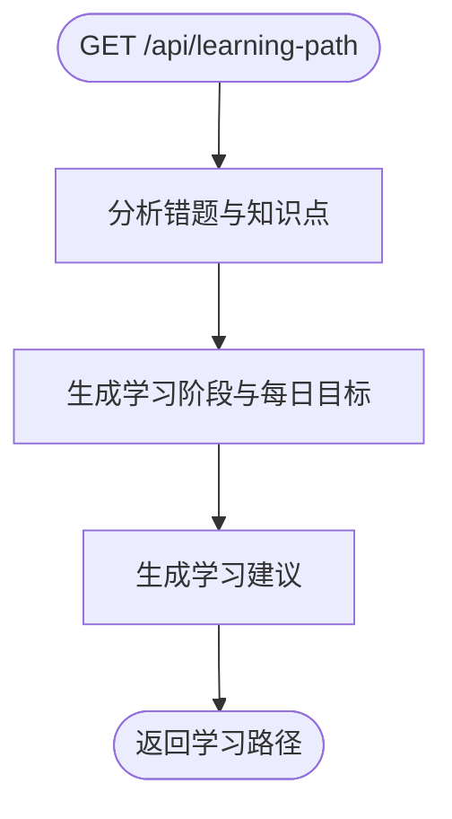
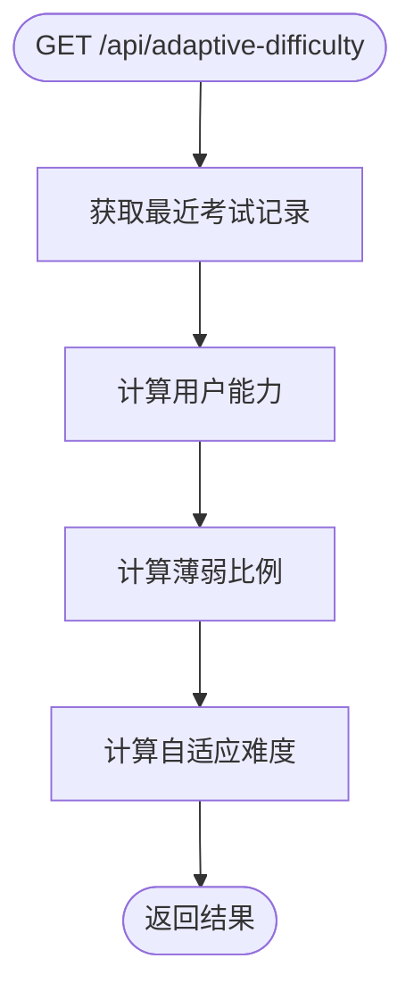
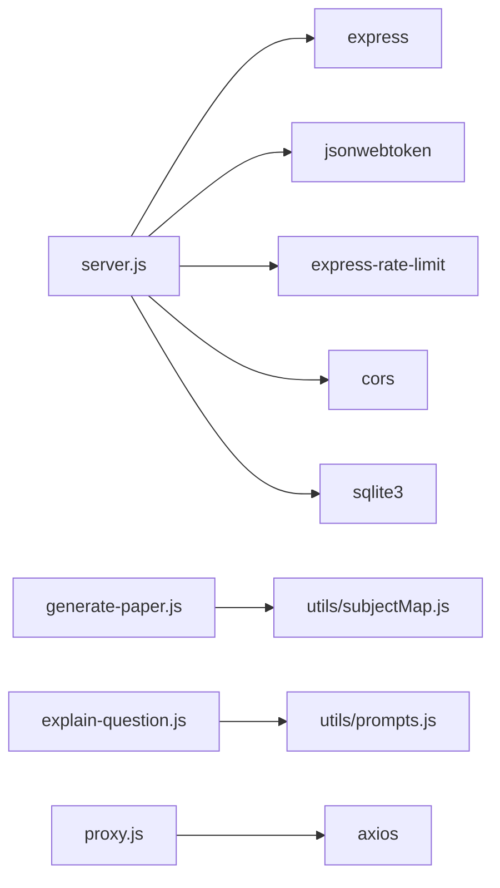

# 项目概述

<cite>
**本文档引用的文件**
- [README.md](file://README.md)
- [package.json](file://package.json)
- [server.js](file://server.js)
- [api/auth.js](file://api/auth.js)
- [api/generate-paper.js](file://api/generate-paper.js)
- [api/explain-question.js](file://api/explain-question.js)
- [api/knowledge-points.js](file://api/knowledge-points.js)
- [api/learning-path.js](file://api/learning-path.js)
- [api/adaptive-difficulty.js](file://api/adaptive-difficulty.js)
- [api/proxy.js](file://api/proxy.js)
- [api/utils/prompts.js](file://api/utils/prompts.js)
</cite>

## 目录
1. [引言](#引言)
2. [项目结构](#项目结构)
3. [核心组件](#核心组件)
4. [架构总览](#架构总览)
5. [详细组件分析](#详细组件分析)
6. [依赖关系分析](#依赖关系分析)
7. [性能考量](#性能考量)
8. [故障排查指南](#故障排查指南)
9. [结论](#结论)
10. [附录](#附录)

## 引言
AI家教项目是一个基于人工智能技术的高考/中考个性化学习平台，旨在为学生提供“学习诊断—预测卷生成—AI智能解题—教学辅助”的一体化解决方案。项目融合了多学科知识点体系、智能组卷引擎、AI代理与GraphRAG知识增强，支持拍照搜题、错题管理、智能组卷、考试模式、学情分析、班级分析、作文评分与PWA离线体验等核心功能。其核心价值在于通过数据驱动与AI能力，帮助学生精准定位薄弱环节、高效提分，并为教师提供教学辅助与班级分析能力。

## 项目结构
项目采用前后端分离与双前端架构（PC端多页应用与移动端PWA），后端以Express提供REST API，数据库采用SQLite（WAL模式），并通过任务队列与异步处理优化图片识别与生成流程。核心目录与职责如下：
- api/: 后端API模块，按业务域划分（认证、组卷、讲解、知识点、学习路径、适应性难度、代理等）
- public/: PWA移动端资源（SPA + Service Worker）
- frontend/: PC端多页应用（各学科考试/报告页面）
- database/: 数据库种子与图谱构建脚本
- scripts/: 运维与数据导入脚本
- tests/: Vitest测试套件
- graphrag_service/: GraphRAG微服务（Python）

图表来源
- [server.js:1-221](file://server.js#L1-L221)
- [api/auth.js:1-47](file://api/auth.js#L1-L47)
- [api/proxy.js:1-106](file://api/proxy.js#L1-L106)
- [api/generate-paper.js:1-430](file://api/generate-paper.js#L1-L430)
- [api/explain-question.js:1-82](file://api/explain-question.js#L1-L82)
- [api/knowledge-points.js:1-146](file://api/knowledge-points.js#L1-L146)
- [api/learning-path.js:1-291](file://api/learning-path.js#L1-L291)
- [api/adaptive-difficulty.js:1-88](file://api/adaptive-difficulty.js#L1-L88)
- [api/utils/prompts.js:1-131](file://api/utils/prompts.js#L1-L131)

章节来源
- [README.md:12-45](file://README.md#L12-L45)
- [server.js:141-205](file://server.js#L141-L205)

## 核心组件
- 认证与安全：基于JWT的认证中间件与安全中间件（CORS、XSS净化/检测、CSRF防护、速率限制）
- AI代理：统一代理DashScope/DeepSeek，支持模型选择、超时控制、令牌用量日志
- 智能组卷：基于用户能力与薄弱知识点，动态生成个性化预测卷，支持题型分布与难度控制
- 题目讲解：基于提示词模板与LLM解析，输出启发式讲解、关键点与变式/同类题
- 知识点管理：支持知识点导入、查询与薄弱点分析
- 学习路径：基于错题与知识点分析，生成周阶段学习计划与建议
- 适应性难度：基于最近考试表现与薄弱比例，计算用户能力与自适应难度
- GraphRAG：知识图谱增强问答与知识点关联

章节来源
- [api/auth.js:29-46](file://api/auth.js#L29-L46)
- [api/proxy.js:33-105](file://api/proxy.js#L33-L105)
- [api/generate-paper.js:6-153](file://api/generate-paper.js#L6-L153)
- [api/explain-question.js:7-81](file://api/explain-question.js#L7-L81)
- [api/knowledge-points.js:7-95](file://api/knowledge-points.js#L7-L95)
- [api/learning-path.js:4-72](file://api/learning-path.js#L4-L72)
- [api/adaptive-difficulty.js:44-75](file://api/adaptive-difficulty.js#L44-L75)

## 架构总览
系统采用“双前端 + 后端API + AI代理 + 数据库/图谱”的分层架构。前端通过统一的API网关访问后端，后端通过代理模块调用第三方大模型，同时维护本地SQLite数据库与GraphRAG微服务进行知识增强。

图表来源
- [server.js:141-205](file://server.js#L141-L205)
- [api/proxy.js:33-105](file://api/proxy.js#L33-L105)
- [api/generate-paper.js:6-153](file://api/generate-paper.js#L6-L153)
- [api/explain-question.js:7-81](file://api/explain-question.js#L7-L81)
- [api/knowledge-points.js:7-95](file://api/knowledge-points.js#L7-L95)
- [api/learning-path.js:4-72](file://api/learning-path.js#L4-L72)
- [api/adaptive-difficulty.js:44-75](file://api/adaptive-difficulty.js#L44-L75)

## 详细组件分析

### 认证与安全中间件
- JWT校验：启动时强制检查JWT密钥，运行时对未携带有效Bearer Token的请求返回401
- 安全头与净化：统一注入安全响应头，XSS净化与检测，CSRF保护
- 速率限制：针对登录、代理与通用API设置不同窗口的限流策略

图表来源
- [api/auth.js:29-46](file://api/auth.js#L29-L46)
- [server.js:141-205](file://server.js#L141-L205)

章节来源
- [api/auth.js:12-27](file://api/auth.js#L12-L27)
- [api/auth.js:29-46](file://api/auth.js#L29-L46)
- [server.js:44-54](file://server.js#L44-L54)

### AI代理与提示词模板
- 代理模块：统一接入DashScope与DeepSeek，支持模型白名单校验、超时控制、令牌用量日志
- 提示词模板：包含图像识别、题目讲解等模板，定义模型、温度、最大tokens与构建函数

图表来源
- [api/proxy.js:33-105](file://api/proxy.js#L33-L105)
- [api/utils/prompts.js:3-25](file://api/utils/prompts.js#L3-L25)

章节来源
- [api/proxy.js:20-31](file://api/proxy.js#L20-L31)
- [api/proxy.js:66-94](file://api/proxy.js#L66-L94)
- [api/utils/prompts.js:97-129](file://api/utils/prompts.js#L97-L129)

### 智能组卷引擎
- 输入：用户邮箱、学科、目标难度、时间限制、是否聚焦薄弱点、是否自适应
- 核心流程：读取错题→匹配知识点→计算薄弱点权重→确定题型分布→生成个性化预测卷→持久化
- 输出：包含标题、学科、元数据（难度、时间估计、题量、分布）、分节与题目清单

图表来源
- [api/generate-paper.js:6-153](file://api/generate-paper.js#L6-L153)
- [api/generate-paper.js:155-184](file://api/generate-paper.js#L155-L184)
- [api/generate-paper.js:192-246](file://api/generate-paper.js#L192-L246)

章节来源
- [api/generate-paper.js:13-19](file://api/generate-paper.js#L13-L19)
- [api/generate-paper.js:34-62](file://api/generate-paper.js#L34-L62)
- [api/generate-paper.js:155-184](file://api/generate-paper.js#L155-L184)

### 题目讲解模块
- 输入：题目内容、学科、知识点
- 流程：构建讲解提示词→调用DashScope→解析LLM响应→返回讲解、关键点与变式/同类题
- 质量控制：解析器对响应质量进行评估，低质量或回退时告警

图表来源
- [api/explain-question.js:7-81](file://api/explain-question.js#L7-L81)
- [api/utils/prompts.js:97-129](file://api/utils/prompts.js#L97-L129)

章节来源
- [api/explain-question.js:12-16](file://api/explain-question.js#L12-L16)
- [api/explain-question.js:29-30](file://api/explain-question.js#L29-L30)
- [api/explain-question.js:55-67](file://api/explain-question.js#L55-L67)

### 知识点管理与薄弱点分析
- 查询：支持按学科/层级过滤，返回带子主题的知识点列表
- 导入：支持导入高考/中考知识点，覆盖/替换策略
- 薄弱点：基于错题与关键词匹配，计算薄弱指数与样例题目

图表来源
- [api/knowledge-points.js:11-42](file://api/knowledge-points.js#L11-L42)
- [api/knowledge-points.js:47-91](file://api/knowledge-points.js#L47-L91)
- [api/knowledge-points.js:97-145](file://api/knowledge-points.js#L97-L145)

章节来源
- [api/knowledge-points.js:47-91](file://api/knowledge-points.js#L47-L91)
- [api/knowledge-points.js:97-145](file://api/knowledge-points.js#L97-L145)

### 学习路径生成
- 分析：基于错题与知识点关键词统计，区分薄弱与优势知识点
- 阶段：按难度分层（基础/核心/难点）生成周阶段学习计划
- 建议：根据薄弱点数量与错题总量给出每日学习时长与重点

图表来源
- [api/learning-path.js:75-110](file://api/learning-path.js#L75-L110)
- [api/learning-path.js:112-176](file://api/learning-path.js#L112-L176)
- [api/learning-path.js:178-201](file://api/learning-path.js#L178-L201)

章节来源
- [api/learning-path.js:75-110](file://api/learning-path.js#L75-L110)
- [api/learning-path.js:112-176](file://api/learning-path.js#L112-L176)
- [api/learning-path.js:178-201](file://api/learning-path.js#L178-L201)

### 适应性难度计算
- 用户能力：基于最近10次考试的正确率、平均难度与时间衰减加权
- 自适应难度：考虑薄弱比例对难度进行上/下调校，保证训练强度适配水平

图表来源
- [api/adaptive-difficulty.js:5-24](file://api/adaptive-difficulty.js#L5-L24)
- [api/adaptive-difficulty.js:26-42](file://api/adaptive-difficulty.js#L26-L42)
- [api/adaptive-difficulty.js:44-75](file://api/adaptive-difficulty.js#L44-L75)

章节来源
- [api/adaptive-difficulty.js:5-24](file://api/adaptive-difficulty.js#L5-L24)
- [api/adaptive-difficulty.js:26-42](file://api/adaptive-difficulty.js#L26-L42)
- [api/adaptive-difficulty.js:44-75](file://api/adaptive-difficulty.js#L44-L75)

## 依赖关系分析
- 后端依赖：Express、JWT、SQLite、Rate Limit、CORS、DOMPurify、marked、KaTeX
- AI集成：DashScope（qwen系列）、DeepSeek（deepseek系列）
- 工程化：ESLint 9、Prettier、Vitest、Docker、GitHub Actions

图表来源
- [package.json:17-30](file://package.json#L17-L30)
- [server.js:1-221](file://server.js#L1-L221)
- [api/generate-paper.js:1-5](file://api/generate-paper.js#L1-L5)
- [api/explain-question.js:1-5](file://api/explain-question.js#L1-L5)
- [api/proxy.js:1](file://api/proxy.js#L1)

章节来源
- [package.json:17-41](file://package.json#L17-L41)
- [server.js:1-221](file://server.js#L1-L221)

## 性能考量
- 速率限制：登录、代理与通用API分别设置限流，避免滥用与雪崩
- 超时控制：AI代理请求设置超时，防止阻塞
- 数据库：SQLite WAL模式提升并发写入性能；索引与查询需结合实际数据规模持续优化
- 前端缓存：PWA Service Worker支持离线访问，减少网络抖动影响
- AI调用：合理设置temperature与max_tokens，避免过度消耗；监控usage日志

## 故障排查指南
- 认证失败：确认JWT_SECRET已设置且长度≥32字符；检查Authorization头格式
- AI服务不可用：检查DASHSCOPE_API_KEY/DEEPSEEK_API_KEY是否配置；查看代理模块错误码
- 组卷失败：确认知识点数据存在且学科匹配；检查时间限制与难度参数范围
- 讲解异常：查看LLM返回状态与解析器质量评分；必要时调整提示词模板
- 数据库连接：通过健康检查端点确认数据库可用性

章节来源
- [api/auth.js:12-27](file://api/auth.js#L12-L27)
- [api/proxy.js:61-64](file://api/proxy.js#L61-L64)
- [api/generate-paper.js:34-36](file://api/generate-paper.js#L34-L36)
- [api/explain-question.js:34-40](file://api/explain-question.js#L34-L40)
- [server.js:126-136](file://server.js#L126-L136)

## 结论
AI家教项目以“数据+AI”为核心驱动力，构建了从学习诊断到个性化训练的闭环。通过智能组卷、AI讲解、知识点管理与学习路径生成，项目在教育科技领域实现了“精准化+个性化”的双重价值。未来可在以下方向持续演进：完善GraphRAG知识图谱、扩展学科与题型模板、引入更多教学分析指标、增强教师端能力与课堂互动。

## 附录
- 快速开始与环境变量配置参见项目根目录README
- API概览与统一响应格式详见README
- 测试与代码规范：npm test、npm run lint、npm run format

章节来源
- [README.md:73-127](file://README.md#L73-L127)
- [README.md:128-154](file://README.md#L128-L154)
- [README.md:164-171](file://README.md#L164-L171)